# Architecture Documentation
## AI-Powered Datto RMM Platform via MCP

**Version:** 2.0.0
**Date:** 2026-03-19
**Status:** Production

---

## Table of Contents

1. [System Overview](#1-system-overview)
2. [Architecture Diagram](#2-architecture-diagram)
3. [Container Reference](#3-container-reference)
4. [Authentication Flow](#4-authentication-flow)
5. [Tool Permission Assignment](#5-tool-permission-assignment)
6. [Chat Request Flow](#6-chat-request-flow)
7. [Tool Execution Flow](#7-tool-execution-flow)
8. [MCP Transport: Why HTTP](#8-mcp-transport-why-http)
9. [Vector Search](#9-vector-search)
10. [Security Model](#10-security-model)
11. [Data Storage](#11-data-storage)
12. [Event Streaming](#12-event-streaming)
13. [Failure Handling](#13-failure-handling)
14. [Local Data Cache](#14-local-data-cache)
15. [LLM Multi-Model Routing](#15-llm-multi-model-routing)

---

## 1 System Overview

This platform provides an AI-powered conversational interface over the Datto RMM API. It allows authorized users to query RMM data — devices, alerts, jobs, sites, audit logs, and more — using natural language, without requiring direct API access or Datto credentials.

### Purpose

- Expose Datto RMM data through a secure, role-gated AI interface.
- Prevent direct API access by routing all Datto calls exclusively through a controlled MCP server.
- Allow fine-grained tool-level permissions so that different user roles can only query the data they are authorized to see.
- Ensure the AI model itself is structurally incapable of using tools the user has not been granted — not just blocked at runtime, but absent from the model's context entirely.

### Major Components

| Component | Container | Responsibility |
|---|---|---|
| **Client (Browser UI)** | — | Next.js browser app; sends requests, renders streamed AI responses via SSE. |
| **API Gateway** | `apisix` | Only public entry point (port 80). Validates JWT, injects user headers, routes traffic. Backed by `etcd` for config. |
| **Web App** | `web-app` | Next.js server (port 3000). Serves the browser UI. Behind APISIX, not directly reachable. |
| **Authentication Service** | `auth-service` | Issues RS256 JWT tokens, validates credentials against PostgreSQL, computes per-user `allowed_tools`. |
| **AI Service** | `ai-service` | Runs the Anthropic LLM. Manages conversation history, vector search, tool routing, and SSE streaming. |
| **Embedding Service** | `embedding-service` | Converts text to embedding vectors (Voyage or OpenAI). Used by AI Service for semantic search. |
| **MCP Bridge** | `mcp-bridge` | HTTP client that enforces the `allowed_tools` permission gate and forwards tool calls to MCP Server. |
| **MCP Server** | `mcp-server` | The only container with Datto credentials. Exposes 37 read-only GET tools over HTTP (MCP protocol). |
| **PgBouncer** | `pgbouncer` | Connection pooler (session mode) sitting in front of PostgreSQL. Absorbs reconnect storms; required for PostgreSQL advisory locks (sync distributed lock). |
| **PostgreSQL + pgvector** | `postgres` | Stores users, roles, tool permissions, chat history + embeddings, refresh tokens, audit logs, Datto data cache. |
| **Redis** | `redis` | JWT revocation set (`revoked_jtis:<jti>`), JTI tracking per user (`user_jtis:<userId>`), API Gateway rate-limit counters. |
| **etcd** | `etcd` | Configuration store for APISIX (routes, upstreams, consumers, plugins). |
| **Zipkin** | `zipkin` | Distributed tracing. APISIX reports all request spans. |
| **APISIX Dashboard** | `apisix-dashboard` | Admin GUI for managing APISIX routes and plugins (dev only, localhost). |
| **LiteLLM Gateway** | `litellm` | Internal-only LLM proxy (port 4000). Routes Anthropic, DeepSeek, and Gemini calls. Enables model swaps without code changes. |
| **Datto RMM API** | — | External SaaS (`*.centrastage.net/api`). Only `mcp-server` can reach it. |

### Key Constraints

1. The MCP server is the **only** component permitted to communicate with the Datto API.
2. The AI service queries the **local PostgreSQL cache** by default — not the live Datto API — to minimise cost and latency. A per-session "Live" toggle bypasses the cache for real-time data.
3. The sync pipeline is **AI-free** — it is plain TypeScript code that pulls Datto API data via MCP and upserts it into `datto_cache_*` tables.
2. The API gateway is the **only** public entry point; all other services are internal.
3. All inter-service communication is authenticated.
4. Tool availability is determined by the authenticated user's role assignments at login time and baked into the JWT — not evaluated per-request at runtime.
5. The AI model is only ever given the definitions of tools the user is permitted to use. It cannot call what it cannot see.
6. The MCP Server communicates over **HTTP transport** (not stdio). It runs as an independent container, is health-checked by Kubernetes, and is shared across all AI Service replicas.
7. Vector embeddings of chat messages are stored alongside the messages and used to surface semantically similar past conversations and RMM context at query time.

---

## 2 Architecture Diagram

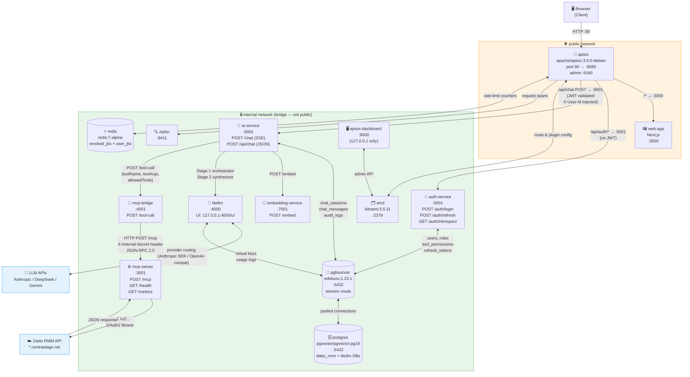
```mermaid
graph TD
    Browser["🖥️ Browser\n(Client)"]

    subgraph public["🌐 public network"]
        APISIX["🔀 apisix\napache/apisix:3.9.0-debian\nport 80 → :9080\nadmin :9180"]
        WebApp["🖼️ web-app\nNext.js\n:3000"]
    end

    subgraph internal["🔒 internal network (bridge — not public)"]
        AuthSvc["🔐 auth-service\n:5001\nPOST /auth/login\nPOST /auth/refresh\nGET /auth/introspect"]
        AISvc["🤖 ai-service\n:6001\nPOST /chat (SSE)\nPOST /api/chat (JSON)"]
        LiteLLM["🔀 litellm\n:4000\nUI: 127.0.0.1:4000/ui"]
        Embed["🔢 embedding-service\n:7001\nPOST /embed"]
        MCPBridge["🌉 mcp-bridge\n:4001\nPOST /tool-call"]
        MCPServer["⚙️ mcp-server\n:3001\nPOST /mcp\nGET /health\nGET /metrics"]
        PGB[("🔁 pgbouncer\nedoburu:1.23.1\n:5432\nsession mode")]
        PG[("🗄️ postgres\npgvector/pgvector:pg16\n:5432\ndatto_rmm + litellm DBs")]
        Redis[("⚡ redis\nredis:7-alpine\nrevoked_jtis + user_jtis")]
        Etcd["🗂️ etcd\nbitnami:3.5.11\n:2379"]
        Zipkin["🔍 zipkin\n:9411"]
        Dashboard["🖥️ apisix-dashboard\n:9000\n(127.0.0.1 only)"]
    end

    DattoAPI["☁️ Datto RMM API\n*.centrastage.net"]
    LLMAPIs["🧠 LLM APIs\nAnthropic / DeepSeek / Gemini"]

    Browser -->|"HTTP :80"| APISIX
    APISIX -->|"/* → :3000"| WebApp
    APISIX -->|"/api/auth/* → :5001\n(no JWT)"| AuthSvc
    APISIX -->|"/api/chat POST → :6001\n(JWT validated\nX-User-Id injected)"| AISvc
    APISIX <-->|"route & plugin config"| Etcd
    APISIX -->|"request spans"| Zipkin
    Dashboard <-->|"admin API"| Etcd

    AuthSvc <-->|"users, roles\ntool_permissions\nrefresh_tokens"| PGB
    AISvc <-->|"chat_sessions\nchat_messages\naudit_logs"| PGB
    PGB <-->|"pooled connections"| PG
    AISvc -->|"POST /embed"| Embed
    AISvc -->|"Stage 1 orchestrator\nStage 2 synthesizer"| LiteLLM
    AISvc -->|"POST /tool-call\n{toolName, toolArgs,\nallowedTools}"| MCPBridge
    MCPBridge -->|"HTTP POST /mcp\nX-Internal-Secret header\nJSON-RPC 2.0"| MCPServer
    MCPServer -->|"GET /v2/...\nOAuth2 Bearer"| DattoAPI
    DattoAPI -->|"JSON response"| MCPServer
    APISIX <-->|"rate-limit counters"| Redis
    LiteLLM <-->|"provider routing\n(Anthropic SDK / OpenAI-compat)"| LLMAPIs
    LiteLLM <-->|"virtual keys\nusage logs"| PGB

    style public fill:#fff3e0,stroke:#ff9800
    style internal fill:#e8f5e9,stroke:#4caf50
    style DattoAPI fill:#e3f2fd,stroke:#2196f3
    style LLMAPIs fill:#e3f2fd,stroke:#2196f3
```

> **Two Docker networks are defined in `docker-compose.yml`:**
> - `public` — contains `apisix` and `web-app`. APISIX binds port 80 to the host; `web-app` is only reachable via APISIX.
> - `internal` (bridge) — all other services. No ports exposed to host except `auth-service :5001` and `ai-service :6001` for direct dev access. `mcp-server`, `mcp-bridge`, `embedding-service`, `postgres`, `redis`, `etcd`, and `zipkin` are **not accessible from outside the Docker network**.

---

## 3 Container Reference

Every container that runs in the platform — what it is, what port it listens on, what network it is on, what it depends on before starting, and how its health is checked.

### 3.1 Startup Dependency Order

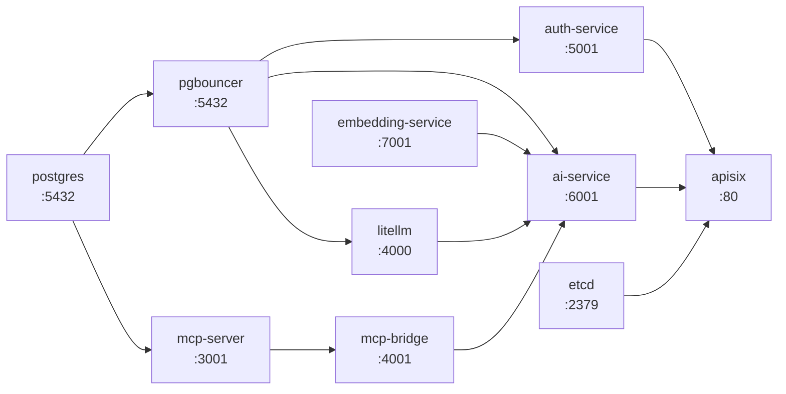
```mermaid
graph LR
    PG["postgres\n:5432"] --> PGB["pgbouncer\n:5432"]
    PG --> MCP["mcp-server\n:3001"]
    PGB --> Auth["auth-service\n:5001"]
    PGB --> AI["ai-service\n:6001"]
    PGB --> LiteLLM["litellm\n:4000"]
    MCP --> Bridge["mcp-bridge\n:4001"]
    Bridge --> AI
    Embed["embedding-service\n:7001"] --> AI
    LiteLLM --> AI
    Etcd["etcd\n:2379"] --> APISIX["apisix\n:80"]
    Auth --> APISIX
    AI --> APISIX
```

No service starts until all its upstream dependencies pass their health check. `postgres` is the root dependency for all data services. `pgbouncer` sits directly in front of PostgreSQL — auth-service, ai-service, and litellm all depend on pgbouncer's healthcheck, not postgres directly. `etcd` is the root dependency for APISIX.

### 3.2 Service Table

| Container | Image / Build | Internal Port | Exposed to Host | Network | Health Check | Depends On |
|---|---|---|---|---|---|---|
| `postgres` | `pgvector/pgvector:pg16` | 5432 | No | internal | `pg_isready -U postgres` | — |
| `pgbouncer` | `edoburu/pgbouncer:1.23.1` | 5432 | No | internal | `pg_isready -h 127.0.0.1` | postgres ✓ |
| `mcp-server` | `./read-only-mcp` | 3001 | No | internal | `GET /health` | postgres ✓ |
| `mcp-bridge` | `./mcp-bridge` | 4001 | No | internal | `GET /health` | mcp-server ✓ |
| `auth-service` | `./auth-service` | 5001 | **5001** | internal | `GET /health` | pgbouncer ✓ |
| `embedding-service` | `./embedding-service` | 7001 | No | internal | `GET /health` | — |
| `ai-service` | `./ai-service` | 6001 | **6001** | internal | `GET /health` | pgbouncer ✓, mcp-bridge ✓, embedding-service ✓, litellm ✓ |
| `litellm` | `ghcr.io/berriai/litellm:main-stable` | 4000 | **127.0.0.1:4000** | internal | `GET /health` (python3) | pgbouncer ✓ |
| `redis` | `redis:7-alpine` | 6379 | No | internal | — | — |
| `etcd` | `bitnamilegacy/etcd:3.5.11` | 2379 | No | internal | `etcdctl endpoint health` | — |
| `apisix` | `apache/apisix:3.9.0-debian` | 9080 | **80** | public + internal | — | etcd ✓, auth-service, ai-service |
| `web-app` | `./services/web-app` | 3000 | No | public + internal | — | — |
| `zipkin` | `openzipkin/zipkin:3` | 9411 | 127.0.0.1:9411 | internal | — | — |
| `apisix-dashboard` | `apache/apisix-dashboard:2.9.0` | 9000 | 127.0.0.1:9000 | internal | — | etcd ✓ |

> **Exposed to Host** — ports accessible from the developer's machine or internet. `auth-service` and `ai-service` are directly exposed in local dev for testing. In production, only APISIX port 80 should be public.

### 3.3 Service Endpoints

| Container | Endpoint | Method | Auth required | Purpose |
|---|---|---|---|---|
| `apisix` | `/api/auth/*` | GET, POST | No | Proxied to auth-service |
| `apisix` | `/api/chat` | POST | JWT (Bearer) | Proxied to ai-service; injects `X-User-Id`, `X-User-Role` headers |
| `apisix` | `/api/history` | GET | JWT | Proxied to ai-service |
| `apisix` | `/api/history/*` | GET | JWT | Proxied to ai-service |
| `apisix` | `/api/admin/*` | GET, POST | JWT | Proxied to ai-service |
| `apisix` | `/api/debug/*` | GET | JWT | Proxied to ai-service |
| `apisix` | `/*` | any | No | Proxied to web-app (catch-all) |
| `auth-service` | `/auth/login` | POST | No | Issue JWT + refresh token |
| `auth-service` | `/auth/refresh` | POST | No | Renew access token |
| `auth-service` | `/auth/introspect` | GET | Bearer JWT | Validate token, return claims |
| `auth-service` | `/health` | GET | No | Liveness check |
| `ai-service` | `/chat` | POST | Headers injected by APISIX | Run LLM + tools, stream SSE |
| `ai-service` | `/health` | GET | No | Liveness check |
| `mcp-bridge` | `/tool-call` | POST | No (internal only) | Permission gate + forward to MCP Server |
| `mcp-bridge` | `/health` | GET | No | Liveness check |
| `mcp-server` | `/mcp` | POST | `X-Internal-Secret` header | MCP JSON-RPC tool execution |
| `mcp-server` | `/health` | GET | No | Liveness check |
| `mcp-server` | `/metrics` | GET | No | Prometheus counters |
| `embedding-service` | `/embed` | POST | No (internal only) | Convert text → vector |
| `embedding-service` | `/health` | GET | No | Liveness check |

### 3.4 Environment Variables per Container

| Variable | Used by | Source |
|---|---|---|
| `DATTO_API_KEY` | `mcp-server` | `.env` file |
| `DATTO_API_SECRET` | `mcp-server` | `.env` file |
| `DATTO_PLATFORM` | `mcp-server` | `.env` file (default: `merlot`) |
| `MCP_INTERNAL_SECRET` | `mcp-server`, `mcp-bridge` | `.env` file — same value both sides |
| `MCP_SERVER_URL` | `mcp-bridge` | `docker-compose.yml` → `http://mcp-server:3001` |
| `MCP_BRIDGE_URL` | `ai-service` | `docker-compose.yml` → `http://mcp-bridge:4001` |
| `DATABASE_URL` | `auth-service`, `ai-service` | `docker-compose.yml` → `postgresql://postgres@pgbouncer:5432/datto_rmm` (SEC-010: via PgBouncer) |
| `JWT_PRIVATE_KEY` | `auth-service` | `.env` file (RS256 PEM) |
| `JWT_PUBLIC_KEY` | `auth-service` | `.env` file (RS256 PEM) |
| `ANTHROPIC_API_KEY` | `ai-service`, `litellm` | `.env` file |
| `LITELLM_URL` | `ai-service` | `docker-compose.yml` → `http://litellm:4000` (absent = direct Anthropic) |
| `LITELLM_MASTER_KEY` | `litellm` | `.env` file — admin password for LiteLLM UI |
| `DEEPSEEK_API_KEY` | `litellm` | `.env` file — required only if DeepSeek models selected |
| `GEMINI_API_KEY` | `litellm` | `.env` file — required only if Gemini models selected |
| `EMBEDDING_SERVICE_URL` | `ai-service` | `docker-compose.yml` → `http://embedding-service:7001` |
| `EMBEDDING_API_KEY` | `embedding-service` | `.env` file |
| `EMBEDDING_PROVIDER` | `embedding-service` | `.env` file (`voyage` or `openai`) |
| `EMBEDDING_MODEL` | `embedding-service` | `.env` file |
| `POSTGRES_PASSWORD` | `postgres` | `.env` file |

### 3.5 How the Internal Network Works

All services except `apisix` and `web-app` are on the `internal` Docker bridge network. Docker's embedded DNS resolves container names as hostnames — `mcp-server`, `mcp-bridge`, `postgres`, etc. — so services call each other by name, not by IP.

```
mcp-bridge   → http://mcp-server:3001/mcp         (Docker DNS)
ai-service   → http://mcp-bridge:4001/tool-call    (Docker DNS)
ai-service   → http://embedding-service:7001/embed
ai-service   → http://litellm:4000                 (LLM proxy — Stage 1 + Stage 2)
ai-service   → postgresql://postgres@pgbouncer:5432/datto_rmm  (SEC-010: via PgBouncer)
auth-service → postgresql://postgres@pgbouncer:5432/datto_rmm  (SEC-010: via PgBouncer)
litellm      → postgresql://postgres@pgbouncer:5432/litellm    (SEC-010: via PgBouncer)
pgbouncer    → postgresql://postgres:5432/datto_rmm            (direct — pooler → DB)
pgbouncer    → postgresql://postgres:5432/litellm              (direct — pooler → DB)
apisix       → http://auth-service:5001            (APISIX upstream)
apisix       → http://ai-service:6001              (APISIX upstream)
apisix       → http://web-app:3000                 (APISIX upstream)
apisix       → http://etcd:2379                    (config store)
apisix       → http://zipkin:9411                  (tracing)
```

Nothing outside the `internal` network can initiate a connection to these services. The only inbound path is through APISIX on port 80.

---

## 4 Authentication Flow

A user authenticates once and receives a short-lived JWT. The critical detail is that at login time the Auth Service queries `tool_permissions` for the user's roles and **bakes the resulting tool list directly into the JWT**. This means the AI service never has to ask "what can this user do?" — the answer is already inside the token.

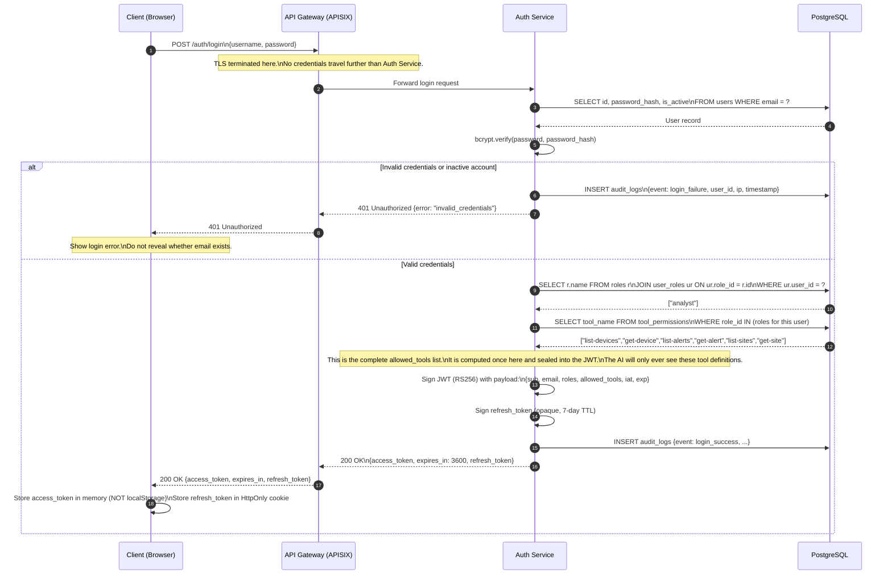
```mermaid
sequenceDiagram
    autonumber
    participant Browser as Client (Browser)
    participant GW as API Gateway (APISIX)
    participant Auth as Auth Service
    participant DB as PostgreSQL

    Browser->>GW: POST /auth/login\n{username, password}
    note over GW: TLS terminated here.\nNo credentials travel further than Auth Service.
    GW->>Auth: Forward login request

    Auth->>DB: SELECT id, password_hash, is_active\nFROM users WHERE email = ?
    DB-->>Auth: User record

    Auth->>Auth: bcrypt.verify(password, password_hash)

    alt Invalid credentials or inactive account
        Auth->>DB: INSERT audit_logs\n{event: login_failure, user_id, ip, timestamp}
        Auth-->>GW: 401 Unauthorized {error: "invalid_credentials"}
        GW-->>Browser: 401 Unauthorized
        note over Browser: Show login error.\nDo not reveal whether email exists.
    else Valid credentials
        Auth->>DB: SELECT r.name FROM roles r\nJOIN user_roles ur ON ur.role_id = r.id\nWHERE ur.user_id = ?
        DB-->>Auth: ["analyst"]

        Auth->>DB: SELECT tool_name FROM tool_permissions\nWHERE role_id IN (roles for this user)
        DB-->>Auth: ["list-devices","get-device","list-alerts","get-alert","list-sites","get-site"]
        note over Auth: This is the complete allowed_tools list.\nIt is computed once here and sealed into the JWT.\nThe AI will only ever see these tool definitions.

        Auth->>Auth: Sign JWT (RS256) with payload:\n{sub, email, roles, allowed_tools, iat, exp}
        Auth->>Auth: Sign refresh_token (opaque, 7-day TTL)
        Auth->>DB: INSERT audit_logs {event: login_success, ...}

        Auth-->>GW: 200 OK\n{access_token, expires_in: 3600, refresh_token}
        GW-->>Browser: 200 OK {access_token, expires_in, refresh_token}
        Browser->>Browser: Store access_token in memory (NOT localStorage)\nStore refresh_token in HttpOnly cookie
    end
```

### JWT Payload Structure

```json
{
  "sub": "d4e5f6a7-...",
  "email": "alice@example.com",
  "roles": ["analyst"],
  "allowed_tools": [
    "list-devices",
    "get-device",
    "list-alerts",
    "get-alert",
    "list-sites",
    "get-site"
  ],
  "iat": 1710000000,
  "exp": 1710003600
}
```

| Claim | Purpose |
|---|---|
| `sub` | Unique user identifier — used when writing to `audit_logs` and `chat_history`. |
| `roles` | Human-readable role names — used for display only; not evaluated for permissions at runtime. |
| `allowed_tools` | The authoritative list of MCP tools this user may call, computed from `tool_permissions` at login. This is the list the AI Service uses to build the prompt. |
| `exp` | Expiry (1 hour). The gateway rejects any request where `now > exp` before it reaches any internal service. |

- Tokens are signed with **RS256**. The Auth Service holds the private key; the API Gateway holds only the public key for local verification.
- Token refresh uses the `refresh_token` (HttpOnly cookie, 7-day TTL). On refresh, `allowed_tools` is recomputed from the database — if an admin changed the user's roles, the new permissions take effect at next refresh.

---

## 5 Tool Permission Assignment

This section explains the complete lifecycle of a tool permission — from an administrator assigning it in the database, all the way to the AI model being structurally unable to use tools that were not assigned.

### 5.1 How Tool Assignment Works

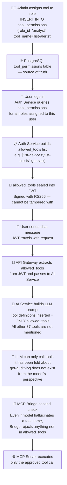
```mermaid
flowchart TD
    A["🧑‍💼 Admin assigns tool to role\nINSERT INTO tool_permissions\n(role_id='analyst', tool_name='list-alerts')"]
    B["🗄️ PostgreSQL\ntool_permissions table\n— source of truth"]
    C["🔐 User logs in\nAuth Service queries tool_permissions\nfor all roles assigned to this user"]
    D["📋 Auth Service builds allowed_tools list\ne.g. ['list-devices','list-alerts','get-site']"]
    E["🔏 allowed_tools sealed into JWT\nSigned with RS256 — cannot be tampered with"]
    F["📨 User sends chat message\nJWT travels with request"]
    G["🔀 API Gateway extracts allowed_tools\nfrom JWT and passes to AI Service"]
    H["🤖 AI Service builds LLM prompt\nTool definitions inserted = ONLY allowed_tools\nAll other 37 tools are not mentioned"]
    I["🧠 LLM can only call tools\nit has been told about\nget-audit-log does not exist\nfrom the model's perspective"]
    J["🌉 MCP Bridge second check\nEven if model hallucinates a tool name,\nBridge rejects anything not in allowed_tools"]
    K["⚙️ MCP Server executes\nonly the approved tool call"]

    A --> B
    B --> C
    C --> D
    D --> E
    E --> F
    F --> G
    G --> H
    H --> I
    I --> J
    J --> K
```

### 5.2 Why the LLM Cannot Use Unauthorized Tools

The AI model is not "told" what it cannot use. It is only ever **shown** what it can use. The tool definitions placed into the system prompt are the complete universe of tools the model knows about for that request. Tools not in `allowed_tools` are never described to the model — they have no name, no description, no parameters. The model has no mechanism to call something it has never been told exists.

This is enforced in three layers:

| Layer | What happens | Can be bypassed? |
|---|---|---|
| **Prompt construction** (AI Service) | Only `allowed_tools` definitions are written into the system prompt | No — the model never sees other tools |
| **MCP Bridge gate** | Every `ToolCallRequest` is checked against `allowed_tools` before forwarding | No — request is dropped in-process before reaching MCP |
| **MCP Server registration** | Only 37 read-only tools are registered; unknown tool names return an error | No — server has no handler for unknown tools |

### 5.3 Role-to-Tool Mapping Examples

```
Role: admin
  → All 37 tools (full access)

Role: analyst
  → list-devices      get-device        list-sites        get-site
  → list-alerts       get-alert         list-jobs         get-job
  → get-activity-logs

Role: helpdesk
  → list-devices      get-device
  → list-alerts       get-alert

Role: readonly
  → list-sites        get-system-status get-rate-limit
```

A user may hold multiple roles. Their effective `allowed_tools` list is the **union** of all tool permissions across all their roles. The Auth Service performs this union query at login time:

```sql
SELECT DISTINCT tp.tool_name
FROM tool_permissions tp
JOIN user_roles ur ON ur.role_id = tp.role_id
WHERE ur.user_id = $1
ORDER BY tp.tool_name;
```

### 5.4 Token Refresh and Permission Changes

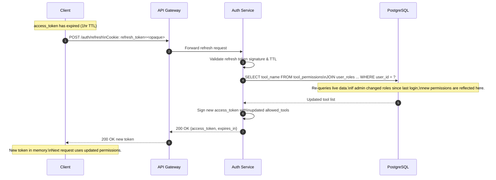
```mermaid
sequenceDiagram
    autonumber
    participant Browser as Client
    participant GW as API Gateway
    participant Auth as Auth Service
    participant DB as PostgreSQL

    note over Browser: access_token has expired (1hr TTL)
    Browser->>GW: POST /auth/refresh\nCookie: refresh_token=<opaque>
    GW->>Auth: Forward refresh request
    Auth->>Auth: Validate refresh token signature & TTL

    Auth->>DB: SELECT tool_name FROM tool_permissions\nJOIN user_roles ... WHERE user_id = ?
    note over DB: Re-queries live data.\nIf admin changed roles since last login,\nnew permissions are reflected here.
    DB-->>Auth: Updated tool list

    Auth->>Auth: Sign new access_token with\nupdated allowed_tools
    Auth-->>GW: 200 OK {access_token, expires_in}
    GW-->>Browser: 200 OK new token
    note over Browser: New token in memory.\nNext request uses updated permissions.
```

> **Important:** Permission changes (adding or removing tools from a role) take effect at the user's next token refresh, not immediately. The maximum lag is the remaining TTL of the current access token — up to 1 hour. If immediate revocation is required (e.g., a security incident), the Auth Service can invalidate the user's refresh token, forcing a new login.

---

## 6 Chat Request Flow

Once authenticated, the client sends natural-language messages. The AI service embeds the message, runs a vector similarity search for relevant context, builds a prompt with only the permitted tool definitions, calls the MCP Bridge for live RMM data via HTTP, and streams the response back.


```mermaid
sequenceDiagram
    autonumber
    participant Browser as Client (Browser)
    participant GW as API Gateway (APISIX)
    participant Auth as Auth Service
    participant AI as AI Service
    participant Embed as Embedding Service
    participant DB as PostgreSQL + pgvector
    participant Bridge as MCP Bridge
    participant MCP as MCP Server (:3001)
    participant Datto as Datto RMM API

    Browser->>GW: POST /chat\nAuthorization: Bearer <JWT>\n{session_id, message: "Show me open alerts"}

    GW->>GW: Decode JWT header + verify RS256 signature
    GW->>GW: Check exp claim — reject if expired
    note over GW: JWT validated locally against Auth Service public key.\nNo Auth Service round-trip for standard requests.

    GW->>Auth: GET /auth/introspect\n(only if token within 5min of expiry)
    Auth-->>GW: {valid: true, user_id, roles, allowed_tools}

    GW->>GW: Lua serverless-post-function\nDecodes JWT payload (base64)\nInjects request headers:\n  X-User-Id: d4e5f6a7-...\n  X-Allowed-Tools: ["list-alerts","get-alert",...]
    note over GW: Headers injected by APISIX Lua plugin\nbefore forwarding. AI Service reads\nthese headers — it never sees the JWT.

    GW->>AI: POST http://ai-service:6001/chat\nHeaders: X-User-Id, X-Allowed-Tools, X-Session-Id\nBody: {message: "Show me open alerts"}

    par Load recent history and run vector search simultaneously
        AI->>DB: SELECT content, role, tools_used\nFROM chat_messages\nWHERE session_id = ?\nORDER BY created_at DESC LIMIT 20
        DB-->>AI: Last 20 messages (conversation history)
    and
        AI->>Embed: embed("Show me open alerts")
        Embed-->>AI: query_vector [0.021, -0.847, ...]
        AI->>DB: SELECT content, role, tools_used,\n1 - (embedding <=> $1) AS similarity\nFROM chat_messages\nWHERE user_id = $2\n  AND 1 - (embedding <=> $1) > 0.78\nORDER BY embedding <=> $1\nLIMIT 5
        DB-->>AI: 5 semantically similar past messages\ne.g. "List critical alerts for site London"\n"Show unresolved alerts older than 7 days"
    end

    AI->>AI: Build system prompt:\n  1. Platform instructions\n  2. Tool definitions — ONLY allowed_tools\n     (tools not in list are never mentioned)\n  3. Vector search results as context:\n     "User has asked about alerts before — see examples"\n  4. Recent conversation history (last 20 turns)

    AI->>AI: LLM inference\nPrompt includes alert context from vector search.\nModel decides to call list-alerts with {max:50}

    AI->>Bridge: ToolCallRequest\n{tool:"list-alerts", args:{max:50}, requestId:"r-001"}

    Bridge->>Bridge: GATE: is "list-alerts" in allowed_tools?\nYES — proceed

    Bridge->>MCP: HTTP POST http://mcp-server:3001/mcp\nHeaders: X-Internal-Secret: <secret>\n         mTLS client cert\nBody: {"jsonrpc":"2.0","id":"r-001",\n"method":"tools/call",\n"params":{"name":"list-alerts","arguments":{"max":50}}}

    note over MCP: Validates X-Internal-Secret header.\nValidates mTLS client certificate.\nRequests failing either check → 401.

    MCP->>MCP: Resolve handler for "list-alerts"\ngetToken() — return cached or refresh OAuth token
    MCP->>Datto: GET /v2/alert/alerts?max=50\nAuthorization: Bearer <datto_oauth_token>

    Datto-->>MCP: 200 OK {pageDetails:{...}, alerts:[...]}
    MCP-->>Bridge: HTTP 200\n{"jsonrpc":"2.0","id":"r-001",\n"result":{"content":[{"type":"text","text":"{ ... }"}]}}

    Bridge-->>AI: Tool result {success:true, data:"{ alerts:[...] }"}

    AI->>AI: LLM continues generation\nreads live alert data + vector context\nformulates answer

    par Save history and embed new messages
        AI->>DB: INSERT chat_messages\n{role:"user", content:"Show me open alerts"}
        AI->>DB: INSERT chat_messages\n{role:"assistant", content:"...",\ntools_used:[{name:"list-alerts",args:{max:50}}]}
    and
        AI->>Embed: embed("Show me open alerts")
        Embed-->>AI: user_vector
        AI->>Embed: embed("I found 12 open alerts...")
        Embed-->>AI: assistant_vector
        AI->>DB: UPDATE chat_messages\nSET embedding = $1\nWHERE id IN (new message ids)
    end

    AI->>DB: INSERT audit_logs\n{user_id, event:"tool_call", tool:"list-alerts",\nmetadata:{args:{max:50}, result_count:12}}

    AI-->>GW: HTTP 200 text/event-stream
    AI-->>GW: SSE: event:delta data:{"delta":"I found 12 open alerts."}
    AI-->>GW: SSE: event:tool_call data:{"tool":"list-alerts","status":"success","result_count":12}
    AI-->>GW: SSE: event:done data:[DONE]

    GW-->>Browser: SSE stream forwarded in real time
    note over Browser: UI renders tokens as they arrive.\nTool badge shown on event:tool_call.
```

---

## 7 Tool Execution Flow

This diagram zooms into a single tool call — from the AI deciding to invoke a tool, through the HTTP channel to the MCP Server, to the Datto response being streamed back to the browser.

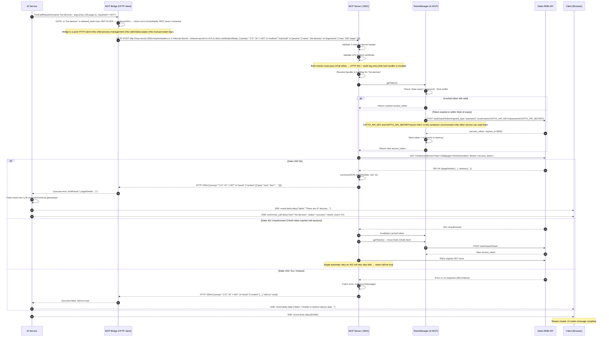
```mermaid
sequenceDiagram
    autonumber
    participant AI as AI Service
    participant Bridge as MCP Bridge (HTTP client)
    participant MCP as MCP Server (:3001)
    participant TM as TokenManager (in MCP)
    participant Datto as Datto RMM API
    participant Browser as Client (Browser)

    AI->>Bridge: ToolCallRequest\n{name:"list-devices", args:{max:100,page:1}, requestId:"r-007"}

    Bridge->>Bridge: GATE: Is "list-devices" in allowed_tools from JWT?\nYES — continue\nNO — return error immediately, MCP never contacted

    note over Bridge: Bridge is a pure HTTP client.\nNo child process management.\nNo stdin/stdout pipes.\nNo manual restart logic.

    Bridge->>MCP: HTTP POST http://mcp-server:3001/mcp\nHeaders:\n  X-Internal-Secret: <shared-secret>\n  mTLS client certificate\nBody: {"jsonrpc":"2.0","id":"r-007",\n"method":"tools/call",\n"params":{"name":"list-devices",\n"arguments":{"max":100,"page":1}}}

    MCP->>MCP: Validate X-Internal-Secret header
    MCP->>MCP: Validate mTLS client certificate
    note over MCP: Both checks must pass.\nFail either → HTTP 401 + audit log entry.\nNo tool handler is invoked.

    MCP->>MCP: Resolve handler in toolMap for "list-devices"
    MCP->>TM: getToken()
    TM->>TM: Check: Date.now() < expiresAt - 5min buffer

    alt Cached token still valid
        TM-->>MCP: Return cached access_token
    else Token expired or within 5min of expiry
        TM->>Datto: POST /auth/oauth/token\n{grant_type:"password",\nusername:DATTO_API_KEY,\npassword:DATTO_API_SECRET}
        note over TM: DATTO_API_KEY and DATTO_API_SECRET\nexist ONLY in this container's environment.\nNo other service can read them.
        Datto-->>TM: {access_token, expires_in:3600}
        TM->>TM: Store token + expiresAt in memory
        TM-->>MCP: Return new access_token
    end

    MCP->>Datto: GET /v2/device/devices?max=100&page=1\nAuthorization: Bearer <access_token>

    alt Datto 200 OK
        Datto-->>MCP: 200 OK {pageDetails:{...}, devices:[...]}
        MCP->>MCP: success(JSON.stringify(data, null, 2))
        MCP-->>Bridge: HTTP 200\n{"jsonrpc":"2.0","id":"r-007",\n"result":{"content":[{"type":"text","text":"..."}]}}
        Bridge-->>AI: {success:true, toolResult:"{ pageDetails... }"}
        AI->>AI: Feed result into LLM context\nContinue generation
        AI-->>Browser: SSE: event:delta data:{"delta":"There are 47 devices..."}
        AI-->>Browser: SSE: event:tool_call data:{"tool":"list-devices","status":"success","result_count":47}

    else Datto 401 Unauthorized (OAuth token expired mid-session)
        Datto-->>MCP: 401 Unauthorized
        MCP->>TM: Invalidate cached token
        MCP->>TM: getToken() — force fresh OAuth fetch
        TM->>Datto: POST /auth/oauth/token
        Datto-->>TM: New access_token
        MCP->>Datto: Retry original GET once
        note over MCP: Single automatic retry on 401.\nIf retry also fails → return isError:true.

    else Datto 429 / 5xx / timeout
        Datto-->>MCP: Error or no response (30s timeout)
        MCP->>MCP: Catch error, build error(message)
        MCP-->>Bridge: HTTP 200\n{"jsonrpc":"2.0","id":"r-007",\n"result":{"content":[...],"isError":true}}
        Bridge-->>AI: {success:false, isError:true}
        AI-->>Browser: SSE: event:delta data:{"delta":"Unable to retrieve device data..."}
    end

    AI-->>Browser: SSE: event:done data:[DONE]
    note over Browser: Stream closed. UI marks message complete.
```

### HTTP Channel Details

The MCP Bridge and MCP Server are **separate containers** communicating over the internal network.

```
MCP Bridge container          Internal network          MCP Server container :3001
────────────────────────────────────────────────────────────────────────────────────
HTTP POST /mcp            ──── mTLS + secret ──────►  validate auth
                                                       dispatch handler
                          ◄─── HTTP 200 JSON  ─────   return result
                                                       write structured logs → stdout
                                                       (picked up by log aggregator)
```

- Every request is a standard HTTP call — retries, timeouts, and connection pooling are handled by the HTTP client library, not custom application code.
- The MCP Server exposes three endpoints: `/mcp` (tool calls), `/health` (Kubernetes probes), `/metrics` (Prometheus scraping).
- All logs from the MCP Server go to its own stdout as structured JSON — completely separate from the Bridge's logs, independently searchable in the log aggregator.
- The MCP Server can be **restarted, redeployed, or scaled independently** without touching the AI Service or Bridge containers.

---

## 8 MCP Transport: Why HTTP

### 8.1 Why Not stdio

MCP originally used stdio as its transport — designed for local desktop tooling where one application spawns one tool process on the same machine. The platform uses **HTTP transport** instead. This section explains why stdio was rejected and what the HTTP design gives us.

#### What stdio would look like at scale

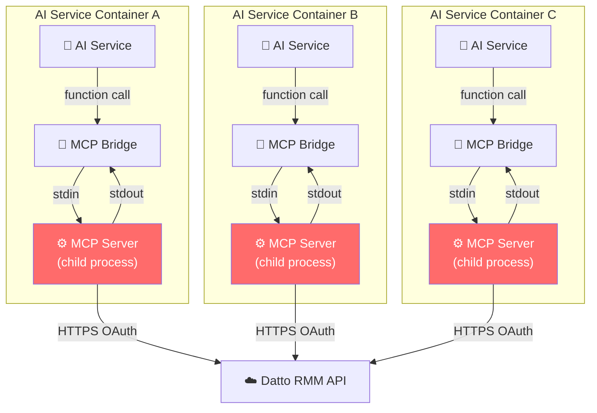
```mermaid
graph TD
    subgraph "AI Service Container A"
        AI_A["🤖 AI Service"]
        Bridge_A["🌉 MCP Bridge"]
        MCP_A["⚙️ MCP Server\n(child process)"]
        AI_A -->|"function call"| Bridge_A
        Bridge_A -->|"stdin"| MCP_A
        MCP_A -->|"stdout"| Bridge_A
    end

    subgraph "AI Service Container B"
        AI_B["🤖 AI Service"]
        Bridge_B["🌉 MCP Bridge"]
        MCP_B["⚙️ MCP Server\n(child process)"]
        AI_B -->|"function call"| Bridge_B
        Bridge_B -->|"stdin"| MCP_B
        MCP_B -->|"stdout"| Bridge_B
    end

    subgraph "AI Service Container C"
        AI_C["🤖 AI Service"]
        Bridge_C["🌉 MCP Bridge"]
        MCP_C["⚙️ MCP Server\n(child process)"]
        AI_C -->|"function call"| Bridge_C
        Bridge_C -->|"stdin"| MCP_C
        MCP_C -->|"stdout"| Bridge_C
    end

    MCP_A -->|"HTTPS OAuth"| Datto["☁️ Datto RMM API"]
    MCP_B -->|"HTTPS OAuth"| Datto
    MCP_C -->|"HTTPS OAuth"| Datto

    style MCP_A fill:#ff6b6b,color:#fff
    style MCP_B fill:#ff6b6b,color:#fff
    style MCP_C fill:#ff6b6b,color:#fff
```

> **3 AI containers = 3 MCP processes = 3 independent Datto OAuth sessions = 3 token caches = 3 connection pools.**
> Scale to 10 containers and you have 10 separate Datto API identities with no coordination between them.

#### The specific problems

| Problem | Detail |
|---|---|
| **Tight coupling** | The MCP server lives and dies with the MCP Bridge process. If the Bridge crashes, the MCP server is gone. If you want to restart the MCP server alone (e.g., to pick up a config change), you cannot — you must restart the entire Bridge and AI Service. |
| **No independent health check** | Kubernetes, load balancers, and uptime monitors work by polling an HTTP endpoint. A stdio process has no endpoint. The only way to know it is alive is to send it a message and wait — which is not how infrastructure health checks work. |
| **Uncoordinated scaling** | Every AI Service replica carries its own MCP server. Each one holds its own Datto OAuth token. There is no shared token cache. If Datto has per-account rate limits, 10 replicas burning 10 token slots will exhaust them faster and you have no central place to enforce rate limiting across instances. |
| **Observability gap** | Logs come out of stderr, captured by the parent process. There is no way to give the MCP server its own log stream, its own metrics endpoint, or its own tracing span without wrapping the entire stdio pipe. |
| **Security implicit, not explicit** | With stdio, the only thing that can talk to the MCP server is the process that spawned it. That is secure, but it is security by accident — an OS-level constraint, not a designed policy. It cannot be audited, cannot be expressed in a firewall rule, and cannot be enforced by a service mesh. |

---

### 8.2 The Chosen Design: HTTP Transport

The MCP Server runs as a **standalone HTTP service** on an internal port. The MCP Bridge is a simple HTTP client. MCP natively supports this via its `StreamableHTTPServerTransport`.

#### How it is deployed

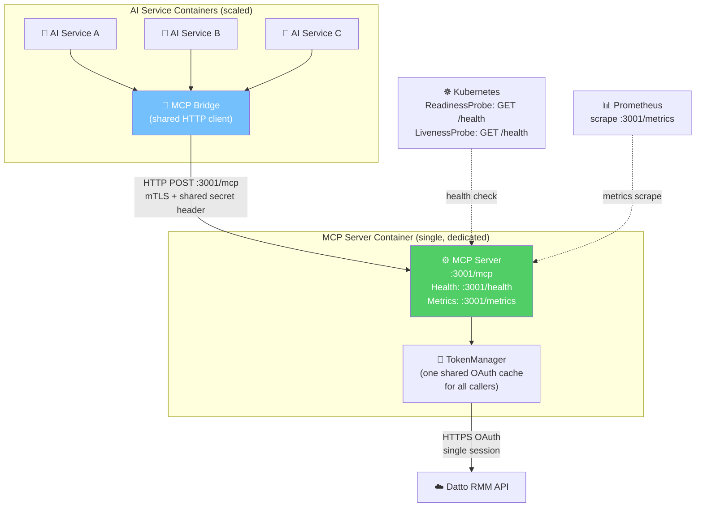
```mermaid
graph TD
    subgraph "AI Service Containers (scaled)"
        AI_A["🤖 AI Service A"]
        AI_B["🤖 AI Service B"]
        AI_C["🤖 AI Service C"]
        Bridge["🌉 MCP Bridge\n(shared HTTP client)"]
        AI_A --> Bridge
        AI_B --> Bridge
        AI_C --> Bridge
    end

    subgraph "MCP Server Container (single, dedicated)"
        MCP["⚙️ MCP Server\n:3001/mcp\nHealth: :3001/health\nMetrics: :3001/metrics"]
        TM["🔑 TokenManager\n(one shared OAuth cache\nfor all callers)"]
        MCP --> TM
    end

    Bridge -->|"HTTP POST :3001/mcp\nmTLS + shared secret header"| MCP
    TM -->|"HTTPS OAuth\nsingle session"| Datto["☁️ Datto RMM API"]

    K8s["☸️ Kubernetes\nReadinessProbe: GET /health\nLivenessProbe: GET /health"]
    K8s -.->|"health check"| MCP

    Prom["📊 Prometheus\nscrape :3001/metrics"]
    Prom -.->|"metrics scrape"| MCP

    style MCP fill:#51cf66,color:#fff
    style Bridge fill:#74c0fc,color:#fff
```

> **All AI containers share one MCP server. One OAuth session. One token cache. One place to monitor. One place to restart.**

---

### 8.3 Side-by-Side Flow Comparison

#### stdio (rejected)

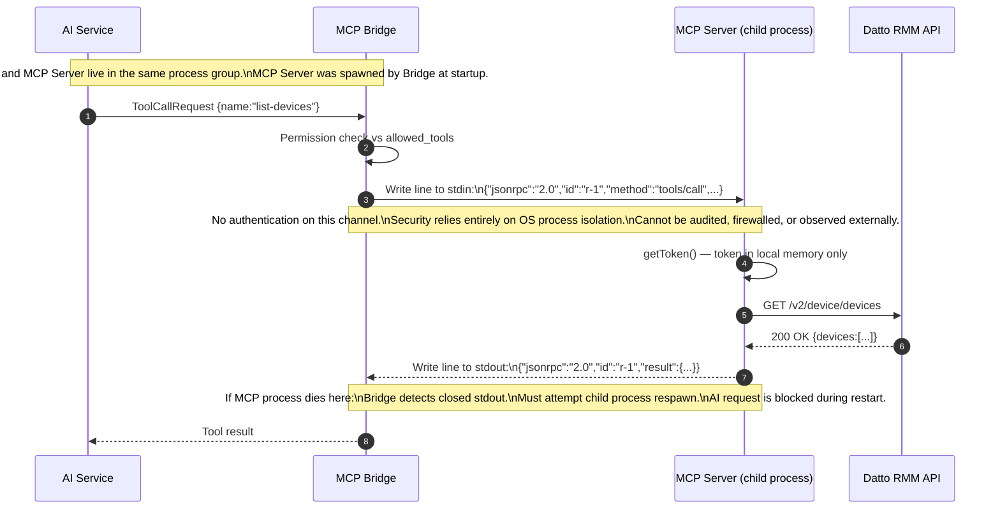
```mermaid
sequenceDiagram
    autonumber
    participant AI as AI Service
    participant Bridge as MCP Bridge
    participant MCP as MCP Server (child process)
    participant Datto as Datto RMM API

    note over AI,Bridge: Bridge and MCP Server live in the same process group.\nMCP Server was spawned by Bridge at startup.

    AI->>Bridge: ToolCallRequest {name:"list-devices"}
    Bridge->>Bridge: Permission check vs allowed_tools

    Bridge->>MCP: Write line to stdin:\n{"jsonrpc":"2.0","id":"r-1","method":"tools/call",...}
    note over Bridge,MCP: No authentication on this channel.\nSecurity relies entirely on OS process isolation.\nCannot be audited, firewalled, or observed externally.

    MCP->>MCP: getToken() — token in local memory only
    MCP->>Datto: GET /v2/device/devices
    Datto-->>MCP: 200 OK {devices:[...]}

    MCP-->>Bridge: Write line to stdout:\n{"jsonrpc":"2.0","id":"r-1","result":{...}}
    note over Bridge,MCP: If MCP process dies here:\nBridge detects closed stdout.\nMust attempt child process respawn.\nAI request is blocked during restart.

    Bridge-->>AI: Tool result
```

#### HTTP transport (chosen)

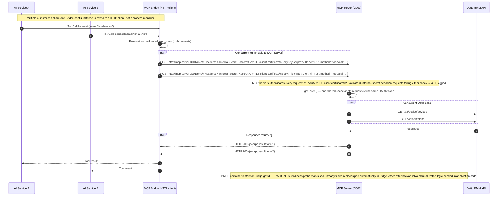
```mermaid
sequenceDiagram
    autonumber
    participant AI_A as AI Service A
    participant AI_B as AI Service B
    participant Bridge as MCP Bridge (HTTP client)
    participant MCP as MCP Server (:3001)
    participant Datto as Datto RMM API

    note over AI_A,Bridge: Multiple AI instances share one Bridge config.\nBridge is now a thin HTTP client, not a process manager.

    AI_A->>Bridge: ToolCallRequest {name:"list-devices"}
    AI_B->>Bridge: ToolCallRequest {name:"list-alerts"}
    Bridge->>Bridge: Permission check vs allowed_tools (both requests)

    par Concurrent HTTP calls to MCP Server
        Bridge->>MCP: POST http://mcp-server:3001/mcp\nHeaders: X-Internal-Secret: <secret>\nmTLS client certificate\nBody: {"jsonrpc":"2.0","id":"r-1","method":"tools/call",...}
    and
        Bridge->>MCP: POST http://mcp-server:3001/mcp\nHeaders: X-Internal-Secret: <secret>\nmTLS client certificate\nBody: {"jsonrpc":"2.0","id":"r-2","method":"tools/call",...}
    end

    note over MCP: MCP Server authenticates every request:\n1. Verify mTLS client certificate\n2. Validate X-Internal-Secret header\nRequests failing either check → 401, logged

    MCP->>MCP: getToken() — one shared cache\nboth requests reuse same OAuth token
    par Concurrent Datto calls
        MCP->>Datto: GET /v2/device/devices
        MCP->>Datto: GET /v2/alert/alerts
    end
    Datto-->>MCP: responses

    par Responses returned
        MCP-->>Bridge: HTTP 200 {jsonrpc result for r-1}
        MCP-->>Bridge: HTTP 200 {jsonrpc result for r-2}
    end

    Bridge-->>AI_A: Tool result
    Bridge-->>AI_B: Tool result

    note over MCP: If MCP container restarts:\nBridge gets HTTP 503.\nK8s readiness probe marks pod unready.\nK8s replaces pod automatically.\nBridge retries after backoff.\nNo manual restart logic needed in application code.
```

---

### 8.4 Security: stdio vs HTTP

HTTP introduces a network port that stdio never had. The following controls lock it down, and the trade produces a net security improvement.

#### Comparison

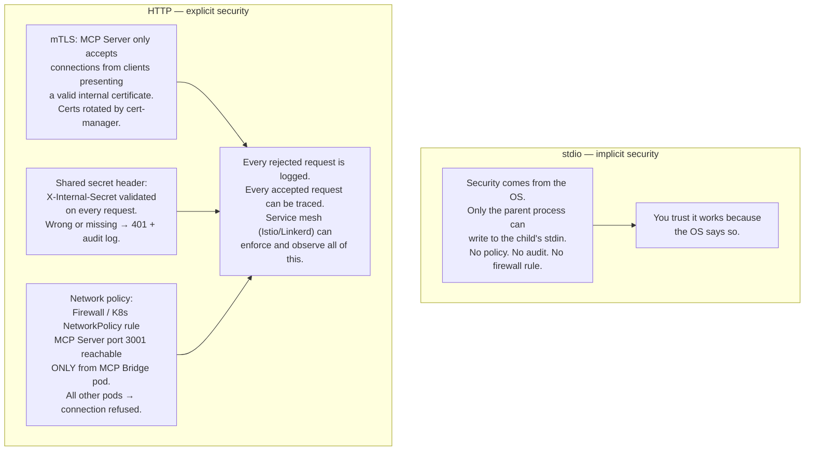
```mermaid
flowchart TD
    subgraph "stdio — implicit security"
        S1["Security comes from the OS.\nOnly the parent process can\nwrite to the child's stdin.\nNo policy. No audit. No firewall rule."]
        S2["You trust it works because\nthe OS says so."]
        S1 --> S2
    end

    subgraph "HTTP — explicit security"
        H1["mTLS: MCP Server only accepts\nconnections from clients presenting\na valid internal certificate.\nCerts rotated by cert-manager."]
        H2["Shared secret header:\nX-Internal-Secret validated\non every request.\nWrong or missing → 401 + audit log."]
        H3["Network policy:\nFirewall / K8s NetworkPolicy rule\nMCP Server port 3001 reachable\nONLY from MCP Bridge pod.\nAll other pods → connection refused."]
        H4["Every rejected request is logged.\nEvery accepted request can be traced.\nService mesh (Istio/Linkerd) can\nenforce and observe all of this."]
        H1 --> H4
        H2 --> H4
        H3 --> H4
    end
```

| Security property | stdio | HTTP transport |
|---|---|---|
| **Authentication** | None — OS process boundary only | mTLS certificate + shared secret header on every request |
| **Authorization** | Implicit — only parent can write stdin | Explicit — NetworkPolicy restricts which pods can reach port 3001 |
| **Auditability** | Cannot log "who called this" — there is only one caller by definition | Every HTTP request logged with caller identity, timestamp, tool name, response code |
| **Observability** | stderr captured by parent, no metrics | `/metrics` endpoint scraped by Prometheus; request rate, error rate, latency tracked |
| **Firewall enforcement** | Not possible — IPC, not network | Kubernetes NetworkPolicy blocks all pods except MCP Bridge from port 3001 |
| **Certificate rotation** | N/A | Automatic via cert-manager; zero-downtime rotation |
| **Secret rotation** | Restart process to pick up new env vars | Rolling restart of MCP Server container; Bridge continues to function during rollout |

#### The network port — locked down at three layers

The MCP Server now has a network port. It is only reachable from the MCP Bridge.

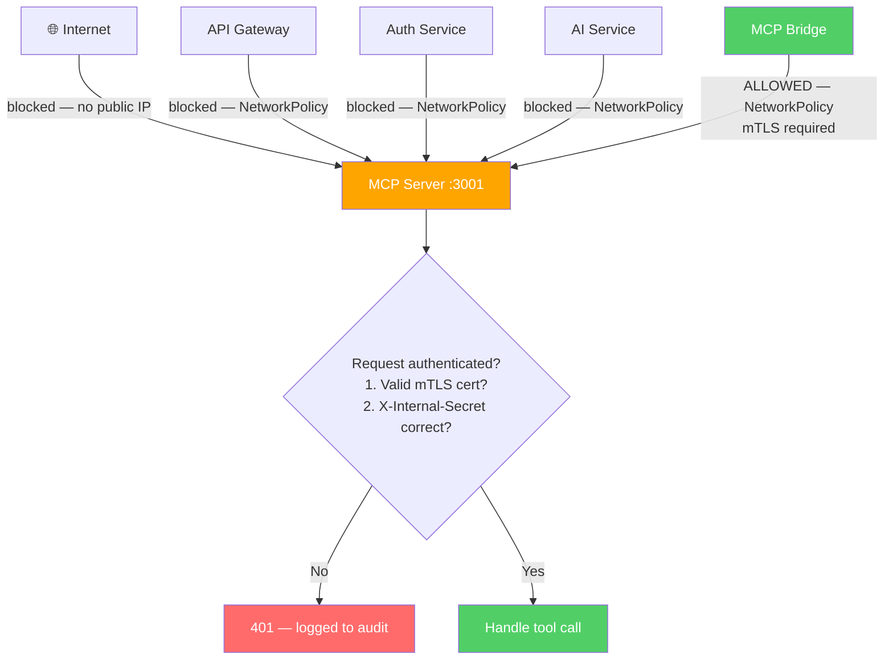
```mermaid
flowchart TD
    Internet["🌐 Internet"] -->|"blocked — no public IP"| MCPPort["MCP Server :3001"]
    APISIX["API Gateway"] -->|"blocked — NetworkPolicy"| MCPPort
    AuthSvc["Auth Service"] -->|"blocked — NetworkPolicy"| MCPPort
    AISvc["AI Service"] -->|"blocked — NetworkPolicy"| MCPPort
    Bridge["MCP Bridge"] -->|"ALLOWED — NetworkPolicy\nmTLS required"| MCPPort

    MCPPort --> Check{"Request authenticated?\n1. Valid mTLS cert?\n2. X-Internal-Secret correct?"}
    Check -- "No" --> Reject["401 — logged to audit"]
    Check -- "Yes" --> Handle["Handle tool call"]

    style MCPPort fill:#ffa500,color:#fff
    style Bridge fill:#51cf66,color:#fff
    style Reject fill:#ff6b6b,color:#fff
    style Handle fill:#51cf66,color:#fff
```

The rule is: **the port must exist, but only one thing in the entire cluster is allowed to reach it.** That is enforced at three levels simultaneously:

1. **Kubernetes NetworkPolicy** — pod-level firewall rule, enforced by the CNI plugin (Cilium/Calico). Drops packets from any pod that is not the MCP Bridge before they even reach the MCP Server container.
2. **mTLS** — even if somehow a packet gets through, the TLS handshake fails without a valid client certificate issued by the internal CA.
3. **Shared secret header** — final application-level check. Belt, braces, and a third belt.

---

### 8.5 What Changes in the Codebase

| Component | stdio version | HTTP version |
|---|---|---|
| **MCP Bridge** | Spawns child process, manages stdin/stdout pipes, monitors `exit` event, handles respawn logic | HTTP client only: `POST /mcp` with JSON-RPC body, read response. ~80% less code. |
| **MCP Server** | Starts with `StdioServerTransport`, reads stdin, writes stdout | Starts with `StreamableHTTPServerTransport` (or SSEServerTransport), listens on `:3001`, exposes `/health` and `/metrics` |
| **Deployment** | MCP Server has no deployment manifest — it is embedded inside the AI Service container | MCP Server gets its own `Deployment`, `Service`, and `NetworkPolicy` manifest |
| **Health checks** | Application-level ping-pong over stdin | `GET /health` returns `200 OK` — Kubernetes readiness and liveness probes use this natively |
| **Restart logic** | Bridge code manually handles 3-retry backoff and respawn | Kubernetes restarts the MCP pod automatically on failure; Bridge just retries the HTTP call after a 503 |
| **Config/secrets** | Env vars injected into the combined AI Service container | Env vars injected into the MCP Server container only — AI Service container has zero visibility of Datto credentials |

> The last row is a security improvement beyond just transport. With stdio, the Datto credentials (`DATTO_API_KEY`, `DATTO_API_SECRET`) had to be present in the same container environment as the AI Service and Bridge. With HTTP transport and separate containers, those credentials are **only ever present in the MCP Server container**. The AI Service container literally cannot read them even if its code was compromised.

---

## 9 Vector Search

Vector search allows the AI to retrieve semantically relevant past conversations and RMM context before generating a response. It is powered by the **pgvector** extension inside the existing PostgreSQL instance — no separate vector database is required.

### 9.1 What Vector Search Does

When a user sends a message, the raw text is not enough context on its own. A user asking "show me offline devices" may have asked a very similar question last week with specific site filters that refined the answer. Without vector search the AI starts fresh every time. With it, semantically similar past interactions are surfaced and injected into the prompt as additional context.

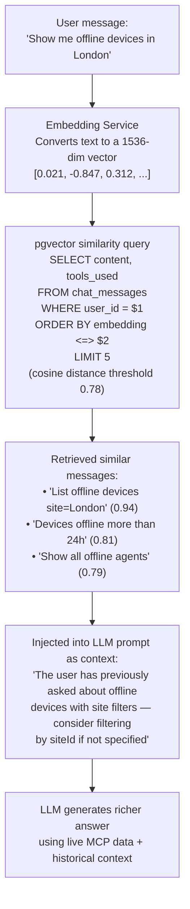
```mermaid
flowchart TD
    A["User message:\n'Show me offline devices in London'"]
    B["Embedding Service\nConverts text to a 1536-dim vector\n[0.021, -0.847, 0.312, ...]"]
    C["pgvector similarity query\nSELECT content, tools_used\nFROM chat_messages\nWHERE user_id = $1\nORDER BY embedding <=> $2\nLIMIT 5\n(cosine distance threshold 0.78)"]
    D["Retrieved similar messages:\n• 'List offline devices site=London' (0.94)\n• 'Devices offline more than 24h' (0.81)\n• 'Show all offline agents' (0.79)"]
    E["Injected into LLM prompt as context:\n'The user has previously asked about offline\ndevices with site filters — consider filtering\nby siteId if not specified'"]
    F["LLM generates richer answer\nusing live MCP data + historical context"]

    A --> B --> C --> D --> E --> F
```

### 9.2 What Gets Embedded

| Content | When embedded | Stored in |
|---|---|---|
| User chat messages | After each message is saved | `chat_messages.embedding` |
| Assistant responses | After each response is saved | `chat_messages.embedding` |
| Tool results (summary) | Optionally, for frequently reused data | `chat_messages.embedding` |

Only the **user's own messages** are searched — there is no cross-user leakage. The vector query always includes `WHERE user_id = $1`.

### 9.3 Embedding Flow

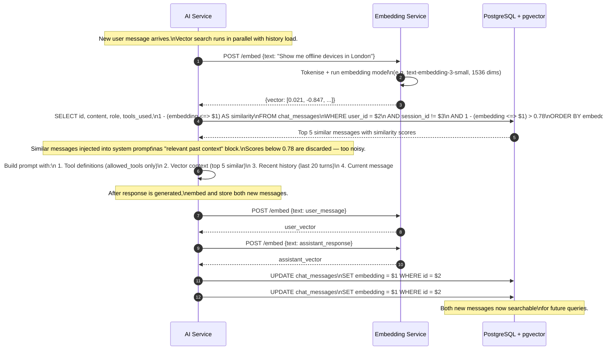
```mermaid
sequenceDiagram
    autonumber
    participant AI as AI Service
    participant Embed as Embedding Service
    participant DB as PostgreSQL + pgvector

    note over AI: New user message arrives.\nVector search runs in parallel with history load.

    AI->>Embed: POST /embed {text: "Show me offline devices in London"}
    Embed->>Embed: Tokenise + run embedding model\n(e.g. text-embedding-3-small, 1536 dims)
    Embed-->>AI: {vector: [0.021, -0.847, ...]}

    AI->>DB: SELECT id, content, role, tools_used,\n1 - (embedding <=> $1) AS similarity\nFROM chat_messages\nWHERE user_id = $2\n  AND session_id != $3\n  AND 1 - (embedding <=> $1) > 0.78\nORDER BY embedding <=> $1\nLIMIT 5
    DB-->>AI: Top 5 similar messages with similarity scores

    note over AI: Similar messages injected into system prompt\nas "relevant past context" block.\nScores below 0.78 are discarded — too noisy.

    AI->>AI: Build prompt with:\n  1. Tool definitions (allowed_tools only)\n  2. Vector context (top 5 similar)\n  3. Recent history (last 20 turns)\n  4. Current message

    note over AI: After response is generated,\nembed and store both new messages.

    AI->>Embed: POST /embed {text: user_message}
    Embed-->>AI: user_vector
    AI->>Embed: POST /embed {text: assistant_response}
    Embed-->>AI: assistant_vector

    AI->>DB: UPDATE chat_messages\nSET embedding = $1 WHERE id = $2
    AI->>DB: UPDATE chat_messages\nSET embedding = $1 WHERE id = $2
    note over DB: Both new messages now searchable\nfor future queries.
```

### 9.4 pgvector Schema

The `chat_messages` table gains one column:

```sql
-- Enable extension (once per database)
CREATE EXTENSION IF NOT EXISTS vector;

-- Add embedding column to chat_messages
ALTER TABLE chat_messages
  ADD COLUMN embedding vector(1536);

-- HNSW index for approximate nearest-neighbour search (SEC-014, db/014_hnsw_index.sql)
-- HNSW has no rebuild requirement and maintains recall quality as the table grows.
-- m=16: connections per layer; ef_construction=64: build-time quality/speed trade-off.
CREATE INDEX chat_messages_embedding_idx
  ON chat_messages
  USING hnsw (embedding vector_cosine_ops)
  WITH (m = 16, ef_construction = 64);
```

**Index type choice:**

| Index | Speed | Accuracy | When to use |
|---|---|---|---|
| `ivfflat` | Fast | ~95% recall | Legacy — requires periodic REINDEX as table grows |
| `hnsw` | Faster | ~99% recall | **Current** — no rebuild requirement, better at scale |
| None (exact) | Slow | 100% | Only for tables under ~50k rows |

The platform uses **HNSW** (migration `db/014_hnsw_index.sql`, SEC-014). HNSW has no rebuild requirement and maintains query quality as the table grows — unlike IVFFlat which degrades without periodic `REINDEX`.

### 9.5 Similarity Threshold

The query uses a cosine similarity threshold of **0.78**. This was chosen to balance relevance against noise:

```
Score 1.00 = identical text
Score 0.90+ = very similar question, same topic and intent
Score 0.78–0.90 = related topic, worth including as context
Score below 0.78 = too different — excluded, would confuse the model
```

This threshold is configurable via an environment variable and can be tuned per deployment without a code change.

### 9.6 Privacy and Isolation

- Every vector query is scoped to `user_id = $1` — users cannot retrieve each other's history.
- Embeddings are mathematical representations of text. They cannot be reversed to recover the original message reliably, but should still be treated as sensitive data — they carry signal about what a user has queried.
- On account deletion, all `chat_messages` rows (including embeddings) are hard-deleted. This is enforced by a `DELETE CASCADE` from `users`.

---

## 10 Security Model

### 10.1 JWT Authentication

All requests to the platform must carry a valid JWT in the `Authorization: Bearer <token>` header.

**Validation steps performed by the API Gateway on every request:**

1. Extract token from `Authorization` header — reject `400` if missing.
2. Decode header — verify `alg` is `RS256` — reject anything else.
3. Verify signature against the Auth Service public key — reject `401` if invalid.
4. Check `exp` claim — reject `401` with `"token_expired"` if stale.
5. Check `nbf` claim if present — reject `401` if not yet valid.
6. **Check `jti` claim against Redis revocation set** — if `EXISTS revoked_jtis:<jti>` returns 1, reject `401` immediately (SEC-002).
7. Extract `user_id` and `allowed_tools` from payload — attach to forwarded request context.

**JTI revocation (SEC-002):**
- Every access token now carries a `jti: uuid` claim set at signing time in `auth-service/src/tokens.ts`.
- `auth-service/src/redis.ts` tracks issued JTIs per user in a Redis sorted set (`user_jtis:<userId>`) and writes revoked JTIs to `revoked_jtis:<jti>` (TTL = token expiry, 1h).
- APISIX Lua `serverless-post-function` checks the revocation set via `resty.redis` on every protected request — fail-open (Redis unavailable) during rollout.
- `POST /auth/revoke` in Auth Service revokes a single JTI or all active JTIs for a user (forced-revoke, SEC-008).

The public key is distributed to the API Gateway at deploy time. The Auth Service private key never leaves the Auth Service container.

**Token lifecycle:**

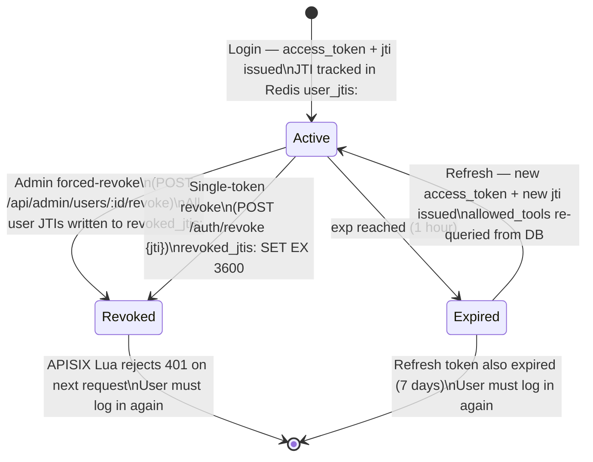
```mermaid
stateDiagram-v2
    [*] --> Active: Login — access_token + jti issued\nJTI tracked in Redis user_jtis:<userId>
    Active --> Expired: exp reached (1 hour)
    Expired --> Active: Refresh — new access_token + new jti issued\nallowed_tools re-queried from DB
    Active --> Revoked: Admin forced-revoke\n(POST /api/admin/users/:id/revoke)\nAll user JTIs written to revoked_jtis:<jti>
    Active --> Revoked: Single-token revoke\n(POST /auth/revoke {jti})\nrevoked_jtis:<jti> SET EX 3600
    Revoked --> [*]: APISIX Lua rejects 401 on next request\nUser must log in again
    Expired --> [*]: Refresh token also expired (7 days)\nUser must log in again
```

### 10.2 RBAC Tool Filtering — Three Layers

The tool permission system is enforced at three independent layers. All three must pass for a tool call to succeed.

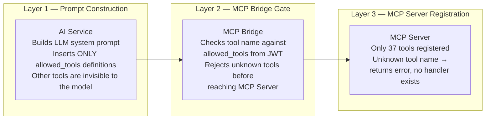
```mermaid
flowchart LR
    subgraph "Layer 1 — Prompt Construction"
        P1["AI Service\nBuilds LLM system prompt\nInserts ONLY allowed_tools definitions\nOther tools are invisible to the model"]
    end
    subgraph "Layer 2 — MCP Bridge Gate"
        P2["MCP Bridge\nChecks tool name against\nallowed_tools from JWT\nRejects unknown tools before\nreaching MCP Server"]
    end
    subgraph "Layer 3 — MCP Server Registration"
        P3["MCP Server\nOnly 37 tools registered\nUnknown tool name →\nreturns error, no handler exists"]
    end
    P1 --> P2 --> P3
```

| Layer | Enforced by | What it stops |
|---|---|---|
| Prompt construction | AI Service | Model never learns about tools it cannot use — cannot attempt to call them |
| MCP Bridge check | MCP Bridge | Defence-in-depth — catches any hallucinated or injected tool names |
| MCP Server registration | MCP Server | Absolute floor — even a compromised bridge cannot invoke a non-existent tool |

**Role-to-tool mapping:**

```
admin     → all 37 tools
analyst   → list-devices, get-device, list-sites, get-site,
            list-alerts, get-alert, list-jobs, get-job,
            get-activity-logs
helpdesk  → list-devices, get-device,
            list-alerts, get-alert
readonly  → list-sites, get-system-status, get-rate-limit,
            get-pagination-config
```

### 10.3 API Gateway Enforcement

Apache APISIX acts as the security perimeter and is the only component reachable from the public internet.

| Capability | Configuration |
|---|---|
| **TLS termination** | All external traffic HTTPS only; internal service-to-service traffic uses mTLS |
| **JWT plugin** | Validates RS256 signature and expiry on every non-login request |
| **Rate limiting** | Per-user sliding-window rate limit (e.g., 60 requests/min); per-IP limit for unauthenticated endpoints |
| **Request size limit** | Chat messages capped at 32 KB to prevent prompt injection via oversized input |
| **IP allowlisting** | Optional; restrict `/admin` routes to corporate IP ranges |
| **Route isolation** | Internal services have no public DNS or public IP; APISIX is the sole ingress |
| **CORS** | Restricted to known browser origin(s) |
| **Security headers** | `Strict-Transport-Security`, `X-Frame-Options`, `Content-Security-Policy` injected on all responses |

### 10.4 Datto Credential Isolation

The Datto API credentials (`DATTO_API_KEY`, `DATTO_API_SECRET`) are held **exclusively** by the MCP Server container.

- Credentials are injected via Kubernetes `Secret` as environment variables into the MCP Server container only — they are never stored in the database, never transmitted over any internal network call, and never logged.
- Because the MCP Server is now a **separate container** (HTTP transport), the AI Service and MCP Bridge containers have **zero visibility** of these credentials — they are not even present in those containers' environments. This is a direct security improvement over the stdio design, where all three components shared one container.
- The MCP Server is **read-only by design** — it registers only GET tools. There are no create, update, or delete endpoints reachable from within the platform.
- Datto OAuth access tokens obtained from the Datto token endpoint are cached **in-memory only** (the `TokenManager` class inside the MCP Server). They are never written to disk, to PostgreSQL, or to any shared cache.
- If the MCP Server container is compromised, the attacker gains read-only access to Datto RMM data via the 37 registered tools. They cannot mutate RMM state and cannot access platform user data (which lives in PostgreSQL, entirely separate from the MCP Server).

---

## 11 Data Storage

All persistent state is held in **PostgreSQL with the pgvector extension**. No separate vector database is required — pgvector adds a native `vector` column type and approximate nearest-neighbour index support directly inside PostgreSQL. Redis is used only as an ephemeral cache for rate-limit counters in the API Gateway.

### 11.1 Schema Overview

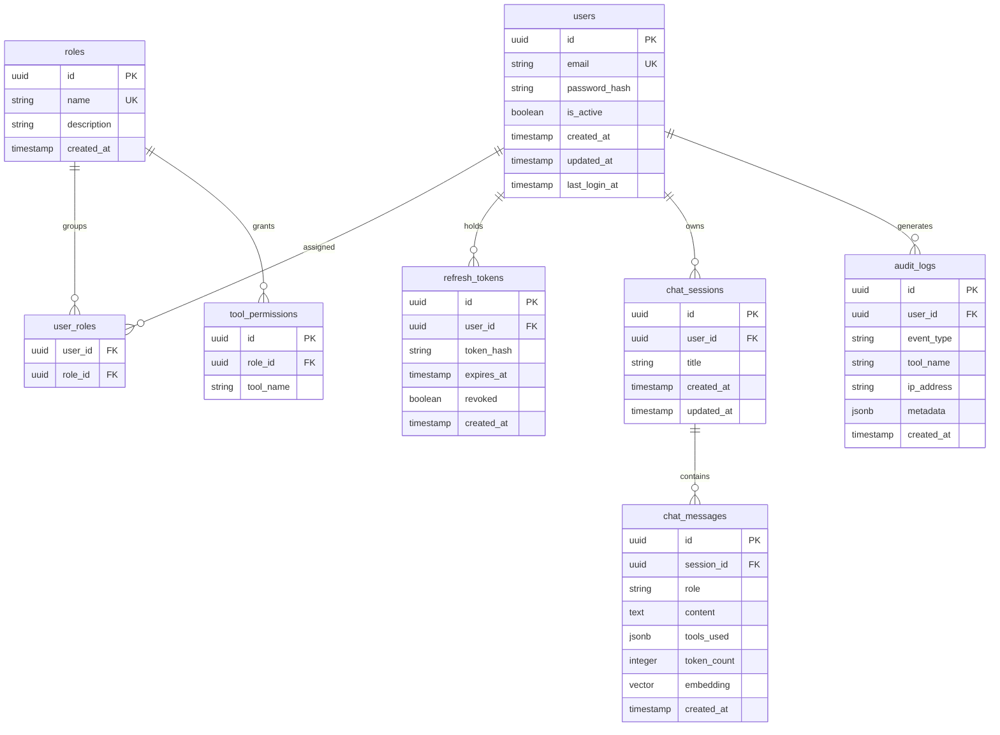
```mermaid
erDiagram
    users {
        uuid id PK
        string email UK
        string password_hash
        boolean is_active
        timestamp created_at
        timestamp updated_at
        timestamp last_login_at
    }

    roles {
        uuid id PK
        string name UK
        string description
        timestamp created_at
    }

    user_roles {
        uuid user_id FK
        uuid role_id FK
    }

    tool_permissions {
        uuid id PK
        uuid role_id FK
        string tool_name
    }

    refresh_tokens {
        uuid id PK
        uuid user_id FK
        string token_hash
        timestamp expires_at
        boolean revoked
        timestamp created_at
    }

    chat_sessions {
        uuid id PK
        uuid user_id FK
        string title
        timestamp created_at
        timestamp updated_at
    }

    chat_messages {
        uuid id PK
        uuid session_id FK
        string role
        text content
        jsonb tools_used
        integer token_count
        vector embedding
        timestamp created_at
    }

    audit_logs {
        uuid id PK
        uuid user_id FK
        string event_type
        string tool_name
        string ip_address
        jsonb metadata
        timestamp created_at
    }

    users ||--o{ user_roles : "assigned"
    roles ||--o{ user_roles : "groups"
    roles ||--o{ tool_permissions : "grants"
    users ||--o{ refresh_tokens : "holds"
    users ||--o{ chat_sessions : "owns"
    chat_sessions ||--o{ chat_messages : "contains"
    users ||--o{ audit_logs : "generates"
```

### 11.2 Table Descriptions

**`users`** — Platform user accounts. Passwords stored as bcrypt hashes (cost factor 12). `is_active = false` suspends the account without deleting history — suspended users are rejected at login but their audit history is preserved.

**`roles`** — Named permission groups (`admin`, `analyst`, `helpdesk`, `readonly`). Custom roles can be added. Role names are immutable once created to prevent permission drift.

**`user_roles`** — Many-to-many join between users and roles. A user may hold multiple roles; their effective tool list is the union of all tool permissions across all assigned roles.

**`tool_permissions`** — The **source of truth** for RBAC. Each row grants a specific `tool_name` to a `role_id`. Adding a row here adds the tool to that role; deleting the row removes it. This table is read at login and token refresh time to compute the `allowed_tools` JWT claim.

**`refresh_tokens`** — Stores hashes (not plaintext) of issued refresh tokens. The `revoked` flag allows immediate invalidation without waiting for expiry. Expired and revoked rows are purged by a nightly job.

**`chat_sessions`** — Groups messages into a named conversation. One user may have many sessions. `title` is auto-generated from the first message or set by the user.

**`chat_messages`** — Individual turns. `role` is `user` or `assistant`. `tools_used` is a JSONB array recording each tool call made during that turn: `[{"name": "list-alerts", "args": {"max": 50}, "result_count": 12}]`. `token_count` records LLM token usage for billing/quota tracking. `embedding` is a 1536-dimensional float vector generated by the Embedding Service immediately after the message is saved — used for vector similarity search on future queries.

**`audit_logs`** — Append-only immutable event log. Event types include:

| event_type | Trigger |
|---|---|
| `login_success` | Successful authentication |
| `login_failure` | Failed login attempt |
| `token_refresh` | Access token refreshed |
| `token_revoked` | Admin or system revoked a token |
| `tool_call` | MCP tool invoked successfully |
| `tool_denied` | Tool call blocked by RBAC |
| `tool_error` | Tool call returned `isError: true` |
| `mcp_restart` | MCP Server container restarted (Kubernetes or manual) |

Audit rows are never updated or deleted. After 90 days, rows are archived to cold storage (e.g., S3 Parquet files) and deleted from PostgreSQL.

---

## 12 Event Streaming

The platform uses **Server-Sent Events (SSE)** to stream AI-generated responses token-by-token to the browser. This eliminates long HTTP timeouts, provides a responsive chat experience, and allows the UI to show tool-call progress as it happens.

### 12.1 How SSE Works in This Platform

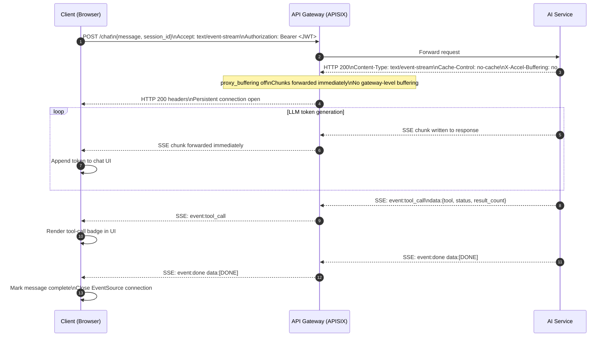
```mermaid
sequenceDiagram
    autonumber
    participant Browser as Client (Browser)
    participant GW as API Gateway (APISIX)
    participant AI as AI Service

    Browser->>GW: POST /chat\n{message, session_id}\nAccept: text/event-stream\nAuthorization: Bearer <JWT>

    GW->>AI: Forward request
    AI-->>GW: HTTP 200\nContent-Type: text/event-stream\nCache-Control: no-cache\nX-Accel-Buffering: no

    note over GW: proxy_buffering off\nChunks forwarded immediately\nNo gateway-level buffering

    GW-->>Browser: HTTP 200 headers\nPersistent connection open

    loop LLM token generation
        AI-->>GW: SSE chunk written to response
        GW-->>Browser: SSE chunk forwarded immediately
        Browser->>Browser: Append token to chat UI
    end

    AI-->>GW: SSE: event:tool_call\ndata:{tool, status, result_count}
    GW-->>Browser: SSE: event:tool_call
    Browser->>Browser: Render tool-call badge in UI

    AI-->>GW: SSE: event:done data:[DONE]
    GW-->>Browser: SSE: event:done data:[DONE]
    Browser->>Browser: Mark message complete\nClose EventSource connection
```

### 12.2 SSE Event Format

Each event is a block of lines ending with a blank line:

```
id: evt-0001
event: delta
data: {"delta": "I found ", "session_id": "sess-abc"}

id: evt-0002
event: delta
data: {"delta": "12 open alerts", "session_id": "sess-abc"}

id: evt-0003
event: tool_call
data: {"tool": "list-alerts", "status": "success", "result_count": 12, "duration_ms": 340}

id: evt-0004
event: delta
data: {"delta": ". The highest priority one is...", "session_id": "sess-abc"}

id: evt-0005
event: done
data: [DONE]
```

### 12.3 Event Types

| Event | Payload | UI action |
|---|---|---|
| `delta` | `{delta: string, session_id}` | Append text to message bubble |
| `tool_call` | `{tool, status, result_count, duration_ms}` | Show tool-call badge with status |
| `tool_error` | `{tool, error_message}` | Show tool-call badge with error state |
| `error` | `{message, code}` | Show inline error in chat UI |
| `done` | `[DONE]` | Finalize message, save to history, close connection |

### 12.4 Reconnection Handling

The browser `EventSource` API automatically reconnects if the connection drops. The `id` field on each event allows the browser to send a `Last-Event-ID` header on reconnect. The AI Service checks this header: if the session is still in memory, it resumes streaming from that point; otherwise it sends a `error` event indicating the response must be re-requested.

### 12.5 API Gateway Configuration for SSE

```yaml
# APISIX route configuration for /chat
upstream:
  keepalive: 32
plugins:
  proxy-rewrite:
    headers:
      X-Accel-Buffering: "no"
  response-rewrite:
    headers:
      Cache-Control: "no-cache"
# Nginx directive required in apisix.conf:
# proxy_buffering off;
# proxy_read_timeout 120s;
# proxy_send_timeout 120s;
```

---

## 13 Failure Handling

### 13.1 Invalid JWT

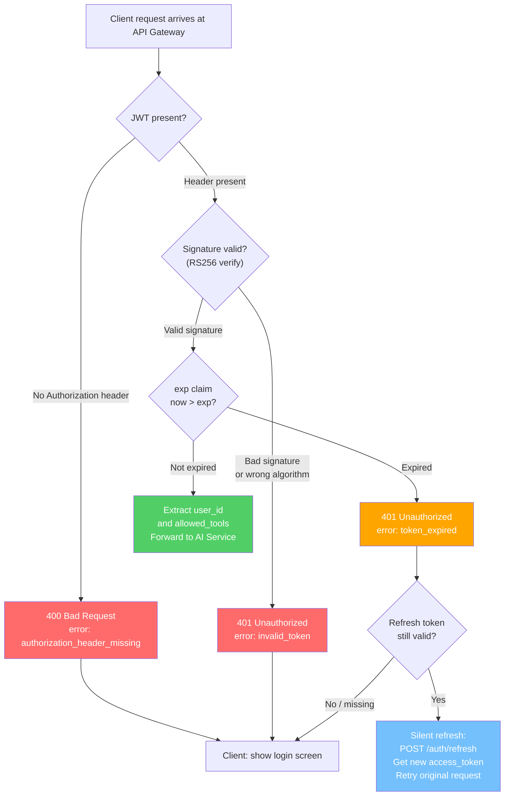
```mermaid
flowchart TD
    A["Client request arrives at API Gateway"] --> B{"JWT present?"}
    B -- "No Authorization header" --> E1["400 Bad Request\nerror: authorization_header_missing"]
    B -- "Header present" --> C{"Signature valid?\n(RS256 verify)"}
    C -- "Bad signature\nor wrong algorithm" --> E2["401 Unauthorized\nerror: invalid_token"]
    C -- "Valid signature" --> D{"exp claim\nnow > exp?"}
    D -- "Expired" --> E3["401 Unauthorized\nerror: token_expired"]
    D -- "Not expired" --> F["Extract user_id\nand allowed_tools\nForward to AI Service"]

    E1 --> G["Client: show login screen"]
    E2 --> G
    E3 --> H{"Refresh token\nstill valid?"}
    H -- "Yes" --> I["Silent refresh:\nPOST /auth/refresh\nGet new access_token\nRetry original request"]
    H -- "No / missing" --> G

    style E1 fill:#ff6b6b,color:#fff
    style E2 fill:#ff6b6b,color:#fff
    style E3 fill:#ffa500,color:#fff
    style F fill:#51cf66,color:#fff
    style I fill:#74c0fc,color:#fff
```

- `400` / `401` errors are returned before any internal service is reached — the gateway absorbs the load.
- All failed attempts (invalid signature, expired) are written to `audit_logs` with the source IP and user agent.
- The client stores access tokens in memory only. On page refresh the user must re-authenticate (or use a valid refresh token from the HttpOnly cookie).

### 13.2 Tool Permission Denial

```mermaid
flowchart TD
    A["AI Service determines tool call needed\ne.g. tool: get-audit-log"] --> B{"Is get-audit-log\nin allowed_tools from JWT?"}

    B -- "NO — tool not in prompt anyway\nbut bridge checks regardless" --> C["MCP Bridge rejects request\nDoes not forward to MCP Server"]
    C --> D["Bridge returns to AI:\nerror: tool_not_permitted"]
    D --> E["AI generates response:\nYou do not have access to audit log data.\nContact your administrator to request access."]
    E --> F["Response streamed to client via SSE"]
    C --> G["INSERT audit_logs\nevent: tool_denied\nuser_id, tool: get-audit-log,\ntimestamp, session_id"]

    B -- "YES — tool is permitted" --> H["Forward to MCP Server\nnormal execution path"]

    style C fill:#ff6b6b,color:#fff
    style H fill:#51cf66,color:#fff
```

**Why this branch rarely triggers:** The AI Service only inserts tool definitions for `allowed_tools` into the system prompt. The model never learns about `get-audit-log` if it is not in the user's list — it cannot choose to call something that was never described to it. The MCP Bridge check is a defence-in-depth safety net.

### 13.3 Datto API Errors

```mermaid
flowchart TD
    A["MCP Server calls Datto API"] --> B{"Response status"}

    B -- "200 OK" --> OK["Return HTTP 200 JSON-RPC result\nto Bridge"]

    B -- "401 Unauthorized\n(OAuth token expired)" --> R["Invalidate cached token\nFetch new token via OAuth\nRetry request ONCE"]
    R --> R2{"Retry succeeded?"}
    R2 -- "Yes" --> OK
    R2 -- "No" --> ERR

    B -- "429 Too Many Requests" --> RL["Return isError: true\nmessage includes Retry-After value"]
    B -- "5xx Server Error" --> ERR["Return isError: true\nwith HTTP status code"]
    B -- "Network timeout\n(30s)" --> TO["Return isError: true\nmessage: request timed out"]

    RL --> AI
    ERR --> AI
    TO --> AI

    AI["AI Service receives isError: true\nContinues generation with error context"]
    AI --> MSG["AI tells user:\nDatto API is currently unavailable\nor rate limited — try again shortly"]
    MSG --> SSE["Error message streamed to client"]
    AI --> LOG["INSERT audit_logs\nevent: tool_error\ndetails: {status, message}"]

    style OK fill:#51cf66,color:#fff
    style ERR fill:#ff6b6b,color:#fff
    style RL fill:#ffa500,color:#fff
```

The MCP Server never throws an unhandled exception on API errors. Every `try/catch` block returns an `isError: true` JSON-RPC result in the HTTP response body. The Bridge and AI Service always receive a structured response — the MCP container stays running.

### 13.4 MCP Server Failures

```mermaid
flowchart TD
    A["MCP Bridge sends\nHTTP POST to mcp-server:3001/mcp"] --> B{"HTTP response?"}

    B -- "200 OK" --> NORM["Normal execution path\nReturn result to AI"]

    B -- "503 Service Unavailable\nor connection refused" --> C["MCP Server container is down\nor restarting"]
    C --> D["Kubernetes detects unhealthy pod\nvia GET /health liveness probe\nMarks pod for restart"]
    D --> E["Bridge: HTTP 503 received\nRetry after 1s backoff\n(standard HTTP client retry)"]
    E --> F{"MCP back up?\nGET /health = 200?"}
    F -- "Yes — K8s restarted pod" --> G["Retry original tool call\nResume normal operation\nNo application-level restart code needed"]
    F -- "No — still down" --> H["Retry 2: wait 2s\nRetry 3: wait 4s"]
    H --> I{"Recovered?"}
    I -- "Yes" --> G
    I -- "No after 3 retries" --> L["Bridge returns isError:true to AI:\nerror: RMM data temporarily unavailable"]
    L --> M["INSERT audit_logs\nevent: mcp_restart_failed"]
    L --> N["Prometheus alert fires:\nmcp_server_up == 0\nfor > 30 seconds"]
    N --> O["Alertmanager pages ops team"]

    NORM --> NORM2["Result delivered to AI Service"]

    style NORM2 fill:#51cf66,color:#fff
    style G fill:#74c0fc,color:#fff
    style L fill:#ff6b6b,color:#fff
```

**Key difference from stdio:** With HTTP transport, the Bridge has no process management code. Kubernetes is responsible for restarting the MCP Server pod when its `/health` endpoint fails. The Bridge simply retries the HTTP call with backoff — standard HTTP client behaviour, no custom restart logic required.

**Degraded state behaviour:**
- The AI Service remains fully functional for conversations that do not require tool calls.
- Tool calls return `isError: true` with a clear message that RMM data is unavailable.
- The chat UI shows a banner: "RMM connectivity is degraded. Text responses are available."
- Once Kubernetes restores the MCP Server pod, the next Bridge retry succeeds automatically — no manual intervention or platform restart needed in most cases.

### 13.5 Error Summary Table

| Failure | Detected by | Response to client | Logged |
|---|---|---|---|
| Missing JWT | API Gateway | `400 Bad Request` | Yes |
| Invalid/tampered JWT | API Gateway | `401 Unauthorized` | Yes |
| Expired access token | API Gateway | `401 token_expired` | No (normal lifecycle) |
| Expired refresh token | Auth Service | `401` → login screen | Yes |
| Tool not permitted | MCP Bridge | AI explains no access | Yes — `tool_denied` |
| Datto `401` (OAuth expired) | MCP Server | Transparent retry | No (normal) |
| Datto `429` rate limit | MCP Server | AI explains rate limit | Yes |
| Datto `5xx` | MCP Server | AI explains unavailability | Yes |
| MCP process crash | MCP Bridge | AI explains unavailability + retry | Yes — `mcp_restart` |
| MCP unrecoverable | MCP Bridge | Degraded mode banner | Yes — `mcp_restart_failed` + alert |

---

## 14 Local Data Cache

### 14.1 Purpose

The local data cache eliminates the need to call the live Datto API for every AI query. Data is pulled on a schedule into `datto_cache_*` PostgreSQL tables. The AI queries local tables by default (cached mode). A per-session Live toggle reverts to real-time API calls for time-sensitive queries.

**Benefits:**
- No Datto API rate limit consumption for repeated queries
- Faster responses (local SQL vs. external HTTP round-trip)
- Offline capability — AI can answer questions even if Datto API is unreachable
- Lower cost — fewer live API calls

### 14.2 Architecture

```
Sync pipeline (no AI):
  Scheduled timer → sync.ts → MCP Bridge → MCP Server → Datto API
                           ↓
                   datto_cache_* tables (PostgreSQL)

Chat request (cached mode):
  User question → AI Service → cachedQueries.ts → datto_cache_* tables
                                                 ↓
                                           Result + cache timestamp note

Chat request (live mode):
  User question → AI Service → MCP Bridge → MCP Server → Datto API
```

### 14.3 Data Mode

Stored in `chat_sessions.data_mode` (`'cached'` | `'live'`). Default is `'cached'`.

Changed via `POST /api/chat/mode { session_id, mode }`.

Shown in chat UI as a pill toggle: **Cached** / **Live**.

### 14.4 Always-Live Tools

These tools are never served from cache regardless of mode:

| Tool | Reason |
|---|---|
| `get-job`, `get-job-components`, `get-job-results`, `get-job-stdout`, `get-job-stderr` | No list endpoint — requires user-provided jobUid |
| `get-activity-logs` | Real-time event stream |
| `get-system-status` | Must be live health check |
| `get-rate-limit` | Current rate limit state |
| `get-pagination-config` | Config check |

### 14.5 Cache Tables

| Table | Source | Sync frequency |
|---|---|---|
| `datto_cache_account` | `GET /v2/account` | Daily |
| `datto_cache_sites` | `GET /v2/account/sites` + per-site detail/settings | Daily |
| `datto_cache_site_variables` | `GET /v2/site/{uid}/variables` | Daily |
| `datto_cache_site_filters` | `GET /v2/site/{uid}/filters` | Daily |
| `datto_cache_devices` | `GET /v2/account/devices` | Daily |
| `datto_cache_device_audit` | `GET /v2/audit/device/{uid}` | Daily |
| `datto_cache_device_software` | `GET /v2/audit/device/{uid}/software` | Daily |
| `datto_cache_esxi_audit` | `GET /v2/audit/esxihost/{uid}` | Daily |
| `datto_cache_printer_audit` | `GET /v2/audit/printer/{uid}` | Daily |
| `datto_cache_alerts` | `GET /v2/account/alerts/open` + `/resolved` | Hourly (open) + Daily (resolved) |
| `datto_cache_users` | `GET /v2/account/users` | Daily |
| `datto_cache_account_variables` | `GET /v2/account/variables` | Daily |
| `datto_cache_components` | `GET /v2/account/components` | Daily |
| `datto_cache_filters` | `GET /v2/account/filters/default` + `/custom` | Daily |
| `datto_sync_log` | Internal sync run tracking | Written on every sync |

All tables use an `ON CONFLICT … DO UPDATE` upsert pattern. A `data jsonb` column stores the full raw API response alongside indexed scalar columns for fast queries.

**Key schema notes:**
- `datto_cache_users` uses `email` as primary key — Datto `/v2/account/users` returns user objects with no `uid` field
- `datto_cache_devices.site_uid` is a logical reference (no DB-enforced FK) — the constraint was dropped to prevent sync failures when a device references a site that wasn't in the sync batch. The relationship is enforced at query level.

**Datto API pagination format** (confirmed from live API inspection):
- Page size param: `max` (not `pageSize`)
- Pages start at `0` (not `1`)
- Continuation: `pageDetails.nextPageUrl` (not `totalPages`)
- Array key varies by tool: `sites`, `devices`, `alerts`, `users`, `components`, `variables`

### 14.6 Datto API Rate Limiting

Datto allows **600 GET requests per 60 seconds** (account-wide, not per-user). Exceeding this returns 429; persistent 429s trigger a temporary 403 IP block.

**Two-layer protection built into the sync pipeline:**

| Layer | Location | Mechanism |
|---|---|---|
| **Proactive throttle** | `ai-service/src/sync.ts` `rateLimit()` | Sliding-window token bucket capped at **480 req/min** (80% of limit). Automatically pauses when window is full. |
| **Reactive 429 retry** | `sync.ts` + `read-only-mcp/src/api.ts` | On any 429 response, waits 62 seconds then retries once. Never retries twice. |

A full sync of ~4,000 devices (with audits) makes ~6,500 API calls total. At 480/min this takes ~14 minutes — well within the daily 02:00 UTC window.

### 14.7 Sync Error Tracking

`datto_sync_log` columns added in migration 011:

| Column | Type | Meaning |
|---|---|---|
| `error` | text | Top-level failure message if the whole sync failed |
| `audit_errors` | integer | Count of per-device audit API failures (device audits are attempted for every device; errors are captured but don't abort the sync) |
| `last_api_error` | text | Last Datto API error seen — surfaced in the UI even on a technically "completed" sync so admins can see if device audits are failing (e.g. 401 Unauthorized, 429 Too Many Requests) |

Both `error` and `last_api_error` are displayed on the `/admin/data-sync` page.

### 14.8 Sync Order

```
Stage 1 (parallel): account, users, account_variables, components, filters
Stage 2:            sites (list + detail + settings + variables + site_filters per site)
Stage 3:            devices (paginated, depends on sites being in cache)
Stage 4 (parallel): alerts open + resolved
Stage 5:            device audits, software, esxi, printers (per device, depends on devices)
```

### 14.9 Cache Fallback

If a cached query returns no data (cache empty, sync not yet run), the AI Service falls back to a live API call automatically. The fallback is transparent to the user.

### 14.10 Admin Panel

`/admin/data-sync` page shows:
- Last full sync and last alert sync: status badge, started/completed time, duration, triggered-by
- Devices synced, open/resolved alerts synced
- Audit errors count (orange) and last API error message if any failures
- Record counts per cache table (sites, devices, audited devices, software entries, ESXi hosts, printers, open/resolved alerts, users, components, filters)
- **Sync Now — Full** and **⚡ Sync Alerts** buttons (polls until complete)

### 14.11 DB Migrations

| Migration | Purpose |
|---|---|
| `db/008_datto_cache.sql` | All 15 `datto_cache_*` tables + `datto_sync_log`; adds `data_mode` column to `chat_sessions` |
| `db/009_fix_users_cache.sql` | Drop + recreate `datto_cache_users` with `email` as PK |
| `db/010_loosen_device_site_fk.sql` | Drop FK constraint on `datto_cache_devices.site_uid` |
| `db/011_sync_log_errors.sql` | Add `audit_errors` + `last_api_error` to `datto_sync_log` |

### 14.12 Data Explorer

An admin-only browser UI for navigating the local cache directly, without the AI or MCP involved.

**Backend:** `ai-service/src/dataBrowser.ts` — 7 Express route handlers, all protected by `adminOnly` middleware.

| Endpoint | Purpose |
|---|---|
| `GET /api/admin/browser/overview` | Stats counts, top 10 sites by device count, last sync status |
| `GET /api/admin/browser/sites` | Paginated + searchable site list |
| `GET /api/admin/browser/sites/:uid` | Site + all devices + open alerts + variables |
| `GET /api/admin/browser/devices` | Paginated + filtered device list (hostname, status, type, OS, site) |
| `GET /api/admin/browser/devices/:uid` | Device + hardware audit (CPU/RAM/BIOS/OS/ESXi/printer) + alerts |
| `GET /api/admin/browser/devices/:uid/software` | Paginated + searchable installed software list |
| `GET /api/admin/browser/alerts` | Paginated + filtered alerts (open/resolved, priority, message search) |

**Frontend pages** (Next.js, under `/admin/explorer/`):

| Page | Description |
|---|---|
| `/admin/explorer` | Overview dashboard — stats grid, nav cards, sync status banner, top sites table |
| `/admin/explorer/sites` | Sites list with search and pagination |
| `/admin/explorer/sites/[uid]` | Site detail — Devices / Open Alerts / Variables tabs |
| `/admin/explorer/devices` | Devices list — hostname search, online/offline filter, device type filter |
| `/admin/explorer/devices/[uid]` | Device detail — Overview / Hardware Audit / Software / Alerts tabs |
| `/admin/explorer/alerts` | Alerts browser — open/resolved toggle, priority filter, message search |

**Design principles:**
- All queries are pure SQL against `datto_cache_*` tables — zero MCP or Datto API calls
- Results are instant regardless of Datto API availability
- Navigation is breadcrumb-based: Explorer → Site → Device (or Explorer → Devices → Device)
- Clicking a row navigates to the relevant detail page

---

---

## 15 LLM Multi-Model Routing

### Overview

Every chat request is split into two stages, each with an independently configurable model. This eliminates the cost of using a large model for tool selection and allows non-Anthropic models (DeepSeek, Gemini) for response synthesis.

```
User question
      ↓
Stage 1: Orchestrator (claude-* only — uses Anthropic tool_use format)
  • Calls MCP tools in a while loop
  • Cheap model by default (claude-haiku)
  • Upgraded to high-risk model when risky tools are in scope
      ↓ all tool results collected
Stage 2: Synthesizer (any model — reads data, writes response)
  • Receives full conversation including all tool results
  • Streams final answer to client
  • If Stage 1 produced no tool calls, Stage 2 is skipped entirely
      ↓
SSE stream to browser (chat.ts) or JSON response (legacyChat.ts)
```

### LiteLLM Gateway

All LLM calls route through a LiteLLM container (internal only, port 4000):

- **All models** (Claude, DeepSeek, Gemini): single OpenAI SDK client (`llmClient`) → `LITELLM_URL/v1/chat/completions`. LiteLLM translates to each provider's native format internally.
- **Claude via OpenRouter**: LiteLLM's `config.yaml` maps `claude-*` model names to `openrouter/anthropic/claude-*` (using dot-notation IDs, e.g. `anthropic/claude-haiku-4.5`). Requires `OPENROUTER_API_KEY`.
- **Fallback**: If `LITELLM_URL` is not set, `llmClient` connects directly to OpenRouter (`https://openrouter.ai/api/v1`). Requires `OPENROUTER_API_KEY`.
- **Auth**: When `LITELLM_MASTER_KEY` is set, all LiteLLM requests use that key (not the provider API key directly).

Orchestrators must always be Anthropic models (`claude-*`). Non-Anthropic models can only be synthesizers. The entire pipeline uses OpenAI SDK format — Anthropic SDK is not used.

### Routing Configuration

Stored in `llm_routing_config` DB table (migration `db/012_llm_routing_config.sql`). 60-second in-process cache in `ai-service/src/llmConfig.ts`.

| Key | Default | Purpose |
|---|---|---|
| `orchestrator_default` | `claude-haiku-4-5-20251001` | Stage 1 model — normal requests |
| `orchestrator_high_risk` | `claude-opus-4-6` | Stage 1 model — high-risk tools in scope |
| `synthesizer_default` | `claude-haiku-4-5-20251001` | Stage 2 fallback |
| `synthesizer_large_data` | `deepseek/deepseek-r1` | Stage 2 when tool results exceed 8 000 chars |
| `synthesizer_high_risk` | `claude-opus-4-6` | Stage 2 when a high-risk tool was called |
| `synthesizer_cached` | `claude-haiku-4-5-20251001` | Stage 2 for cached-mode queries |
| `default_data_mode` | `cached` | Default data mode for new sessions (`cached` or `live`) |

**Synthesizer priority order:** high-risk tool called → cached data mode → large data → default.

### Admin Panel

`/admin/llm-config` lets admins change any routing slot and the default data mode without restarting services. Save calls `PUT /api/admin/llm-config`, which writes to DB and invalidates the in-process cache.

### New Files (v1.8.0)

| File | Purpose |
|---|---|
| `db/012_llm_routing_config.sql` | Migration: `llm_routing_config` table + 7 default rows |
| `db/013_llm_logs_models.sql` | Migration: adds `orchestrator_model`, `synthesizer_model`, `tools_called` to `llm_request_logs` |
| `services/litellm/config.yaml` | LiteLLM provider routing config (all Claude models via OpenRouter) |
| `ai-service/src/llmConfig.ts` | DB accessor (60s cache) + routing decision functions |
| `ai-service/src/modelRouter.ts` | Single `llmClient` (OpenAI SDK), `synthesize()`, `synthesizeStream()` |
| `services/web-app/src/app/admin/llm-config/page.tsx` | Admin UI for model config + data mode |
| `services/web-app/src/app/admin/llm-logs/page.tsx` | Admin LLM logs page with Stage 1 / Stage 2 model badges |

### Modified Files (v1.8.0)

| File | Change |
|---|---|
| `docker-compose.yml` | Added `litellm` service; added `LITELLM_URL` to ai-service env |
| `ai-service/package.json` | Added `openai ^4.67.0` |
| `ai-service/src/chat.ts` | Two-stage loop; routing calls; OpenAI SDK for all models; streaming tool call accumulation |
| `ai-service/src/legacyChat.ts` | Two-stage loop; routing calls; OpenAI SDK; LLM request log capture with model tracking |
| `ai-service/src/history.ts` | Return type changed from Anthropic to OpenAI message format |
| `ai-service/src/prompt.ts` | Added `buildSynthesizerPrompt()` |
| `ai-service/src/admin.ts` | Added 3 LLM config handlers |
| `ai-service/src/index.ts` | Registered 3 new admin routes; updated LLM logs query to include model columns |
| `services/web-app/src/lib/api.ts` | Added `getLlmConfig`, `putLlmConfig`, `getLlmModels`, `LlmLogSummary` model fields |
| `services/web-app/src/app/admin/layout.tsx` | Added "LLM Config" nav link |

### New Files (v2.0.0 — Phase 0 security hardening)

| File | Purpose |
|---|---|
| `services/pgbouncer/pgbouncer.ini` | PgBouncer config — session mode, max_client_conn=100, default_pool_size=20 (SEC-010) |
| `services/pgbouncer/userlist.txt` | PgBouncer userlist — trust auth for dev; swap for scram-sha-256 hashes in production (SEC-010) |
| `auth-service/src/redis.ts` | Redis client singleton — JTI tracking (`user_jtis:<userId>`), revocation (`revoked_jtis:<jti>`), forced-revoke (SEC-002, SEC-008) |
| `db/014_hnsw_index.sql` | Migration — drops IVFFlat index, creates HNSW (`m=16, ef_construction=64`) on `chat_messages.embedding` (SEC-014) |
| `ai-service/src/tools/shared.ts` | Shared constants (`PAGE_PROPS`, `SITE_UID`, `DEVICE_UID`, `JOB_UID`) and `ToolDef` interface (ARCH-002) |
| `ai-service/src/tools/account.ts` | 8 account-level tool definitions (ARCH-002) |
| `ai-service/src/tools/sites.ts` | 7 site tool definitions (ARCH-002) |
| `ai-service/src/tools/devices.ts` | 5 device tool definitions (ARCH-002) |
| `ai-service/src/tools/alerts.ts` | 1 alert tool definition (ARCH-002) |
| `ai-service/src/tools/jobs.ts` | 5 job tool definitions (ARCH-002) |
| `ai-service/src/tools/audit.ts` | 5 audit tool definitions (ARCH-002) |
| `ai-service/src/tools/activity.ts` | 1 activity tool definition (ARCH-002) |
| `ai-service/src/tools/filters.ts` | 2 filter tool definitions (ARCH-002) |
| `ai-service/src/tools/system.ts` | 3 system tool definitions (ARCH-002) |
| `ai-service/src/tools/index.ts` | Assembles full `toolRegistry` array from domain modules; re-exports `ToolDef` type (ARCH-002) |

### Modified Files (v2.0.0)

| File | Change |
|---|---|
| `docker-compose.yml` | Added `pgbouncer` service (SEC-010); auth-service/ai-service/litellm routed through pgbouncer; added `REDIS_URL` to auth-service, `AUTH_SERVICE_URL` to ai-service |
| `auth-service/src/tokens.ts` | `signAccessToken()` embeds `jti: randomUUID()`, returns `{token, jti}` (SEC-002) |
| `auth-service/src/handlers.ts` | `handleLogin`/`handleRefresh` destructure `{token, jti}`, call `trackJti()`; added `handleRevoke()` (SEC-002, SEC-008) |
| `auth-service/src/index.ts` | Added `POST /auth/revoke` route (SEC-008) |
| `auth-service/package.json` | Added `ioredis ^5.4.1` dependency (SEC-002) |
| `ai-service/src/index.ts` | `validateEnv()` startup check for `LITELLM_MASTER_KEY` (SEC-007); `GET /api/admin/sync/health` endpoint (SEC-016); `POST /api/admin/users/:id/revoke` proxy (SEC-008) |
| `ai-service/src/sync.ts` | PostgreSQL advisory locks on `runSync` and `runAlertSync` to prevent concurrent runs (SEC-011) |
| `ai-service/src/cachedQueries.ts` | `ALERT_CACHED_NOTE()` appended to all alert query results — warns when cache is > 30 min old (SEC-012) |
| `ai-service/src/llmConfig.ts` | JSDoc documenting scope-based orchestrator routing as intentional — ADR-003 resolved (SEC-013) |
| `ai-service/src/chat.ts` | Context overflow guard — breaks Stage 1 loop at 100k chars (SEC-015) |
| `ai-service/src/legacyChat.ts` | Context overflow guard — breaks Stage 1 loop at 100k chars (SEC-015) |
| `ai-service/src/toolRegistry.ts` | Rewritten as thin re-export shim; all 37 definitions moved to `src/tools/` domain files (ARCH-002) |
| `services/apisix/init-routes.sh` | Added `limit-req` plugin to auth route (SEC-006); Lua function extended with Redis JTI revocation check (SEC-002); fixed auth-service/ai-service port references |
| `services/apisix/apisix.yaml` | Fixed upstream ports; added `limit-req` reference to auth route (SEC-006) |
| `services/apisix/add-missing-routes.sh` | Fixed ai-service port reference |
| `.env.example` | Added `REDIS_URL` section documenting SEC-002/SEC-008 purpose |

---

*Document generated for the Datto RMM AI Platform — internal use only.*
*Version 2.0.0 — Phase 0 security hardening: PgBouncer (SEC-010), JTI revocation (SEC-002), forced-revoke (SEC-008), rate limiting (SEC-006), sync lock (SEC-011), context overflow guard (SEC-015), alert staleness indicator (SEC-012), HNSW index migration (SEC-014), sync health endpoint (SEC-016), toolRegistry domain split (ARCH-002).*
