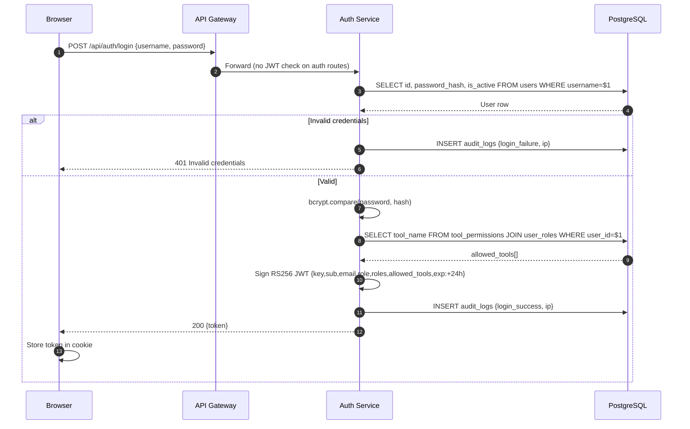

# Authentication Flow

> Part of the [[Datto RMM AI Platform|claude]] knowledge graph · **Flow** node

How a user logs in, gets a JWT with baked-in tool permissions, and that JWT is validated on every subsequent request.



## JWT Payload

```json
{
  "key": "dattoapp",
  "sub": "<uuid>",
  "email": "admin@example.com",
  "role": "admin",
  "roles": ["admin"],
  "allowed_tools": ["get-account", "list-sites", "...37 total"]
}
```

## Key Points

- `allowed_tools` is computed once at login from `tool_permissions` table — sealed into the token
- The [[API Gateway]] validates the RS256 signature locally (no round-trip to [[Auth Service]])
- APISIX Lua injects `X-User-Id`, `X-User-Role`, `X-Allowed-Tools` headers from the decoded payload
- Failed logins are audit-logged with the client IP

## Related Nodes

[[Auth Service]] · [[JWT Model]] · [[RBAC System]] · [[Users Table]] · [[Tool Permissions Table]] · [[API Gateway]]
