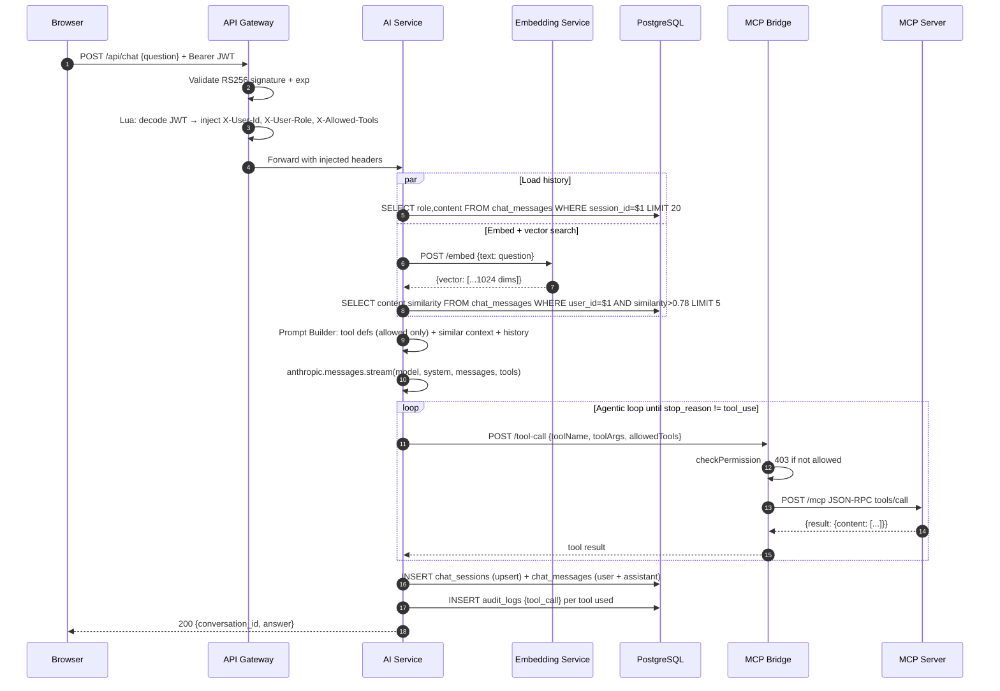

# Chat Request Flow

> Part of the [[Datto RMM AI Platform|claude]] knowledge graph · **Flow** node

End-to-end path of a user message from browser to LLM response, including tool calls.

## Two Chat Modes

| Mode | Route | Format | File |
|---|---|---|---|
| Legacy (sync) | `POST /api/chat` | `{conversation_id, answer}` | `legacyChat.ts` |
| Streaming (SSE) | `POST /chat` | `event: delta` stream | `chat.ts` |

## Related Nodes

[[AI Service]] · [[Prompt Builder]] · [[Tool Router]] · [[Tool Execution Flow]] · [[Chat Messages Table]] · [[Embedding Service]] · [[API Gateway]] · [[MCP Bridge]]
