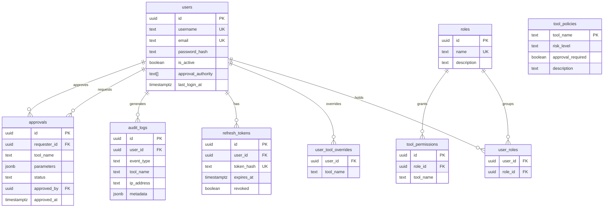
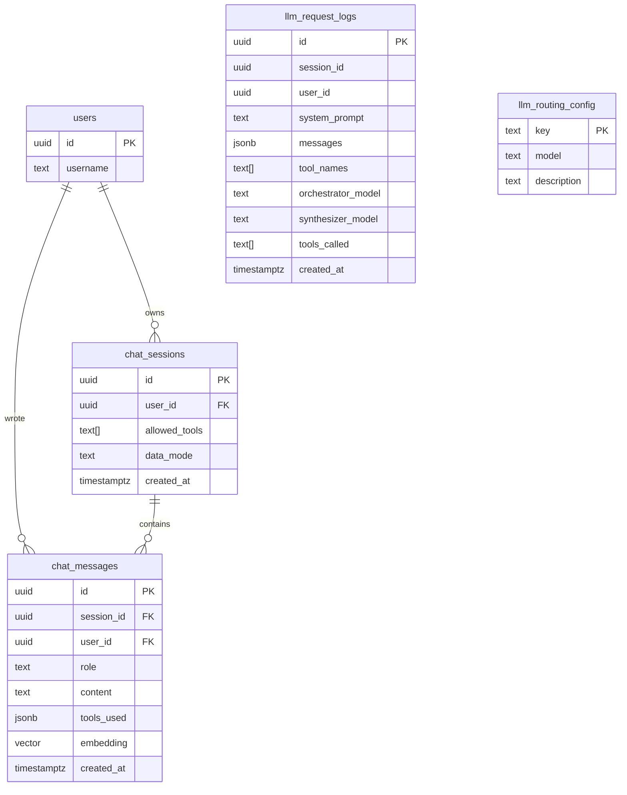

# Database Schema Reference

> **Datto RMM AI Platform** | PostgreSQL 16 + pgvector + pg_trgm | 28 tables across 3 domains
> This file is the authoritative reference for every table, column, index, FK, and design decision in the platform database.

---

## Contents

1. [Quick Reference — All Tables](#1-quick-reference--all-tables)
2. [Visual Schema Diagrams](#2-visual-schema-diagrams)
3. [Extensions & Migrations](#3-extensions--migrations)
4. [Domain 1 — Platform / Auth](#4-domain-1--platform--auth)
5. [Domain 2 — Chat & LLM](#5-domain-2--chat--llm)
6. [Domain 3 — Datto Data Cache](#6-domain-3--datto-data-cache)
7. [Relationships Map](#7-relationships-map)
8. [Indexes Reference](#8-indexes-reference)
9. [Key Design Decisions](#9-key-design-decisions)

---

## 1 Quick Reference — All Tables

| Table | Domain | Rows grow | Written by | Read by |
|---|---|---|---|---|
| `users` | Auth | Rarely | Admin UI | Auth Service, AI Service |
| `roles` | Auth | Rarely | Admin UI | Auth Service |
| `user_roles` | Auth | Rarely | Admin UI | Auth Service |
| `tool_permissions` | Auth | Rarely | Admin UI | Auth Service |
| `tool_policies` | Auth | Rarely | Admin UI | AI Service |
| `user_tool_overrides` | Auth | Rarely | Admin UI | AI Service |
| `refresh_tokens` | Auth | Per login | Auth Service | Auth Service |
| `audit_logs` | Auth | Per event | AI Service, Auth Service | Admin UI |
| `approvals` | Auth | Per request | AI Service | Admin UI, users |
| `chat_sessions` | Chat | Per conversation | AI Service | AI Service |
| `chat_messages` | Chat | Per message | AI Service | AI Service |
| `llm_request_logs` | LLM | Per chat request | AI Service | Admin UI |
| `llm_routing_config` | LLM | Static (7 rows) | Admin UI | AI Service |
| `datto_sync_log` | Cache | Per sync run | AI Service sync | Admin UI |
| `datto_cache_account` | Cache | 1 row | AI Service sync | AI Service queries |
| `datto_cache_sites` | Cache | ~100s | AI Service sync | AI Service queries |
| `datto_cache_site_variables` | Cache | ~1000s | AI Service sync | AI Service queries |
| `datto_cache_site_filters` | Cache | ~100s | AI Service sync | AI Service queries |
| `datto_cache_devices` | Cache | ~1000s–10000s | AI Service sync | AI Service queries |
| `datto_cache_device_audit` | Cache | Per device | AI Service sync | AI Service queries |
| `datto_cache_device_software` | Cache | Many per device | AI Service sync | AI Service queries |
| `datto_cache_esxi_audit` | Cache | ESXi hosts only | AI Service sync | AI Service queries |
| `datto_cache_printer_audit` | Cache | Printers only | AI Service sync | AI Service queries |
| `datto_cache_alerts` | Cache | ~100s–1000s | AI Service sync | AI Service queries |
| `datto_cache_users` | Cache | ~10s–100s | AI Service sync | AI Service queries |
| `datto_cache_account_variables` | Cache | ~10s | AI Service sync | AI Service queries |
| `datto_cache_components` | Cache | ~100s | AI Service sync | AI Service queries |
| `datto_cache_filters` | Cache | ~10s | AI Service sync | AI Service queries |

---

## 2 Visual Schema Diagrams

### 2.1 Domain Overview

All 28 tables grouped by domain. Arrows show cross-domain FK connections (user identity flowing into Chat and Auth tables).

```mermaid
graph TD
    subgraph AUTH["🔐 Platform / Auth"]
        direction TB
        users["users\n(identity + bcrypt)"]
        roles["roles"]
        user_roles["user_roles\n(join)"]
        tool_permissions["tool_permissions\n(role → tool grants)"]
        tool_policies["tool_policies\n(risk level, approval)"]
        user_tool_overrides["user_tool_overrides\n(per-user grants)"]
        refresh_tokens["refresh_tokens\n(hashed, 7d TTL)"]
        audit_logs["audit_logs\n(append-only)"]
        approvals["approvals\n(approval requests)"]
    end

    subgraph CHAT["💬 Chat & LLM"]
        direction TB
        chat_sessions["chat_sessions\n(conversation thread)"]
        chat_messages["chat_messages\n(+ vector(1024) embedding)"]
        llm_request_logs["llm_request_logs\n(full payload log)"]
        llm_routing_config["llm_routing_config\n(7 static rows)"]
    end

    subgraph CACHE["🗄️ Datto Data Cache"]
        direction TB
        datto_sync_log["datto_sync_log\n(sync run history)"]
        datto_cache_account["datto_cache_account\n(1 row — account summary)"]
        datto_cache_sites["datto_cache_sites\n(sites list)"]
        datto_cache_site_variables["datto_cache_site_variables"]
        datto_cache_site_filters["datto_cache_site_filters"]
        datto_cache_devices["datto_cache_devices\n(largest table)"]
        datto_cache_device_audit["datto_cache_device_audit\n(1:1 hardware)"]
        datto_cache_device_software["datto_cache_device_software\n(many per device)"]
        datto_cache_esxi_audit["datto_cache_esxi_audit\n(ESXi only)"]
        datto_cache_printer_audit["datto_cache_printer_audit\n(printers only)"]
        datto_cache_alerts["datto_cache_alerts"]
        datto_cache_users["datto_cache_users\n(Datto portal users)"]
        datto_cache_account_variables["datto_cache_account_variables"]
        datto_cache_components["datto_cache_components"]
        datto_cache_filters["datto_cache_filters"]
    end

    users -->|"user_id"| chat_sessions
    users -->|"user_id"| chat_messages
    users -->|"user_id"| refresh_tokens
    users -->|"user_id"| audit_logs
    users -->|"requester_id / approved_by"| approvals
    users -->|"user_id"| user_roles
    users -->|"user_id"| user_tool_overrides
    roles -->|"role_id"| user_roles
    roles -->|"role_id"| tool_permissions
    chat_sessions -->|"session_id"| chat_messages

    style AUTH fill:#1e3a5f,stroke:#1d4ed8,color:#e2e8f0
    style CHAT fill:#1a2e1a,stroke:#16a34a,color:#e2e8f0
    style CACHE fill:#2d1a1a,stroke:#dc2626,color:#e2e8f0
```



---

### 2.2 Platform / Auth ERD



---

### 2.3 Chat & LLM ERD



> `llm_request_logs` and `llm_routing_config` have no FKs — intentional. Logs survive user/session deletion. Config is standalone.

---

### 2.4 Datto Cache ERD

```mermaid
erDiagram
    datto_sync_log {
        uuid id PK
        text triggered_by
        text status
        integer sites_synced
        integer devices_synced
        integer alerts_open_synced
        integer audit_errors
        text last_api_error
    }
    datto_cache_account {
        integer id PK
        text uid
        text name
        integer device_count
    }
    datto_cache_sites {
        text uid PK
        text name
        integer device_count
        integer online_count
        jsonb data
    }
    datto_cache_site_variables {
        text site_uid FK
        text name
        text value
        boolean masked
    }
    datto_cache_site_filters {
        integer id
        text site_uid FK
        text name
        jsonb data
    }
    datto_cache_devices {
        text uid PK
        text site_uid
        text hostname
        text device_class
        boolean online
        text operating_system
        jsonb data
    }
    datto_cache_device_audit {
        text device_uid PK_FK
        integer ram_total_mb
        integer cpu_cores
        integer total_storage_gb
        jsonb data
    }
    datto_cache_device_software {
        bigint id PK
        text device_uid FK
        text name
        text version
        text publisher
    }
    datto_cache_esxi_audit {
        text device_uid PK_FK
        integer vm_count
        integer datastore_count
        jsonb data
    }
    datto_cache_printer_audit {
        text device_uid PK_FK
        text model
        integer toner_black_pct
        integer page_count
        jsonb data
    }
    datto_cache_alerts {
        text alert_uid PK
        text device_uid
        text site_uid
        text alert_message
        text priority
        boolean resolved
        timestamptz alert_timestamp
    }
    datto_cache_users {
        text email PK
        text username
        text first_name
        text status
        boolean disabled
    }
    datto_cache_account_variables {
        integer id PK
        text name
        text value
        boolean masked
    }
    datto_cache_components {
        text uid PK
        text name
        text category
        text component_type
    }
    datto_cache_filters {
        integer id PK
        text name
        text filter_type
        jsonb data
    }

    datto_cache_sites ||--o{ datto_cache_site_variables : "has"
    datto_cache_sites ||--o{ datto_cache_site_filters : "has"
    datto_cache_devices ||--o| datto_cache_device_audit : "hardware audit"
    datto_cache_devices ||--o{ datto_cache_device_software : "software"
    datto_cache_devices ||--o| datto_cache_esxi_audit : "ESXi audit"
    datto_cache_devices ||--o| datto_cache_printer_audit : "printer audit"
```

> `datto_cache_devices.site_uid` → `datto_cache_sites.uid` is a **logical relationship** (no enforced FK). `datto_cache_alerts.device_uid` and `.site_uid` are also logical. Arrows are omitted from the diagram to reflect the actual schema.

---

## 3 Extensions & Migrations

**Extensions** (migrations 001, 018):
```sql
uuid-ossp   -- uuid_generate_v4() for all PKs
vector      -- pgvector extension for 1024-dim embeddings
pg_trgm     -- trigram similarity for fuzzy text search (typo-tolerant site/device lookup)
```

**Migration history** — apply in order:

| File | What it creates / changes |
|---|---|
| `001_extensions.sql` | `uuid-ossp`, `vector` extensions |
| `002_users.sql` | `users` table |
| `003_roles_and_permissions.sql` | `roles`, `user_roles`, `tool_permissions` |
| `004_tokens.sql` | `refresh_tokens` |
| `005_chat.sql` | `chat_sessions`, `chat_messages` |
| `006_audit.sql` | `audit_logs` |
| `007_vector_index.sql` | `ivfflat` index on `chat_messages.embedding` |
| `008_datto_cache.sql` | All 15 Datto cache tables + `datto_sync_log`; adds `data_mode` to `chat_sessions` |
| `009_fix_users_cache.sql` | Drops + recreates `datto_cache_users` with `email` as PK |
| `010_loosen_device_site_fk.sql` | Drops FK constraint on `datto_cache_devices.site_uid` |
| `011_sync_log_errors.sql` | Adds `audit_errors`, `last_api_error` to `datto_sync_log` |
| `012_llm_routing_config.sql` | `llm_routing_config` (7 default rows) |
| `013_llm_logs_models.sql` | Adds `orchestrator_model`, `synthesizer_model`, `tools_called` to `llm_request_logs` |
| `014_hnsw_index.sql` | Drops IVFFlat, creates HNSW index on `chat_messages.embedding` (SEC-014) |
| `014_observability.sql` | 10 performance indexes for observability time-windowed aggregations |
| `015_action_proposals.sql` | `action_proposals` table — write tool staging state machine (SEC-Write-001) |
| `016_audit_log_rls.sql` | Audit log immutability via PostgreSQL RLS (SEC-Audit-001) |
| `017_request_traces.sql` | Distributed tracing tables for observability spans |
| `018_fuzzy_search.sql` | `pg_trgm` extension + GIN trigram indexes on `datto_cache_sites.name`, `datto_cache_devices.hostname`, `datto_cache_devices.site_name` |
| `seed.sql` | 4 default users, 4 roles, tool assignments, tool_policies, `llm_request_logs` table |

> `tool_policies`, `approvals`, `user_tool_overrides`, and `llm_request_logs` are created in `seed.sql`, not numbered migrations.

---

## 4 Domain 1 — Platform / Auth

These tables control identity, access, and the RBAC system. Written rarely; read on every request.

---

### `users`

Platform user accounts. One row per human user.

```sql
id                 uuid PRIMARY KEY DEFAULT uuid_generate_v4()
username           text NOT NULL UNIQUE
email              text NOT NULL UNIQUE
password_hash      text NOT NULL          -- bcrypt cost 12, never plaintext
is_active          boolean NOT NULL DEFAULT true
approval_authority text[] NOT NULL DEFAULT '{}'  -- tool names this user can approve for others
created_at         timestamptz NOT NULL DEFAULT now()
updated_at         timestamptz NOT NULL DEFAULT now()
last_login_at      timestamptz            -- null until first login
```

**Indexes:** `username` UNIQUE, `email` UNIQUE (implicit on constraints)

**Referenced by:** `user_roles`, `user_tool_overrides`, `refresh_tokens`, `chat_sessions`, `chat_messages`, `audit_logs`, `approvals` (requester + approver)

**Default seed users** (password: `secret`):

| username | email | role |
|---|---|---|
| `admin_user` | `admin@example.com` | admin |
| `analyst_user` | `analyst@example.com` | analyst |
| `helpdesk_user` | `helpdesk@example.com` | helpdesk |
| `readonly_user` | `readonly@example.com` | readonly |

---

### `roles`

Named roles. Each user can hold multiple roles via `user_roles`.

```sql
id          uuid PRIMARY KEY DEFAULT uuid_generate_v4()
name        text NOT NULL UNIQUE     -- 'admin', 'analyst', 'helpdesk', 'readonly'
description text
created_at  timestamptz NOT NULL DEFAULT now()
```

---

### `user_roles`

Many-to-many join: which roles does each user hold?

```sql
user_id  uuid NOT NULL REFERENCES users(id) ON DELETE CASCADE
role_id  uuid NOT NULL REFERENCES roles(id) ON DELETE CASCADE
PRIMARY KEY (user_id, role_id)
```

**A user's effective tool list = UNION of all `tool_permissions` rows across all their roles.**

---

### `tool_permissions`

Which tool names does each role grant?

```sql
id        uuid PRIMARY KEY DEFAULT uuid_generate_v4()
role_id   uuid NOT NULL REFERENCES roles(id) ON DELETE CASCADE
tool_name text NOT NULL
UNIQUE (role_id, tool_name)
```

**This is the source of truth for RBAC.** Adding a row grants the tool; removing revokes it. Changes take effect at the user's next token refresh (JWT re-issued).

**Default role → tool assignments:**

| Role | Tools |
|---|---|
| `admin` | All 37 tools |
| `analyst` | `list-devices`, `get-device`, `list-sites`, `get-site`, `list-open-alerts`, `list-resolved-alerts`, `get-alert`, `get-job`, `get-activity-logs` |
| `helpdesk` | `list-devices`, `get-device`, `list-open-alerts`, `list-resolved-alerts`, `get-alert` |
| `readonly` | `list-sites`, `get-system-status`, `get-rate-limit`, `get-pagination-config` |

---

### `tool_policies`

Per-tool metadata — risk level and whether calls require approval.

```sql
tool_name         text PRIMARY KEY
risk_level        text NOT NULL DEFAULT 'low'   -- 'low' | 'high'
approval_required boolean NOT NULL DEFAULT false
description       text
```

**Used by:** AI Service routing (`checkHighRiskInScope`, `checkToolHighRisk`) — high-risk tools trigger the `orchestrator_high_risk` and `synthesizer_high_risk` model slots.

**Managed via:** `/admin/tools` admin page → `PATCH /api/admin/tools/:toolName`

---

### `user_tool_overrides`

Per-user tool grants that override role assignments. Used to give a specific user access to a tool without changing their role.

```sql
user_id   uuid NOT NULL REFERENCES users(id) ON DELETE CASCADE
tool_name text NOT NULL
PRIMARY KEY (user_id, tool_name)
```

---

### `refresh_tokens`

Opaque refresh tokens for JWT renewal. Only the SHA-256 hash is stored — plaintext is never persisted.

```sql
id         uuid PRIMARY KEY DEFAULT uuid_generate_v4()
user_id    uuid NOT NULL REFERENCES users(id) ON DELETE CASCADE
token_hash text NOT NULL UNIQUE    -- SHA-256 of the raw 32-byte hex token
expires_at timestamptz NOT NULL    -- 7 days from issue
revoked    boolean NOT NULL DEFAULT false
created_at timestamptz NOT NULL DEFAULT now()
```

**Flow:** Auth Service issues raw token → client stores it in HttpOnly cookie → on refresh, client sends raw token → Auth Service hashes it and looks up this table → issues new access JWT.

---

### `audit_logs`

Append-only event log. Every security event writes a row. Never updated or deleted.

```sql
id         uuid PRIMARY KEY DEFAULT uuid_generate_v4()
user_id    uuid REFERENCES users(id) ON DELETE SET NULL  -- null if user deleted
event_type text NOT NULL    -- 'login_success' | 'login_failure' | 'tool_call' |
                            -- 'tool_denied' | 'tool_error' | 'logout' | ...
tool_name  text             -- null for non-tool events
ip_address text
metadata   jsonb NOT NULL DEFAULT '{}'
created_at timestamptz NOT NULL DEFAULT now()
```

**Indexes:** `user_id`, `event_type`, `created_at`

> `ON DELETE SET NULL` on `user_id` — deleting a user preserves their audit history with a null user reference.

---

### `approvals`

Tool call approval requests — raised when a tool has `approval_required = true`.

```sql
id           uuid PRIMARY KEY DEFAULT uuid_generate_v4()
requester_id uuid REFERENCES users(id) ON DELETE CASCADE
tool_name    text NOT NULL
parameters   jsonb NOT NULL DEFAULT '{}'
status       text NOT NULL DEFAULT 'pending'   -- CHECK: 'pending' | 'approved' | 'rejected'
risk_level   text
approved_by  uuid REFERENCES users(id) ON DELETE SET NULL
approved_at  timestamptz
created_at   timestamptz NOT NULL DEFAULT now()
```

**FK notes:**
- `requester_id → users.id ON DELETE CASCADE` — deleting user deletes their pending requests
- `approved_by → users.id ON DELETE SET NULL` — deleting approver preserves the approval record with null approver

---

## 5 Domain 2 — Chat & LLM

These tables store conversation history, embeddings, LLM execution logs, and model routing config.

---

### `chat_sessions`

One row per conversation thread. Groups all messages for a single user interaction stream.

```sql
id            uuid PRIMARY KEY DEFAULT uuid_generate_v4()
user_id       uuid NOT NULL REFERENCES users(id) ON DELETE CASCADE
title         text              -- optional display name
allowed_tools text[] NOT NULL DEFAULT '{}'  -- tools available at session creation
data_mode     text NOT NULL DEFAULT 'cached'  -- 'cached' | 'live' — Datto data mode
created_at    timestamptz NOT NULL DEFAULT now()
updated_at    timestamptz NOT NULL DEFAULT now()
```

**`data_mode`** is set per-session via `POST /api/chat/mode`. Default comes from `llm_routing_config.default_data_mode`. Cached = query local DB; Live = hit Datto API in real time.

---

### `chat_messages`

Individual messages within a session. Includes the embedding vector for semantic search.

```sql
id          uuid PRIMARY KEY DEFAULT uuid_generate_v4()
session_id  uuid NOT NULL REFERENCES chat_sessions(id) ON DELETE CASCADE
user_id     uuid NOT NULL REFERENCES users(id) ON DELETE CASCADE
role        text NOT NULL CHECK (role IN ('user', 'assistant'))
content     text NOT NULL
tools_used  jsonb NOT NULL DEFAULT '[]'   -- array of tool names called in this turn
token_count integer                        -- null if not tracked
embedding   vector(1024)                  -- Voyage-3 embedding for similarity search
created_at  timestamptz NOT NULL DEFAULT now()
```

**Vector index:** `ivfflat (embedding vector_cosine_ops) WITH (lists=100)` — approximate cosine similarity, good up to ~5M rows.

**Similarity search query** (threshold 0.78):
```sql
SELECT content, role, tools_used,
       1 - (embedding <=> $1) AS similarity
FROM chat_messages
WHERE user_id = $2
  AND session_id != $3          -- exclude current session
  AND 1 - (embedding <=> $1) > 0.78
ORDER BY embedding <=> $1
LIMIT 5;
```

---

### `llm_request_logs`

Full payload log of every LLM request — system prompt, messages, tools, models used. Written by `legacyChat.ts` at the start of each request and updated after Stage 2 completes.

```sql
id                 uuid PRIMARY KEY DEFAULT uuid_generate_v4()
session_id         uuid               -- references chat_sessions (no FK — may be ad-hoc)
user_id            uuid               -- references users (no FK — log survives user deletion)
system_prompt      text               -- full system prompt sent to Stage 1
messages           jsonb              -- full OpenAI-format conversation array
tool_names         text[]             -- names of tools available (Stage 1 definitions)
tools_payload      jsonb              -- full OpenAI tool definition objects
orchestrator_model text               -- Stage 1 model that was used
synthesizer_model  text               -- Stage 2 model (null if Stage 2 was skipped)
tools_called       text[] DEFAULT '{}' -- tools actually called during the request
created_at         timestamptz DEFAULT now()
```

**Write pattern:** INSERT at Stage 1 start (with `orchestrator_model`); UPDATE after Stage 2 (adds `synthesizer_model`, `tools_called`).

**Admin UI:** `/admin/llm-logs` — shows last 50 requests with Stage 1/Stage 2 model badges and tools column. Click View for full payload modal.

---

### `llm_routing_config`

Exactly 7 rows. Stores which model to use for each routing slot. Edited from `/admin/llm-config`. Cached in-process for 60 seconds.

```sql
key         text PRIMARY KEY
model       text NOT NULL    -- model name OR 'cached'/'live' for default_data_mode
description text
```

**The 7 rows:**

| key | Default | What it controls |
|---|---|---|
| `orchestrator_default` | `claude-haiku-4-5-20251001` | Stage 1 model — normal requests |
| `orchestrator_high_risk` | `claude-opus-4-6` | Stage 1 when high-risk tools are in scope |
| `synthesizer_default` | `claude-haiku-4-5-20251001` | Stage 2 fallback |
| `synthesizer_cached` | `claude-haiku-4-5-20251001` | Stage 2 for cached-mode queries |
| `synthesizer_large_data` | `deepseek/deepseek-r1` | Stage 2 when tool results > 8 000 chars |
| `synthesizer_high_risk` | `claude-opus-4-6` | Stage 2 when a high-risk tool was called |
| `default_data_mode` | `cached` | Default `data_mode` for new `chat_sessions` |

> `default_data_mode` stores `'cached'` or `'live'` in the `model` column — intentional overloading to avoid a separate config table.

---

## 6 Domain 3 — Datto Data Cache

15 tables storing a local mirror of the Datto RMM API. Written by the sync pipeline in `ai-service/src/sync.ts`; read by `ai-service/src/cachedQueries.ts` when a chat is in cached mode.

**Pattern:** All cache tables have a `data jsonb` column storing the full raw API response, plus scalar indexed columns for fast SQL queries. All use `ON CONFLICT … DO UPDATE` upserts.

---

### `datto_sync_log`

One row per sync run. Tracks progress, counts, errors.

```sql
id                      uuid PRIMARY KEY DEFAULT uuid_generate_v4()
started_at              timestamptz DEFAULT now()
completed_at            timestamptz           -- null while running
triggered_by            text NOT NULL         -- 'schedule' | 'manual'
status                  text NOT NULL DEFAULT 'running'  -- 'running' | 'completed' | 'failed'
error                   text                  -- top-level failure (whole sync failed)
audit_errors            integer DEFAULT 0     -- count of per-device audit failures
last_api_error          text                  -- last Datto API error seen (even on success)
sites_synced            integer DEFAULT 0
devices_synced          integer DEFAULT 0
alerts_open_synced      integer DEFAULT 0
alerts_resolved_synced  integer DEFAULT 0
users_synced            integer DEFAULT 0
device_audits_synced    integer DEFAULT 0
device_software_synced  integer DEFAULT 0
esxi_audits_synced      integer DEFAULT 0
printer_audits_synced   integer DEFAULT 0
```

---

### `datto_cache_account`

Account summary. Always exactly 1 row, replaced on every full sync.

```sql
id            integer PRIMARY KEY
uid           text NOT NULL
name          text NOT NULL
portal_url    text
device_count  integer
online_count  integer
offline_count integer
data          jsonb NOT NULL
synced_at     timestamptz DEFAULT now()
```

---

### `datto_cache_sites`

One row per Datto site.

```sql
uid                   text PRIMARY KEY     -- Datto site UID (e.g. "abc123")
id                    integer              -- Datto numeric ID
name                  text NOT NULL
description           text
on_demand             boolean
device_count          integer
online_count          integer
offline_count         integer
autotask_company_name text
autotask_company_id   text
proxy_host            text
proxy_port            integer
proxy_type            text
data                  jsonb NOT NULL       -- raw list-endpoint response
detail_data           jsonb               -- raw get-site detail response
settings_data         jsonb               -- raw get-site settings response
synced_at             timestamptz DEFAULT now()
```

**Indexes:** `name` B-tree for exact search; `name gin_trgm_ops` GIN for fuzzy/trigram search (migration 018)

**Referenced by (FK):** `datto_cache_site_variables`, `datto_cache_site_filters`
**Logical reference from (no FK enforced):** `datto_cache_devices.site_uid`

---

### `datto_cache_site_variables`

Site-level variables (key-value pairs). One row per variable per site.

```sql
id        integer
site_uid  text NOT NULL REFERENCES datto_cache_sites(uid) ON DELETE CASCADE
name      text NOT NULL
value     text             -- null if masked
masked    boolean DEFAULT false
synced_at timestamptz DEFAULT now()
PRIMARY KEY (site_uid, name)
```

---

### `datto_cache_site_filters`

Custom device filters defined at the site level.

```sql
id        integer
site_uid  text NOT NULL REFERENCES datto_cache_sites(uid) ON DELETE CASCADE
name      text NOT NULL
data      jsonb NOT NULL
synced_at timestamptz DEFAULT now()
PRIMARY KEY (site_uid, id)
```

---

### `datto_cache_devices`

All managed devices. The largest cache table. Contains 30 UDF columns (`udf1`–`udf30`).

```sql
uid              text PRIMARY KEY
id               integer
hostname         text NOT NULL
int_ip_address   text
ext_ip_address   text
site_uid         text             -- logical FK to datto_cache_sites.uid (NOT enforced)
site_name        text             -- denormalized for fast display
device_class     text             -- 'Desktop' | 'Laptop' | 'Server' | ...
device_type      text
operating_system text
display_version  text             -- OS version string
online           boolean
reboot_required  boolean
last_seen        timestamptz
warranty_date    text
av_product       text
av_status        text
patch_status     text
udf1–udf30       text             -- user-defined fields (30 columns)
data             jsonb NOT NULL
synced_at        timestamptz DEFAULT now()
```

**Indexes:** `hostname`, `site_uid`, `online`, `device_class`, `operating_system` (B-tree); `hostname gin_trgm_ops`, `site_name gin_trgm_ops` (GIN trigram — migration 018)

**Why no FK on `site_uid`?** Migration 010 dropped it. Sync processes devices independently of sites — a device may reference a site UID that hasn't been synced yet. The FK caused violations and aborted device syncs. Relationship is enforced at query level: `cachedListSiteDevices` filters `WHERE site_uid = $1`.

**Referenced by (FK):** `datto_cache_device_audit`, `datto_cache_device_software`, `datto_cache_esxi_audit`, `datto_cache_printer_audit`, `datto_cache_alerts` (logical only)

---

### `datto_cache_device_audit`

Hardware audit snapshot per device. One row per device (1:1 with `datto_cache_devices`).

```sql
device_uid        text PRIMARY KEY REFERENCES datto_cache_devices(uid) ON DELETE CASCADE
cpu_description   text
cpu_cores         integer
cpu_processors    integer
cpu_speed_mhz     integer
ram_total_mb      integer
bios_manufacturer text
bios_version      text
bios_release_date text
os_name           text
os_build          text
os_install_date   text
drive_count       integer
total_storage_gb  integer
free_storage_gb   integer
nic_count         integer
data              jsonb NOT NULL   -- full audit payload
synced_at         timestamptz DEFAULT now()
```

---

### `datto_cache_device_software`

Installed software per device. Many rows per device.

```sql
id           bigserial PRIMARY KEY
device_uid   text NOT NULL REFERENCES datto_cache_devices(uid) ON DELETE CASCADE
name         text NOT NULL
version      text
publisher    text
install_date text
synced_at    timestamptz DEFAULT now()
```

**Indexes:** `device_uid`, `name`

---

### `datto_cache_esxi_audit`

ESXi host audit. Only populated for ESXi-class devices. 1:1 with `datto_cache_devices`.

```sql
device_uid      text PRIMARY KEY REFERENCES datto_cache_devices(uid) ON DELETE CASCADE
vm_count        integer
datastore_count integer
data            jsonb NOT NULL
synced_at       timestamptz DEFAULT now()
```

---

### `datto_cache_printer_audit`

Printer audit. Only populated for printer-class devices. 1:1 with `datto_cache_devices`.

```sql
device_uid        text PRIMARY KEY REFERENCES datto_cache_devices(uid) ON DELETE CASCADE
model             text
toner_black_pct   integer
toner_cyan_pct    integer
toner_magenta_pct integer
toner_yellow_pct  integer
drum_pct          integer
page_count        integer
data              jsonb NOT NULL
synced_at         timestamptz DEFAULT now()
```

---

### `datto_cache_alerts`

Open and recently resolved alerts.

```sql
alert_uid       text PRIMARY KEY
device_uid      text             -- logical ref to datto_cache_devices (no FK)
device_name     text             -- denormalized
site_uid        text             -- logical ref to datto_cache_sites (no FK)
site_name       text             -- denormalized
alert_message   text NOT NULL
priority        text             -- 'Critical' | 'High' | 'Moderate' | 'Low' | 'Information'
resolved        boolean DEFAULT false
muted           boolean DEFAULT false
alert_timestamp timestamptz
resolved_at     timestamptz
autotask_ticket text
data            jsonb NOT NULL
synced_at       timestamptz DEFAULT now()
```

**Indexes:** `device_uid`, `site_uid`, `resolved`, `priority`

---

### `datto_cache_users`

Datto portal users (not platform users — a completely separate set of people).

```sql
email       text PRIMARY KEY    -- Datto users have no uid field — email is the natural PK
username    text
first_name  text
last_name   text
telephone   text
status      text
last_access timestamptz
disabled    boolean
data        jsonb NOT NULL
synced_at   timestamptz DEFAULT now()
```

> **Why `email` as PK?** The Datto `/v2/account/users` endpoint returns user objects with no `uid` field. Migration 009 corrected the original design (which used a non-existent `uid`).

---

### `datto_cache_account_variables`

Account-level key-value variables (applies to all sites).

```sql
id        integer PRIMARY KEY
name      text NOT NULL
value     text
masked    boolean DEFAULT false
synced_at timestamptz DEFAULT now()
```

---

### `datto_cache_components`

Job component definitions (scripts, policies, etc.).

```sql
uid            text PRIMARY KEY
id             integer
name           text NOT NULL
category       text
component_type text
data           jsonb NOT NULL
synced_at      timestamptz DEFAULT now()
```

---

### `datto_cache_filters`

Default and custom device filters at the account level.

```sql
id          integer PRIMARY KEY
name        text NOT NULL
filter_type text NOT NULL    -- 'default' | 'custom'
data        jsonb NOT NULL
synced_at   timestamptz DEFAULT now()
```

---

## 7 Relationships Map

```
users
  ├─< user_roles >──── roles
  │                      └─< tool_permissions (tool_name)
  ├─< user_tool_overrides (tool_name)
  ├─< refresh_tokens
  ├─< audit_logs (ON DELETE SET NULL)
  ├─< approvals (requester_id)
  ├─ approvals (approved_by, ON DELETE SET NULL)
  ├─< chat_sessions
  │     └─< chat_messages
  └─< chat_messages

tool_policies (no FK — keyed by tool_name string)
llm_routing_config (standalone, 7 static rows)
llm_request_logs (no FK — intentional: survives session/user deletion)

datto_cache_sites
  ├─< datto_cache_site_variables
  └─< datto_cache_site_filters

datto_cache_devices  (site_uid → datto_cache_sites, logical only — no FK)
  ├─ datto_cache_device_audit (1:1)
  ├─< datto_cache_device_software
  ├─ datto_cache_esxi_audit (1:1, ESXi only)
  └─ datto_cache_printer_audit (1:1, printers only)

datto_cache_alerts  (device_uid, site_uid → logical refs, no FK)
datto_cache_account  (singleton)
datto_cache_users  (independent, email PK)
datto_cache_account_variables  (independent)
datto_cache_components  (independent)
datto_cache_filters  (independent)
datto_sync_log  (independent, append-only)
```

---

## 8 Indexes Reference

| Table | Column(s) | Type | Purpose |
|---|---|---|---|
| `users` | `username` | UNIQUE | Login lookup |
| `users` | `email` | UNIQUE | Email uniqueness |
| `user_roles` | `(user_id, role_id)` | PK | Join lookup |
| `tool_permissions` | `(role_id, tool_name)` | UNIQUE | Dedup + lookup |
| `refresh_tokens` | `token_hash` | UNIQUE | Token lookup on refresh |
| `audit_logs` | `user_id` | B-tree | Filter by user |
| `audit_logs` | `event_type` | B-tree | Filter by event |
| `audit_logs` | `created_at` | B-tree | Time-range queries |
| `chat_messages` | `embedding` | ivfflat cosine | Vector similarity search |
| `datto_cache_sites` | `name` | B-tree | Site name search |
| `datto_cache_devices` | `hostname` | B-tree | Hostname search |
| `datto_cache_devices` | `site_uid` | B-tree | Devices by site |
| `datto_cache_devices` | `online` | B-tree | Online/offline filter |
| `datto_cache_devices` | `device_class` | B-tree | Type filter |
| `datto_cache_devices` | `operating_system` | B-tree | OS filter |
| `datto_cache_device_software` | `device_uid` | B-tree | Software by device |
| `datto_cache_device_software` | `name` | B-tree | Software name search |
| `datto_cache_alerts` | `device_uid` | B-tree | Alerts by device |
| `datto_cache_alerts` | `site_uid` | B-tree | Alerts by site |
| `datto_cache_alerts` | `resolved` | B-tree | Open/resolved filter |
| `datto_cache_alerts` | `priority` | B-tree | Priority filter |
| `datto_cache_sites` | `name` | GIN (gin_trgm_ops) | Fuzzy site name search (migration 018) |
| `datto_cache_devices` | `hostname` | GIN (gin_trgm_ops) | Fuzzy hostname search (migration 018) |
| `datto_cache_devices` | `site_name` | GIN (gin_trgm_ops) | Fuzzy site name filter on devices (migration 018) |

---

## 9 Key Design Decisions

### Why `uuid_generate_v4()` for all PKs?
UUIDs are safe to generate client-side, avoid enumeration attacks, and are merge-safe if data is ever combined across environments. The `uuid-ossp` extension provides `uuid_generate_v4()`.

### Why pgvector instead of a separate vector DB?
Keeps the architecture simple — one database, one backup strategy, one operational concern. pgvector's `ivfflat` index gives ~95% recall at production scale. A separate Pinecone/Weaviate instance would add latency, cost, and a new failure domain.

### Why no FK on `datto_cache_devices.site_uid`?
The sync pipeline processes devices in bulk after sites. A device may reference a site UID that sync hasn't persisted yet. A hard FK caused `ON CONFLICT` failures for those devices, silently dropping them. Removing the constraint (migration 010) lets all devices sync; the site relationship is enforced at query time.

### Why `email` as PK on `datto_cache_users`?
The Datto API returns user objects with no `uid` field — only `email` is guaranteed unique. The original migration (008) used a fabricated `uid` column which caused every sync to fail with NOT NULL violations. Migration 009 corrected this.

### Why no FK on `llm_request_logs`?
Log rows should survive user deletion and session deletion for auditability. Hard FKs would cascade-delete log history when a user account is removed, which defeats the purpose of the log.

### Why `audit_logs.user_id ON DELETE SET NULL` (not CASCADE)?
Same reasoning — preserving the audit trail is more important than referential integrity. A deleted user's events remain in the log with `user_id = null`.

### Why `tool_policies` and `tool_permissions` are separate tables?
`tool_permissions` is the RBAC table (role → tool grants). `tool_policies` is metadata about tools themselves (risk level, approval required). Keeping them separate means risk metadata doesn't change when you add/remove role assignments, and vice versa.

### Why `llm_routing_config` uses the `model` column to store `'cached'`/`'live'`?
The `default_data_mode` key is conceptually a config setting, not a model name. Rather than add a separate config table for one value, it reuses the `model` column. The code (`getRoutingConfig()`) knows to treat this key specially.

### Why `data jsonb` on every cache table?
The raw Datto API response is stored alongside the indexed scalar columns. This means:
- New fields added by Datto are available immediately without a schema migration
- Queries that need fields not yet promoted to scalar columns can use `data->>'fieldName'`
- The full response is available for debugging and for building new features

---

*DATABASE.md — Datto RMM AI Platform — internal use only.*
*Reflects schema as of migration 018 (2026-03-19). Update this file whenever a new migration is added.*
