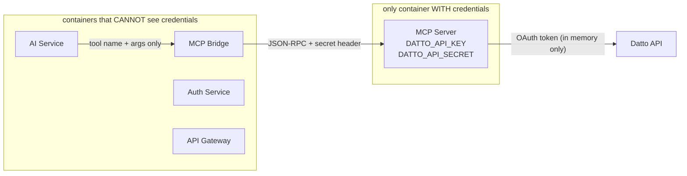

# Datto Credential Isolation

> Part of the [[Datto RMM AI Platform|claude]] knowledge graph · **Security** node

**Purpose:** Structural guarantee that Datto API credentials (`DATTO_API_KEY`, `DATTO_API_SECRET`) are present **only** in the [[MCP Server]] container environment.

## What the Credentials Protect

- OAuth token fetch: `POST *.centrastage.net/auth/oauth/token`
- All Datto API calls: `GET /v2/...`

## Isolation Chain

## Security Properties

- Credentials injected as env vars into MCP container only
- OAuth tokens cached **in-memory only** — never written to DB, disk, or logs (see [[Token Manager]])
- MCP Server is **read-only by design** — 37 GET tools only, no create/update/delete Datto operations
- If MCP container is compromised: attacker gets read-only RMM data access only, zero access to platform user data (different container, different DB)

## Related Nodes

[[MCP Server]] · [[Token Manager]] · [[Network Isolation]] · [[Tool Execution Flow]]
