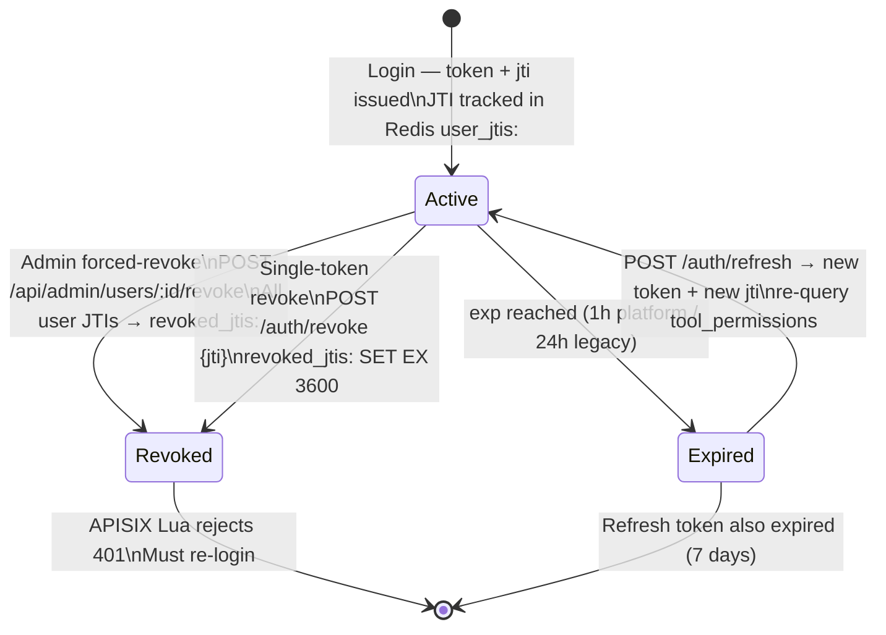

---
tags:
  - platform/security
  - jwt
  - auth
type: Security
description: RS256 asymmetric JWT structure with JTI revocation, claim purposes, token lifecycle, and key storage for the platform authentication model
---

# JWT Model

> Part of the [[Datto RMM AI Platform|claude]] knowledge graph · **Security** node

**Algorithm:** RS256 (asymmetric)
- Private key: [[Auth Service]] only — never leaves that container
- Public key: [[API Gateway]] — local signature verification, no round-trip to Auth Service

## Payload Structure

```json
{
  "key": "dattoapp",
  "sub": "<user-uuid>",
  "email": "user@example.com",
  "role": "admin",
  "roles": ["admin"],
  "allowed_tools": ["get-account", "list-sites", "..."],
  "jti": "550e8400-e29b-41d4-a716-446655440000",
  "iat": 1710000000,
  "exp": 1710086400
}
```

## Claim Purposes

| Claim | Used By | Purpose |
|---|---|---|
| `key` | [[API Gateway]] jwt-auth plugin | Consumer identity for APISIX |
| `sub` | [[AI Service]], audit_logs | User identity throughout platform |
| `role` | [[Web App]] | Display role in UI |
| `allowed_tools` | [[API Gateway]] Lua → [[AI Service]] | RBAC enforcement — sealed at login |
| `jti` | [[API Gateway]] Lua, [[Auth Service]] Redis | Per-token UUID for revocation — checked against `revoked_jtis:<jti>` in Redis on every request (SEC-002) |
| `exp` | [[API Gateway]] | Reject stale tokens before any service |

## Token Lifecycle



**JTI revocation (SEC-002 ✅):**
- `auth-service/src/tokens.ts` — `signAccessToken()` embeds `jti: randomUUID()`, returns `{token, jti}`
- `auth-service/src/redis.ts` — `trackJti(userId, jti)` → `ZADD user_jtis:<userId> <expiry> <jti>`
- `auth-service/src/redis.ts` — `revokeJti(jti)` → `SET revoked_jtis:<jti> 1 EX 3600`
- `auth-service/src/redis.ts` — `revokeAllForUser(userId)` → scans sorted set, writes all active JTIs to revocation set (SEC-008)
- APISIX Lua `serverless-post-function` — `EXISTS revoked_jtis:<jti>` via `resty.redis` — fail-open if Redis unavailable

## Key Storage

Keys stored in `.env` as base64-encoded PEM. `auth-service/src/tokens.ts` detects and decodes both raw PEM and base64 formats.

## Related Nodes

[[Auth Service]] · [[RBAC System]] · [[API Gateway]] · [[Authentication Flow]] · [[Tool Permissions Table]]
