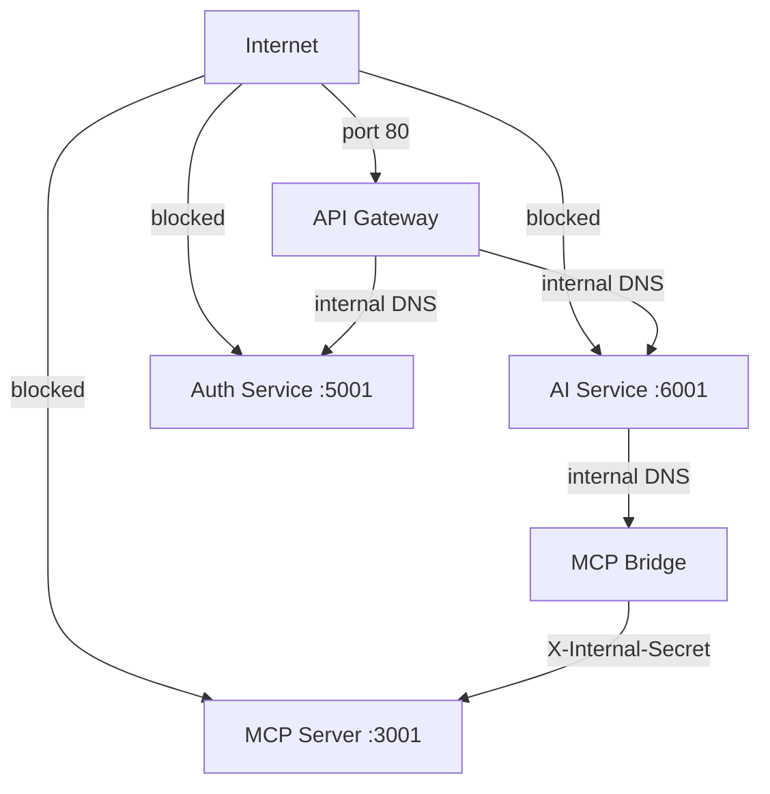

---
tags:
  - platform/security
  - docker
  - network
type: Security
description: Two Docker network topology ensuring internal services are structurally unreachable from the public internet
---

# Network Isolation

> Part of the [[Datto RMM AI Platform|claude]] knowledge graph · **Security** node

**Purpose:** Structural guarantee that internal services are unreachable from outside the Docker network, regardless of application-layer controls.

## Two Docker Networks

| Network | Members | Public? |
|---|---|---|
| `public` | [[API Gateway]], [[Web App]] | APISIX port 80 only |
| `internal` (bridge) | All other services | No public ports |

## Reachability Matrix

> [!success] SEC-006 ✅ — Auth login rate limiting implemented
> `POST /api/auth/login` is rate-limited via APISIX `limit-req` plugin: 5 req/s sustained, burst 10, `remote_addr` key, 429 rejection. Applied in `services/apisix/init-routes.sh`.

## Inter-Service Auth

- [[MCP Bridge]] → [[MCP Server]]: `X-Internal-Secret` header (shared secret in `.env`)
- [[API Gateway]] → internal services: plain HTTP (network boundary is the security layer)
- All containers resolve each other by Docker DNS hostname (service name)

## Dev Exceptions (localhost only)

- `auth-service:5001` exposed for direct testing
- `ai-service:6001` exposed for direct testing
- `apisix-dashboard:9000` on `127.0.0.1`
- `zipkin:9411` on `127.0.0.1`

## Related Nodes

[[API Gateway]] · [[MCP Server]] · [[Datto Credential Isolation]] · [[MCP Bridge]]
