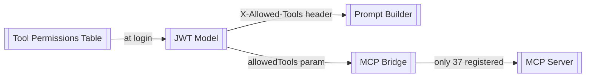

# RBAC System

> Part of the [[Datto RMM AI Platform|claude]] knowledge graph · **Module** node

**Purpose:** Three-layer role-based access control ensuring users can only call tools they are authorised for. Permissions computed once at login and sealed into the JWT.

## Files

- `auth-service/src/handlers.ts` — query + embed into JWT
- `mcp-bridge/src/validate.ts` — runtime gate
- `ai-service/src/legacyChat.ts` + `chat.ts` — prompt filter
- `ai-service/src/toolRegistry.ts` — source of all 37 definitions

## Flow



## Default Role Mappings

```
admin    → all 37 tools

analyst  → list-devices, get-device, list-sites, get-site,
           list-open-alerts, list-resolved-alerts, get-alert,
           get-job, get-activity-logs  (9 tools)

helpdesk → list-devices, get-device,
           list-open-alerts, list-resolved-alerts, get-alert  (5 tools)

readonly → list-sites, get-system-status,
           get-rate-limit, get-pagination-config  (4 tools)
```

## Three Permission Layers

| Layer | Where | What it stops |
|---|---|---|
| **1 — Prompt** | [[Prompt Builder]] | Model never sees definitions of unauthorised tools |
| **2 — Bridge gate** | [[MCP Bridge]] `validate.ts` | 403 on any tool not in `allowedTools` |
| **3 — MCP registry** | [[MCP Server]] | `Unknown tool: x` error for unregistered names |

## Related Nodes

[[Tool Permissions Table]] · [[JWT Model]] · [[Tool Router]] · [[Authentication Flow]] · [[Tool Execution Flow]] · [[Auth Service]] · [[AI Service]] · [[MCP Bridge]]
