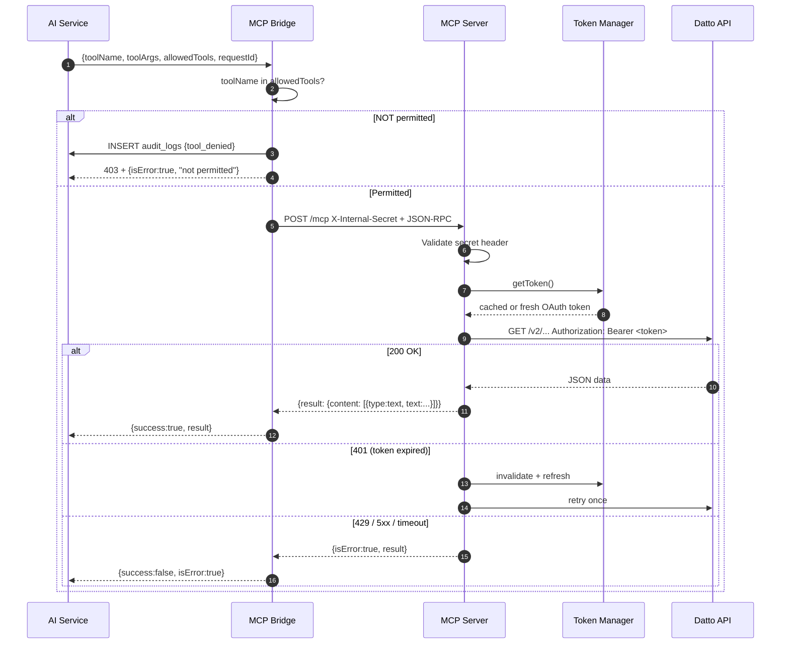

# Tool Execution Flow

> Part of the [[Datto RMM AI Platform|claude]] knowledge graph · **Flow** node

What happens from the moment the LLM decides to call a tool until the result is returned.

## Three-Layer Permission Model

| Layer | Where | What it stops |
|---|---|---|
| **1 — Prompt** | [[Prompt Builder]] | Model never sees definitions of unauthorised tools |
| **2 — Bridge gate** | [[MCP Bridge]] `validate.ts` | 403 on any tool not in `allowedTools` |
| **3 — MCP registry** | [[MCP Server]] | `Unknown tool: x` error for unregistered names |

## Related Nodes

[[MCP Bridge]] · [[MCP Server]] · [[Token Manager]] · [[RBAC System]] · [[AI Service]] · [[Chat Request Flow]]
