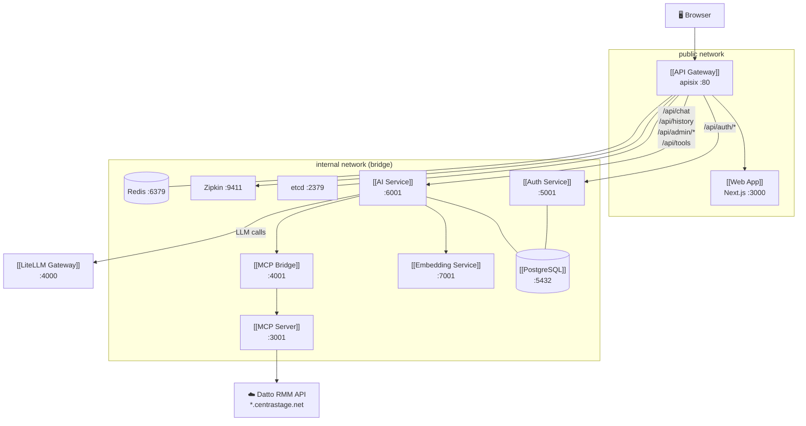
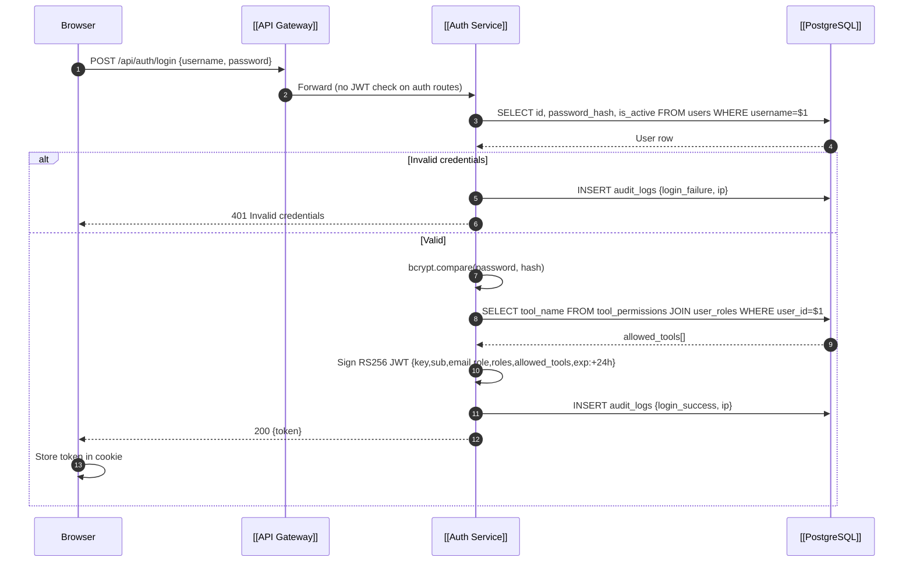
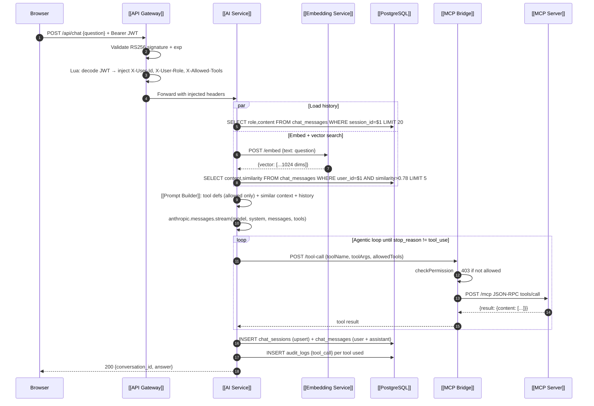
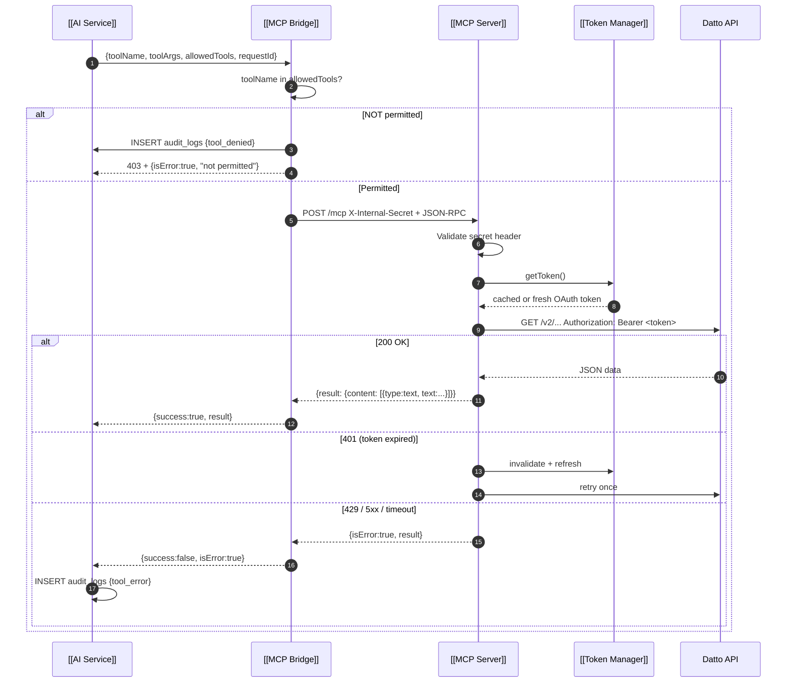
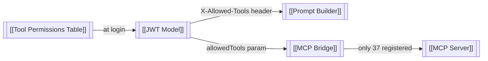
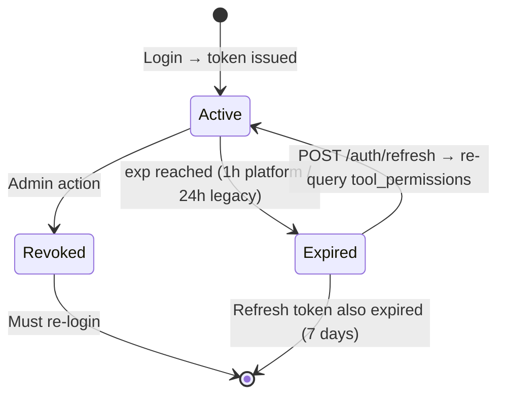
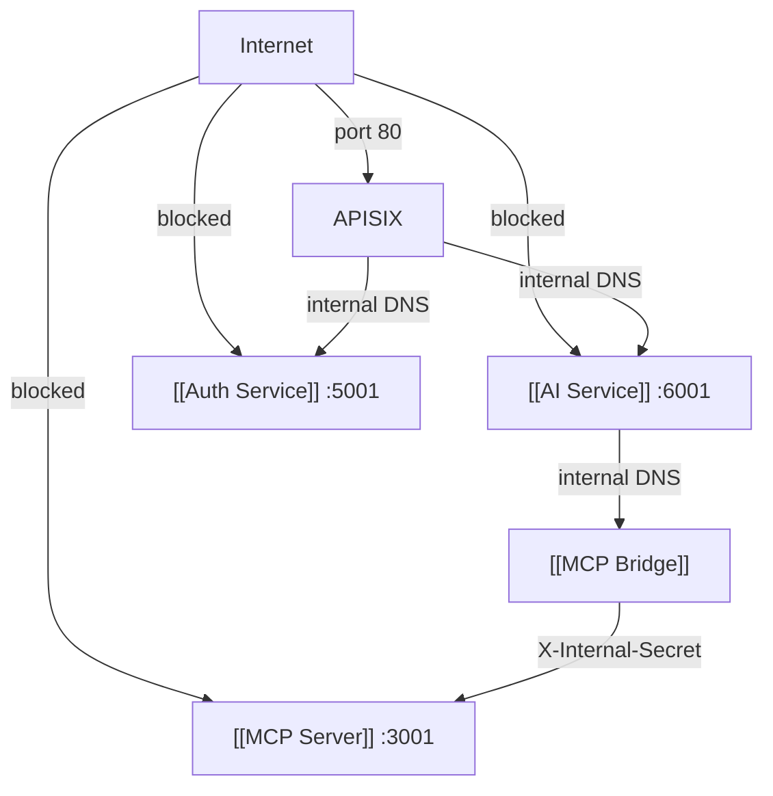
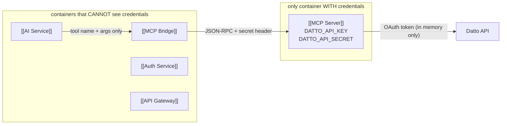

# Datto RMM AI Platform — Second Brain

> **Obsidian Knowledge Graph** | Version 1.9.0 | 2026-03-18
> Navigate this file like a graph. Every `[[Node]]` is a clickable link to a section or sibling note.

---

## ⚠️ Standing Rules for Claude

These rules apply to every conversation in this project. Follow them without being asked.

### 1 — Use the docs, not your memory
- **`claude.md`** (this file) is the authoritative source for service architecture, data models, security design, module descriptions, and quick reference.
- **`ARCHITECTURE.md`** is the detailed technical specification with diagrams, flows, and implementation notes.
- Before answering questions about how the system works or starting implementation tasks, **read the relevant section** of these files. Do not rely on conversation memory or assume you remember the architecture.
- If the question is about a specific file or module, **read that file** before answering.

### 2 — Keep the docs current
- After **any code change** that affects architecture, APIs, data models, config, or behaviour — update `claude.md` and/or `ARCHITECTURE.md` in the same response.
- Changes that always require a doc update: new DB migrations, new services, new API routes, new env vars, schema changes, new source files, changed sync behaviour, security model changes.
- Changes that do **not** require a doc update: bug fixes that don't change behaviour, refactors that don't change interfaces, UI styling.
- Keep the version number and date current when making meaningful updates.

### 3 — Docs over context window
- These files are the project memory. Claude's conversation context is ephemeral and will be summarised or lost.
- Never save architectural knowledge only in memory. Always write it to the relevant doc.
- If you learn something about how the Datto API actually behaves (field names, pagination format, rate limits), document it in the relevant section immediately.

---

---

# System Map

The platform exposes the Datto RMM API through a secure, role-gated AI interface. No user ever touches the Datto API directly. All paths flow through [[API Gateway]] → internal services → [[MCP Server]].



**Key constraints:**
- [[MCP Server]] is the **only** container with Datto credentials
- [[API Gateway]] is the **only** public entry point
- Tool availability is baked into the [[JWT Model]] at login — never re-evaluated per request
- The LLM only sees tool definitions for tools the user is permitted to use
- [[Local Data Cache]] stores Datto data in PostgreSQL — AI queries cache by default, live API on demand

---

# Services

## [[API Gateway]]

**Purpose:** Single public entry point. Validates RS256 JWTs, injects user identity headers, routes traffic, enforces rate limits. Backed by `etcd` for live config.

**Image:** `apache/apisix:3.9.0-debian`
**Ports:** `80` (public), `127.0.0.1:9180` (admin API)
**Networks:** `public` + `internal`

**Dependencies:**
- [[etcd]] — route and plugin configuration store
- [[Auth Service]] — upstream for `/api/auth/*`
- [[AI Service]] — upstream for `/api/chat`, `/api/history`, `/api/admin/*`, `/api/tools`, `/api/debug/*`, `/api/approvals*`
- [[Web App]] — upstream for `/*` catch-all
- Redis — rate-limit counters

**Key Functions:**
- JWT validation (RS256 signature + expiry) on every protected route
- Lua `serverless-post-function` decodes JWT payload and injects:
  - `X-User-Id: <sub>`
  - `X-User-Role: <role>`
  - `X-Allowed-Tools: <json array>`
- Routes: `/api/auth/*` (no JWT), all others require Bearer token

**Lua injection snippet (all protected routes):**
```lua
local pl = cjson.decode(ngx.decode_base64(jwt_payload_part))
ngx.req.set_header("X-User-Id", pl.sub or "")
ngx.req.set_header("X-User-Role", pl.role or "")
ngx.req.set_header("X-Allowed-Tools", cjson.encode(pl.allowed_tools or {}))
```

**Related nodes:** [[Auth Service]] · [[AI Service]] · [[JWT Model]] · [[Network Isolation]] · [[Authentication Flow]]

---

## [[Auth Service]]

**Purpose:** Issues RS256 JWT tokens, validates credentials against PostgreSQL, computes per-user `allowed_tools`, manages refresh tokens.

**Build:** `./auth-service`
**Port:** `5001`
**Key env vars:** `DATABASE_URL`, `JWT_PRIVATE_KEY`, `JWT_PUBLIC_KEY`

**Dependencies:**
- [[PostgreSQL]] — users, roles, tool_permissions, refresh_tokens, audit_logs
- [[Users Table]] · [[Roles Table]] · [[Tool Permissions Table]]

**Key Functions (file: `auth-service/src/handlers.ts`):**

| Function | Route | Purpose |
|---|---|---|
| `handleLegacyLogin` | `POST /api/auth/login` | Web-app compat: `{username,password}` → `{token}` |
| `handleLogin` | `POST /auth/login` | Platform: `{email,password}` → `{access_token, refresh_token}` |
| `handleRefresh` | `POST /auth/refresh` | Renew access token, re-query tool permissions |
| `handleIntrospect` | `GET /auth/introspect` | Validate token, return claims |
| `handleLegacyVerify` | `GET /api/auth/verify` | APISIX compat token check |

**Token signing (file: `auth-service/src/tokens.ts`):**
- `signAccessToken(payload)` — RS256, 1h TTL
- `generateRefreshToken()` — 32-byte hex opaque token
- `hashRefreshToken(raw)` — SHA-256, stored in DB (never plaintext)
- Keys accepted as raw PEM or base64-encoded PEM

**Related nodes:** [[JWT Model]] · [[RBAC System]] · [[Authentication Flow]] · [[Users Table]] · [[Tool Permissions Table]]

---

## [[AI Service]]

**Purpose:** Runs the Anthropic LLM. Manages conversation history, vector search, tool routing, agentic loop, and both synchronous (legacy) and SSE streaming chat.

**Build:** `./ai-service`
**Port:** `6001`
**Key env vars:** `DATABASE_URL`, `ANTHROPIC_API_KEY`, `MCP_BRIDGE_URL`, `EMBEDDING_SERVICE_URL`, `LITELLM_URL`

**Dependencies:**
- [[PostgreSQL]] — chat_sessions, chat_messages, audit_logs, tool_policies, approvals
- [[Embedding Service]] — text → vector for semantic search
- [[MCP Bridge]] — tool call execution
- Anthropic API — LLM inference

**Source files:**

| File | Role |
|---|---|
| `src/index.ts` | Express server, all route wiring |
| `src/legacyChat.ts` | `POST /api/chat` sync handler — two-stage loop (orchestrator + synthesizer) |
| `src/chat.ts` | `POST /chat` SSE streaming handler — two-stage loop with streaming synthesizer |
| `src/admin.ts` | All `/api/admin/*` CRUD handlers incl. LLM routing config |
| `src/approvals.ts` | `/api/approvals/*` user approval handlers |
| `src/history.ts` | Session/message load + save |
| `src/prompt.ts` | [[Prompt Builder]] + `buildSynthesizerPrompt` |
| `src/llmConfig.ts` | Routing config DB accessor (60s cache) + routing decision functions |
| `src/modelRouter.ts` | Single `llmClient` (OpenAI SDK via LiteLLM `/v1`), `synthesize()`, `synthesizeStream()` |
| `src/toolRegistry.ts` | [[Tool Router]] — all 37 tool definitions |
| `src/mcpBridge.ts` | HTTP client to [[MCP Bridge]] |
| `src/vectorSearch.ts` | pgvector similarity queries |
| `src/sse.ts` | SSE event writers |
| `src/db.ts` | pg Pool singleton |
| `src/sync.ts` | [[Local Data Cache]] sync pipeline — rate-limited MCP calls → upsert cache tables |
| `src/cachedQueries.ts` | SQL query handlers for all 28 cacheable tools |
| `src/dataBrowser.ts` | [[Data Explorer]] REST handlers — read-only SQL queries against cache tables for the admin browser UI |

**Related nodes:** [[Prompt Builder]] · [[Tool Router]] · [[MCP Bridge]] · [[Chat Request Flow]] · [[Tool Execution Flow]] · [[Chat Messages Table]] · [[RBAC System]] · [[Local Data Cache]]

---

## [[MCP Bridge]]

**Purpose:** Permission gate and HTTP client between [[AI Service]] and [[MCP Server]]. Enforces `allowed_tools` check before any tool call reaches the MCP layer.

**Build:** `./mcp-bridge`
**Port:** `4001` (internal only)
**Key env vars:** `MCP_SERVER_URL`, `MCP_INTERNAL_SECRET`

**Dependencies:**
- [[MCP Server]] — forwards approved tool calls via JSON-RPC 2.0
- [[AI Service]] — caller

**Key Functions (file: `mcp-bridge/src/index.ts`):**

| Function | File | Purpose |
|---|---|---|
| `POST /tool-call` | `index.ts` | Validate fields → `checkPermission` → `callMcpTool` |
| `checkPermission` | `validate.ts` | Returns 403 if `toolName` not in `allowedTools` |
| `callMcpTool` | `mcpClient.ts` | POST JSON-RPC to MCP Server, retry 3× on 503 |

**Retry policy (`mcpClient.ts`):**
- 401 → throw immediately
- 503 / network error → retry 1s / 2s / 4s backoff
- Exhausted → `{ isError: true, result: "MCP Server unavailable" }`

**Related nodes:** [[MCP Server]] · [[AI Service]] · [[Tool Execution Flow]] · [[RBAC System]] · [[Network Isolation]]

---

## [[MCP Server]]

**Purpose:** The **only** container with Datto credentials. Exposes 37 read-only tools over HTTP using MCP `StreamableHTTPServerTransport`. Manages Datto OAuth token cache.

**Build:** `./read-only-mcp`
**Port:** `3001` (internal only)
**Key env vars:** `DATTO_API_KEY`, `DATTO_API_SECRET`, `DATTO_PLATFORM`, `MCP_INTERNAL_SECRET`

**Dependencies:**
- Datto RMM API (`*.centrastage.net`)

**Endpoints:**

| Endpoint | Purpose |
|---|---|
| `POST /mcp` | JSON-RPC 2.0 tool execution |
| `GET /health` | Liveness probe |
| `GET /metrics` | Prometheus counters |

**Security checks on every `/mcp` request:**
1. `X-Internal-Secret` header must match env var
2. `Accept: application/json, text/event-stream` required

**Token management (`src/TokenManager`):**
- Caches Datto OAuth token in memory
- Refreshes 5 minutes before expiry
- On 401 from Datto: invalidate + fetch + retry once

**37 tool groups:**
- Account (4) · Sites (7) · Devices (9) · Alerts (5) · Jobs (5) · Audit (4) · Activity (1) · Filters (2)

**Related nodes:** [[MCP Bridge]] · [[Token Manager]] · [[Tool Execution Flow]] · [[Datto Credential Isolation]] · [[Network Isolation]]

---

## [[Embedding Service]]

**Purpose:** Converts text to embedding vectors. Used by [[AI Service]] for semantic memory search.

**Build:** `./embedding-service`
**Port:** `7001` (internal only)
**Key env vars:** `EMBEDDING_API_KEY`, `EMBEDDING_PROVIDER` (`voyage` | `openai`), `EMBEDDING_MODEL`

**Endpoint:** `POST /embed { text } → { vector: number[], dimensions: number }`

**Providers:**
- `voyage` (default) — `voyage-3`, 1024 dimensions → matches `vector(1024)` in [[Chat Messages Table]]
- `openai` — `text-embedding-3-small`, 1536 dimensions (requires schema change)

> ⚠️ Requires a real `EMBEDDING_API_KEY` in `.env`. Without it, embeddings silently fail and vector search is disabled.

**Related nodes:** [[AI Service]] · [[Chat Messages Table]] · [[Chat Request Flow]]

---

## [[LiteLLM Gateway]]

**Purpose:** Internal-only LLM proxy. Routes calls to Anthropic, DeepSeek, and Gemini without changing any application code. Enables admin-panel model swaps.

**Image:** `ghcr.io/berriai/litellm:main-latest`
**Port:** `4000` (internal only)
**Key env vars:** `ANTHROPIC_API_KEY`, `DEEPSEEK_API_KEY` (optional), `GEMINI_API_KEY` (optional), `LITELLM_MASTER_KEY` (optional)
**Config file:** `services/litellm/config.yaml`

**Routing:**
- `/anthropic` — Anthropic passthrough; preserves tool_use streaming format used by Anthropic SDK
- `/v1` — OpenAI-compatible endpoint used for DeepSeek and Gemini synthesizers

**Called by:** [[AI Service]] `modelRouter.ts` (via `LITELLM_URL` env var)
**Calls:** Anthropic API, DeepSeek API, Gemini API

> If `LITELLM_URL` is not set in ai-service, the Anthropic SDK falls back to direct `api.anthropic.com`. Non-Anthropic synthesizers are unavailable in that mode.

**Related nodes:** [[AI Service]] · [[Chat Request Flow]]

---

## [[Local Data Cache]]

**Purpose:** Pulls Datto RMM data into local PostgreSQL on a schedule. [[AI Service]] queries the local cache by default (cached mode) instead of calling the live Datto API. A Live toggle in the chat UI switches to real-time API calls.

**No AI involvement in sync** — plain TypeScript data pipeline only.

**Source files:**

| File | Role |
|---|---|
| `ai-service/src/sync.ts` | Sync pipeline — rate-limited MCP calls, upserts into cache tables, error tracking |
| `ai-service/src/cachedQueries.ts` | SQL query handlers — one per cacheable tool |
| `db/008_datto_cache.sql` | Migration — all `datto_cache_*` tables + `datto_sync_log` |
| `db/009_fix_users_cache.sql` | Migration — recreate `datto_cache_users` with `email` as PK (Datto users have no `uid`) |
| `db/010_loosen_device_site_fk.sql` | Migration — drop hard FK on `datto_cache_devices.site_uid` (logical link preserved via column) |
| `db/011_sync_log_errors.sql` | Migration — add `audit_errors` + `last_api_error` columns to `datto_sync_log` |

**Two modes:**

| Mode | What happens |
|---|---|
| `cached` (default) | AI queries `datto_cache_*` tables — fast, no Datto API call |
| `live` | AI calls Datto API via MCP Bridge in real time |

**Stored per session** in `chat_sessions.data_mode`. Toggled via `POST /api/chat/mode`.

**Always-live tools** (never cached): `get-job*`, `get-job-*`, `get-activity-logs`, `get-system-status`, `get-rate-limit`, `get-pagination-config`

**Sync schedule:**

| Type | Schedule |
|---|---|
| Full sync | Daily at 02:00 UTC |
| Alert sync | Every hour |
| Manual | `POST /api/admin/sync` (admin only) |

**Datto API rate limiting:**
- Datto allows 600 GET requests per 60 seconds (account-wide)
- `sync.ts` enforces a **480 req/min** cap (80% of limit) via a sliding-window token bucket in `rateLimit()`
- If a 429 is received anyway, `callMcpTool` and `read-only-mcp/src/api.ts` both wait 62 seconds and retry once
- Persistent 429s → Datto 403 IP block — never retry more than once

**Error tracking in `datto_sync_log`:**

| Column | Purpose |
|---|---|
| `error` | Top-level failure message (whole sync failed) |
| `audit_errors` | Count of per-device audit failures (device audits are retried silently) |
| `last_api_error` | Last Datto API error message — surfaced even on successful sync if audits partially failed |

**Cache tables (15):** `datto_sync_log` · `datto_cache_account` · `datto_cache_sites` · `datto_cache_site_variables` · `datto_cache_site_filters` · `datto_cache_devices` · `datto_cache_device_audit` · `datto_cache_device_software` · `datto_cache_esxi_audit` · `datto_cache_printer_audit` · `datto_cache_alerts` · `datto_cache_users` · `datto_cache_account_variables` · `datto_cache_components` · `datto_cache_filters`

**Key schema notes:**
- `datto_cache_users` PK is `email` — Datto user objects have no `uid` field
- `datto_cache_devices.site_uid` is a logical FK (no DB enforcement) — dropped to prevent sync failures when a device references a site not yet in cache
- Site↔device relationship is enforced at query level: `cachedListSiteDevices` filters by `site_uid`

**Admin panel page:** `/admin/data-sync` — shows last sync times, record counts, audit error counts, Sync Now buttons.

**Related nodes:** [[AI Service]] · [[MCP Bridge]] · [[PostgreSQL]] · [[Chat Request Flow]]

---

## [[Web App]]

**Purpose:** Next.js frontend. Serves the browser UI — chat interface, history, admin panel, approvals.

**Build:** `./services/web-app`
**Port:** `3000` (internal, behind [[API Gateway]])
**Key env vars:** `NEXT_PUBLIC_API_URL` (empty = same-origin)

**Pages:**

| Route | Purpose |
|---|---|
| `/login` | Login form → `POST /api/auth/login` |
| `/chat` | Main chat + history sidebar + tools panel |
| `/history` | Conversation list |
| `/history/[id]` | Conversation detail |
| `/trace` | Debug: last 20 chats with tool calls |
| `/approvals` | User approval requests |
| `/admin/users` | User CRUD + tool assignment |
| `/admin/roles` | Role management |
| `/admin/tools` | Tool policies (risk level, approval required) |
| `/admin/approvals` | Admin approval queue |
| `/admin/data-sync` | Data sync status, record counts, manual sync trigger |
| `/admin/explorer` | [[Data Explorer]] overview — stats grid, nav cards, top sites, last sync status |
| `/admin/explorer/sites` | Searchable/paginated sites list |
| `/admin/explorer/sites/[uid]` | Site detail — Devices, Open Alerts, Variables tabs |
| `/admin/explorer/devices` | Filtered/paginated devices list (hostname, status, type) |
| `/admin/explorer/devices/[uid]` | Device detail — Overview, Hardware Audit, Software, Alerts tabs |
| `/admin/explorer/alerts` | Alerts browser — open/resolved toggle, priority filter, message search |

**API client:** `src/lib/api.ts` — all fetch calls, Bearer token from `document.cookie` (`token=...`)

**Related nodes:** [[API Gateway]] · [[Auth Service]] · [[AI Service]] · [[Authentication Flow]]

---

# Execution Flows

## [[Authentication Flow]]



**JWT payload:**
```json
{
  "key": "dattoapp",
  "sub": "<uuid>",
  "email": "admin@example.com",
  "role": "admin",
  "roles": ["admin"],
  "allowed_tools": ["get-account", "list-sites", "...37 total"]
}
```

**Related nodes:** [[Auth Service]] · [[JWT Model]] · [[RBAC System]] · [[Users Table]] · [[Tool Permissions Table]]

---

## [[Chat Request Flow]]



**Related nodes:** [[AI Service]] · [[Prompt Builder]] · [[Tool Router]] · [[Tool Execution Flow]] · [[Chat Messages Table]] · [[Embedding Service]]

---

## [[Tool Execution Flow]]



**Three-layer permission model:**

| Layer | Where | What it stops |
|---|---|---|
| **1 — Prompt** | [[Prompt Builder]] | Model never sees definitions of unauthorised tools |
| **2 — Bridge gate** | [[MCP Bridge]] `validate.ts` | 403 on any tool not in `allowedTools` |
| **3 — MCP registry** | [[MCP Server]] | `Unknown tool: x` error for unregistered names |

**Related nodes:** [[MCP Bridge]] · [[MCP Server]] · [[Token Manager]] · [[RBAC System]] · [[AI Service]]

---

# Code Modules

## [[Token Manager]]

**Purpose:** In-memory Datto OAuth token cache inside [[MCP Server]]. Prevents redundant OAuth calls across concurrent tool requests.

**File:** `read-only-mcp/src/index.ts` (inline class)

**Functions:**

| Function | Description |
|---|---|
| `getToken()` | Return cached token or fetch new one |
| `refreshToken()` | POST to Datto `/auth/oauth/token`, store result + `expiresAt` |
| `invalidate()` | Clear cache on 401 response from Datto |

**Logic:** `if (Date.now() < expiresAt - 5min) return cached; else refresh()`

**Called by:** Tool handlers in [[MCP Server]]
**Calls:** `POST *.centrastage.net/auth/oauth/token`

**Related nodes:** [[MCP Server]] · [[Datto Credential Isolation]] · [[Tool Execution Flow]]

---

## [[RBAC System]]

**Purpose:** Three-layer role-based access control ensuring users can only call tools they are authorised for. Permissions computed once at login and sealed into the JWT.

**Files:**
- `auth-service/src/handlers.ts` — query + embed into JWT
- `mcp-bridge/src/validate.ts` — runtime gate
- `ai-service/src/legacyChat.ts` + `chat.ts` — prompt filter
- `ai-service/src/toolRegistry.ts` — source of all 37 definitions

**Flow:**


**Default role mappings:**

```
admin    → all 37 tools
analyst  → list-devices, get-device, list-sites, get-site,
           list-open-alerts, list-resolved-alerts, get-alert,
           get-job, get-activity-logs  (9 tools)
helpdesk → list-devices, get-device,
           list-open-alerts, list-resolved-alerts, get-alert  (5 tools)
readonly → list-sites, get-system-status,
           get-rate-limit, get-pagination-config  (4 tools)
```

**Called by:** [[Auth Service]] · [[AI Service]] · [[MCP Bridge]]
**Calls:** [[Tool Permissions Table]] · [[Users Table]]

**Related nodes:** [[Tool Permissions Table]] · [[JWT Model]] · [[Tool Router]] · [[Authentication Flow]] · [[Tool Execution Flow]]

---

## [[Tool Router]]

**Purpose:** Registry of all 37 MCP tool definitions used by [[AI Service]] to build Anthropic tool call schemas. Only tools matching `allowed_tools` are passed to the LLM.

**File:** `ai-service/src/toolRegistry.ts`

**Structure per tool:**
```typescript
{
  name: "list-devices",
  description: "List/search devices...",
  inputSchema: { type: "object", properties: { ... } }
}
```

**Tool groups (37 total):**

| Group | Count | Examples |
|---|---|---|
| Account | 4 | `get-account`, `list-users`, `list-account-variables`, `list-components` |
| Sites | 7 | `list-sites`, `get-site`, `list-site-devices`, `list-site-open-alerts`, ... |
| Devices | 9 | `list-devices`, `get-device`, `get-device-by-mac`, `get-device-audit`, ... |
| Alerts | 5 | `list-open-alerts`, `list-resolved-alerts`, `get-alert`, ... |
| Jobs | 5 | `get-job`, `get-job-components`, `get-job-results`, `get-job-stdout`, `get-job-stderr` |
| Audit | 4 | `get-device-audit-by-mac`, `get-esxi-audit`, `get-printer-audit`, `get-device-software` |
| Activity | 1 | `get-activity-logs` |
| Filters | 2 | `list-default-filters`, `list-custom-filters` |
| System | 3 | `get-system-status`, `get-rate-limit`, `get-pagination-config` |

**Called by:** `legacyChat.ts` · `chat.ts` · `admin.ts` (for tools listing)
**Calls:** [[Prompt Builder]] · [[MCP Bridge]]

**Related nodes:** [[RBAC System]] · [[Prompt Builder]] · [[MCP Bridge]] · [[Tool Execution Flow]]

---

## [[Prompt Builder]]

**Purpose:** Constructs the LLM system prompt from three blocks: platform instructions, filtered tool definitions, and semantically similar past messages.

**File:** `ai-service/src/prompt.ts`
**Function:** `buildSystemPrompt(allowedToolDefs, similarMessages): string`

**Prompt structure:**
```
1. Platform instructions
   — You are a Datto RMM assistant
   — Only use the tools provided
   — Be concise and accurate

2. Tool definitions block
   — JSON array of ONLY allowed tool schemas
   — Tools not in allowed_tools are never mentioned

3. Similar past messages block (from vector search)
   — Up to 5 semantically similar prior exchanges
   — Provides RMM-domain context without full history replay
```

**Called by:** `legacyChat.ts:handleLegacyChat` · `chat.ts:handleChat`
**Calls:** [[Tool Router]] (receives filtered defs) · vector search results from [[Chat Messages Table]]

**Related nodes:** [[Tool Router]] · [[RBAC System]] · [[Chat Request Flow]] · [[Embedding Service]]

---

# Database Model

## [[PostgreSQL]]

**Image:** `pgvector/pgvector:pg16`
**Port:** `5432` (internal only)
**Volume:** `postgres_data` (named, persists across container restarts)
**Extensions:** `uuid-ossp`, `vector`
**Database:** `datto_rmm`

> **Full schema reference:** See `DATABASE.md` — every table, column, index, FK, and design decision documented in one place.

**28 tables across 3 domains:**
- **Auth:** `users`, `roles`, `user_roles`, `tool_permissions`, `tool_policies`, `user_tool_overrides`, `refresh_tokens`, `audit_logs`, `approvals`
- **Chat & LLM:** `chat_sessions`, `chat_messages`, `llm_request_logs`, `llm_routing_config`
- **Datto Cache:** `datto_sync_log` + 14 `datto_cache_*` tables

**Migrations:** `db/001_extensions.sql` → `db/013_llm_logs_models.sql` (13 numbered migrations + `seed.sql`)
**Seed:** `db/seed.sql` (4 default users, 4 roles, tool assignments, `tool_policies`, `llm_request_logs`)

---

## [[Users Table]]

**Table:** `users`

```sql
id               uuid PRIMARY KEY DEFAULT uuid_generate_v4()
username         text NOT NULL UNIQUE
email            text NOT NULL UNIQUE
password_hash    text NOT NULL          -- bcrypt cost 12
is_active        boolean DEFAULT true
approval_authority text[] DEFAULT '{}'  -- tools this user can approve
created_at       timestamptz DEFAULT now()
updated_at       timestamptz DEFAULT now()
last_login_at    timestamptz
```

**Used by:** [[Auth Service]] (login, refresh) · [[AI Service]] (admin CRUD, approvals)
**References:** `user_roles`, `chat_sessions`, `chat_messages`, `refresh_tokens`, `audit_logs`, `approvals`

**Default users (password: `secret`):**
- `admin_user` / `admin@example.com` → role: admin
- `analyst_user` / `analyst@example.com` → role: analyst
- `helpdesk_user` / `helpdesk@example.com` → role: helpdesk
- `readonly_user` / `readonly@example.com` → role: readonly

**Related nodes:** [[Auth Service]] · [[Roles Table]] · [[RBAC System]] · [[Authentication Flow]]

---

## [[Roles Table]]

**Tables:** `roles` + `user_roles`

```sql
-- roles
id          uuid PRIMARY KEY DEFAULT uuid_generate_v4()
name        text NOT NULL UNIQUE
description text
created_at  timestamptz DEFAULT now()

-- user_roles (many-to-many)
user_id     uuid REFERENCES users(id) ON DELETE CASCADE
role_id     uuid REFERENCES roles(id) ON DELETE CASCADE
PRIMARY KEY (user_id, role_id)
```

**Effective tool list** = UNION of all `tool_permissions` rows across all roles the user holds.

**Used by:** [[Auth Service]] (login query) · [[AI Service]] admin roles endpoints
**References:** [[Tool Permissions Table]]

**Related nodes:** [[Tool Permissions Table]] · [[RBAC System]] · [[Users Table]]

---

## [[Tool Permissions Table]]

**Table:** `tool_permissions`

```sql
id          uuid PRIMARY KEY DEFAULT uuid_generate_v4()
role_id     uuid REFERENCES roles(id) ON DELETE CASCADE
tool_name   text NOT NULL
UNIQUE (role_id, tool_name)
```

**This is the source of truth for RBAC.** Adding a row grants the tool to that role. Removing it revokes it. Changes take effect at the user's next token refresh.

**Related tables:** `tool_policies` — per-tool metadata (risk_level, approval_required)

```sql
-- tool_policies
tool_name        text PRIMARY KEY
risk_level       text DEFAULT 'low'
approval_required boolean DEFAULT false
description      text
```

**Used by:** [[Auth Service]] (login + refresh), [[AI Service]] admin tools endpoints
**Managed via:** `PUT /api/admin/roles/:role` · `PATCH /api/admin/tools/:toolName`

**Related nodes:** [[Roles Table]] · [[RBAC System]] · [[Auth Service]] · [[JWT Model]]

---

## [[Chat Messages Table]]

**Tables:** `chat_sessions` + `chat_messages`

```sql
-- chat_sessions
id            uuid PRIMARY KEY DEFAULT uuid_generate_v4()
user_id       uuid REFERENCES users(id) ON DELETE CASCADE
title         text
allowed_tools text[] DEFAULT '{}'   -- tools available at time of session
data_mode     text NOT NULL DEFAULT 'cached'  -- 'cached' | 'live' — set by chat UI toggle
created_at    timestamptz DEFAULT now()
updated_at    timestamptz DEFAULT now()

-- chat_messages
id            uuid PRIMARY KEY DEFAULT uuid_generate_v4()
session_id    uuid REFERENCES chat_sessions(id) ON DELETE CASCADE
user_id       uuid REFERENCES users(id) ON DELETE CASCADE
role          text CHECK (role IN ('user','assistant'))
content       text NOT NULL
tools_used    jsonb DEFAULT '[]'    -- tool names called in this turn
token_count   integer
embedding     vector(1024)         -- Voyage-3 embedding for vector search
created_at    timestamptz DEFAULT now()
```

**Vector index:**
```sql
CREATE INDEX chat_messages_embedding_idx ON chat_messages
  USING ivfflat (embedding vector_cosine_ops) WITH (lists=100);
```

**Similarity search query:**
```sql
SELECT content, role, tools_used,
       1 - (embedding <=> $1) AS similarity
FROM chat_messages
WHERE user_id = $2
  AND session_id != $3
  AND 1 - (embedding <=> $1) > 0.78
ORDER BY embedding <=> $1
LIMIT 5;
```

**Used by:** [[AI Service]] `history.ts`, `vectorSearch.ts`
**Written by:** `saveMessages()` in `ai-service/src/history.ts`
**Read by:** `loadHistory()`, `searchSimilar()`

**Related nodes:** [[AI Service]] · [[Embedding Service]] · [[Prompt Builder]] · [[Chat Request Flow]]

---

# Security Model

## [[JWT Model]]

**Algorithm:** RS256 (asymmetric)
- Private key: [[Auth Service]] only — never leaves that container
- Public key: [[API Gateway]] — used for local signature verification, no Auth Service round-trip

**Payload structure:**
```json
{
  "key": "dattoapp",
  "sub": "<user-uuid>",
  "email": "user@example.com",
  "role": "admin",
  "roles": ["admin"],
  "allowed_tools": ["get-account", "list-sites", "..."],
  "iat": 1710000000,
  "exp": 1710086400
}
```

**Claim purposes:**

| Claim | Used by | Purpose |
|---|---|---|
| `key` | [[API Gateway]] jwt-auth plugin | Consumer identity for APISIX |
| `sub` | [[AI Service]], audit_logs | User identity throughout platform |
| `role` | [[Web App]] | Display role in UI |
| `allowed_tools` | [[API Gateway]] Lua → [[AI Service]] | RBAC enforcement — sealed at login |
| `exp` | [[API Gateway]] | Reject stale tokens before any service |

**Token lifecycle:**


**Keys stored in `.env`** as base64-encoded PEM. `tokens.ts` detects and decodes both formats.

**Related nodes:** [[Auth Service]] · [[RBAC System]] · [[API Gateway]] · [[Authentication Flow]]

---

## [[Network Isolation]]

**Purpose:** Structural guarantee that internal services are unreachable from outside the Docker network, regardless of application-layer controls.

**Two Docker networks:**

| Network | Members | Public? |
|---|---|---|
| `public` | [[API Gateway]], [[Web App]] | APISIX port 80 only |
| `internal` (bridge) | All other services | No public ports |

**Reachability matrix:**



**Inter-service auth:**
- [[MCP Bridge]] → [[MCP Server]]: `X-Internal-Secret` header (shared secret in `.env`)
- [[API Gateway]] → internal: plain HTTP (network boundary is the security layer)
- All containers resolve each other by Docker DNS hostname

**Dev exceptions** (localhost only):
- `auth-service:5001` exposed for direct testing
- `ai-service:6001` exposed for direct testing
- `apisix-dashboard:9000` on `127.0.0.1`
- `zipkin:9411` on `127.0.0.1`

**Related nodes:** [[API Gateway]] · [[MCP Server]] · [[Datto Credential Isolation]]

---

## [[Datto Credential Isolation]]

**Purpose:** Structural guarantee that Datto API credentials (`DATTO_API_KEY`, `DATTO_API_SECRET`) are present **only** in the [[MCP Server]] container environment.

**What the credentials protect:**
- OAuth token fetch: `POST *.centrastage.net/auth/oauth/token`
- All Datto API calls: `GET /v2/...`

**Isolation chain:**



**Properties:**
- Credentials injected as env vars into MCP container only
- OAuth tokens cached **in-memory only** — never written to DB, disk, or logs
- MCP Server is **read-only by design** — 37 GET tools only, no create/update/delete
- If MCP container is compromised: attacker gets read-only RMM data access only, zero access to platform user data (different container, different DB)

**Related nodes:** [[MCP Server]] · [[Token Manager]] · [[Network Isolation]] · [[Tool Execution Flow]]

---

## [[Data Explorer]]

**Purpose:** Admin-only browser UI for navigating the local Datto RMM cache without LLM involvement. Provides fast, direct SQL access to sites, devices, audits, software, alerts, and variables.

**Backend:** `ai-service/src/dataBrowser.ts`
**Routes (all `adminOnly` middleware):**

| Route | Handler | Returns |
|---|---|---|
| `GET /api/admin/browser/overview` | `handleBrowserOverview` | Stats counts + top 10 sites + last sync |
| `GET /api/admin/browser/sites` | `handleBrowserSites` | Paginated + searchable site list |
| `GET /api/admin/browser/sites/:uid` | `handleBrowserSite` | Site + devices + open alerts + variables |
| `GET /api/admin/browser/devices` | `handleBrowserDevices` | Paginated + filtered device list |
| `GET /api/admin/browser/devices/:uid` | `handleBrowserDevice` | Device + audit (hardware/ESXi/printer) + alerts |
| `GET /api/admin/browser/devices/:uid/software` | `handleBrowserDeviceSoftware` | Paginated + searchable software |
| `GET /api/admin/browser/alerts` | `handleBrowserAlerts` | Paginated + filtered alerts |

**Frontend pages:** `/admin/explorer/` subtree (see [[Web App]] pages table)

**Design:** Pure read-only SQL against cache tables — no MCP calls, no Datto API dependency, instant results even when Datto is unreachable. All queries join against `datto_cache_*` tables.

**Related nodes:** [[AI Service]] · [[Local Data Cache]] · [[Web App]] · [[RBAC System]]

---

# Quick Reference

## Service Ports

| Service | Port | Exposed |
|---|---|---|
| [[API Gateway]] | 9080 → host:80 | ✅ Public |
| [[Web App]] | 3000 | Via APISIX only |
| [[Auth Service]] | 5001 | Dev only |
| [[AI Service]] | 6001 | Dev only |
| [[LiteLLM Gateway]] | 4000 | 127.0.0.1 (UI at `/ui`) |
| [[Embedding Service]] | 7001 | Internal |
| [[MCP Bridge]] | 4001 | Internal |
| [[MCP Server]] | 3001 | Internal |
| [[PostgreSQL]] | 5432 | Internal |
| Redis | 6379 | Internal |
| etcd | 2379 | Internal |
| Zipkin | 9411 | 127.0.0.1 |
| APISIX Dashboard | 9000 | 127.0.0.1 |

## Environment Variables Checklist

| Variable | Required by | Notes |
|---|---|---|
| `DATTO_API_KEY` | [[MCP Server]] | Datto API key |
| `DATTO_API_SECRET` | [[MCP Server]] | Datto API secret |
| `DATTO_PLATFORM` | [[MCP Server]] | Default: `merlot` |
| `MCP_INTERNAL_SECRET` | [[MCP Server]] + [[MCP Bridge]] | Must match both sides |
| `JWT_PRIVATE_KEY` | [[Auth Service]] | RS256 PEM, base64-encoded |
| `JWT_PUBLIC_KEY` | [[Auth Service]] | RS256 PEM, base64-encoded |
| `ANTHROPIC_API_KEY` | [[LiteLLM Gateway]] | Passed to LiteLLM for direct-Anthropic fallback routes (if configured) |
| `OPENROUTER_API_KEY` | [[LiteLLM Gateway]] + [[AI Service]] | Used by LiteLLM for all Claude/DeepSeek/Gemini routing via OpenRouter; also used by ai-service direct fallback when `LITELLM_URL` is absent |
| `LITELLM_URL` | [[AI Service]] | `http://litellm:4000` — activates LiteLLM routing; absent = direct OpenRouter fallback |
| `LITELLM_MASTER_KEY` | [[LiteLLM Gateway]] | Optional key securing LiteLLM itself; all ai-service requests must use this key when set |
| `DEEPSEEK_API_KEY` | [[LiteLLM Gateway]] | Required if `deepseek/*` models are routed directly (not via OpenRouter) |
| `GEMINI_API_KEY` | [[LiteLLM Gateway]] | Required if `gemini/*` models are routed directly (not via OpenRouter) |
| `EMBEDDING_API_KEY` | [[Embedding Service]] | Voyage or OpenAI key |
| `EMBEDDING_PROVIDER` | [[Embedding Service]] | `voyage` or `openai` |
| `POSTGRES_PASSWORD` | [[PostgreSQL]] | Default: `postgres` |

## [[LLM Routing Setup Guide]]

Complete reference for configuring the two-stage LLM pipeline — what each piece is, where it lives, and how to change it.

---

### How the two-stage pipeline works

Every chat request runs through two stages:

```
Stage 1 — Orchestrator (MUST be claude-*)
  Receives: user question + tool definitions
  Does: calls MCP tools in a loop until it has all the data
  Sends to Stage 2: the full conversation with all tool results embedded

Stage 2 — Synthesizer (any model)
  Receives: full conversation including all tool results
  Does: reads the data, writes a clean answer
  Sends to user: the final response (streamed or JSON)

  ↑ Stage 2 is SKIPPED entirely if Stage 1 called zero tools.
    The Stage 1 text is sent directly to the user.
```

**Why two stages?**
Stage 1 only needs to understand tool schemas and decide what to call. A cheap fast model (Haiku) handles this well. Stage 2 reads potentially large data dumps and writes prose — a better model or a cheap local LLM works here. Splitting saves cost without sacrificing quality.

**Important implementation detail:** Both stages use the **OpenAI SDK** (`llmClient`) via LiteLLM's `/v1/chat/completions` endpoint — not the Anthropic SDK. Claude models route through LiteLLM → OpenRouter using OpenRouter model IDs with dot notation (e.g. `anthropic/claude-haiku-4.5`). LiteLLM handles format translation internally. Tool calls use OpenAI format (`tool_calls` array + `role: "tool"` messages) throughout.

---

### File map — what does what

| File | What it controls |
|---|---|
| `services/litellm/config.yaml` | Which providers LiteLLM knows about and what API keys they use. Claude models route via OpenRouter using dot-notation IDs (e.g. `anthropic/claude-haiku-4.5`). |
| `docker-compose.yml` | LiteLLM container config + `LITELLM_URL` injection into ai-service |
| `.env` | All API keys (`OPENROUTER_API_KEY`, `LITELLM_MASTER_KEY`, `DEEPSEEK_API_KEY`, `GEMINI_API_KEY`) |
| `db/012_llm_routing_config.sql` | Migration that creates the routing config table with default values |
| `db/013_llm_logs_models.sql` | Migration that adds `orchestrator_model`, `synthesizer_model`, `tools_called` to `llm_request_logs` |
| `ai-service/src/llmConfig.ts` | Reads routing config from DB (60s cache). Contains the routing decision logic. |
| `ai-service/src/modelRouter.ts` | Single `llmClient` (OpenAI SDK → LiteLLM `/v1`). Implements `synthesize()` and `synthesizeStream()`. Falls back to direct OpenRouter if `LITELLM_URL` absent. |
| `ai-service/src/chat.ts` | SSE streaming handler — Stage 1 loop (OpenAI format, streaming tool call accumulation) + Stage 2 `synthesizeStream` |
| `ai-service/src/legacyChat.ts` | Sync JSON handler — Stage 1 loop + Stage 2 `synthesize`; logs `orchestrator_model` + `synthesizer_model` to `llm_request_logs` |
| `ai-service/src/prompt.ts` | `buildSynthesizerPrompt()` — the system prompt Stage 2 receives |
| `services/web-app/src/app/admin/llm-config/page.tsx` | Admin UI — dropdowns for each routing slot + data mode toggle |
| `services/web-app/src/app/admin/llm-logs/page.tsx` | Admin LLM logs — Stage 1 / Stage 2 model badges + tools called column |

---

### The routing config table

Stored in PostgreSQL. Seeded by `db/012_llm_routing_config.sql`. Changed at runtime via the admin panel or direct SQL. Cached in-process for 60 seconds.

```sql
SELECT key, model FROM llm_routing_config;

-- key                    | model
-- -----------------------+-----------------------------
-- orchestrator_default   | claude-haiku-4-5-20251001   ← Stage 1 normal requests
-- orchestrator_high_risk | claude-opus-4-6             ← Stage 1 when risky tools in scope
-- synthesizer_default    | claude-haiku-4-5-20251001   ← Stage 2 fallback
-- synthesizer_large_data | deepseek/deepseek-r1        ← Stage 2 when results > 8 000 chars
-- synthesizer_high_risk  | claude-opus-4-6             ← Stage 2 when high-risk tool was called
-- synthesizer_cached     | claude-haiku-4-5-20251001   ← Stage 2 for cached-mode queries
-- default_data_mode      | cached                      ← default for new sessions
```

**Synthesizer priority** (highest wins):
1. A high-risk tool was called → `synthesizer_high_risk`
2. Data mode is `cached` → `synthesizer_cached`
3. Total tool result length > 8 000 chars → `synthesizer_large_data`
4. Everything else → `synthesizer_default`

`orchestrator_high_risk` triggers when **any tool in the user's allowed set** has `risk_level = 'high'` in the `tool_policies` table — not just when it is called, but when it is in scope.

---

### How to change a model

**Via the admin panel (preferred — no restart needed):**
1. Log in as admin → `/admin/llm-config`
2. Pick the slot you want to change (e.g. "Synthesizer — Default")
3. Select a model from the dropdown
4. Click **Save**

The save button calls `PUT /api/admin/llm-config`, which writes to DB and immediately invalidates the 60-second in-process cache. The next request uses the new model.

**Via SQL (direct):**
```sql
UPDATE llm_routing_config SET model = 'claude-opus-4-6' WHERE key = 'synthesizer_default';
```
Cache invalidates automatically within 60 seconds, or restart ai-service to force immediate pickup.

**Orchestrator models must be Anthropic** (`claude-*`). The orchestrator uses `anthropicClient` which calls the Anthropic tool_use API. Non-Anthropic models cannot handle Anthropic's tool_use format. The admin UI enforces this — non-Anthropic models are hidden from orchestrator dropdowns.

---

### How to add a new model

**Step 1 — Add it to LiteLLM config (`services/litellm/config.yaml`):**
```yaml
model_list:
  - model_name: claude-sonnet-4-6          # the name you'll use in the DB
    litellm_params:
      model: anthropic/claude-sonnet-4-6   # litellm provider prefix / model id
      api_key: os.environ/ANTHROPIC_API_KEY
```

**Step 2 — Add it to the hardcoded model list in `ai-service/src/admin.ts`:**
```typescript
const LLM_MODELS = [
  // ... existing entries ...
  { id: "claude-sonnet-4-6", label: "Claude Sonnet 4.6", provider: "anthropic", canOrchestrate: true },
];
```
`canOrchestrate: true` = Anthropic model, shows in orchestrator dropdowns.
`canOrchestrate: false` = non-Anthropic, synthesizer only.

**Step 3 — Rebuild ai-service:**
```bash
docker compose build ai-service && docker compose up -d ai-service
```

**Step 4 — Select it in the admin panel** or update the DB directly.

---

### How to enable DeepSeek or Gemini

These require API keys that are not in `.env` by default.

**DeepSeek:**
1. Add `DEEPSEEK_API_KEY=sk-...` to `.env`
2. LiteLLM already has DeepSeek models configured (`services/litellm/config.yaml`)
3. Restart LiteLLM: `docker compose restart litellm`
4. Select `DeepSeek R1` or `DeepSeek Chat` as a synthesizer in `/admin/llm-config`

**Gemini:**
1. Add `GEMINI_API_KEY=...` to `.env`
2. LiteLLM already has `gemini/gemini-2.0-flash` configured
3. Restart LiteLLM: `docker compose restart litellm`
4. Select `Gemini 2.0 Flash` as a synthesizer in `/admin/llm-config`

Neither DeepSeek nor Gemini can be orchestrators.

---

### How to disable LiteLLM (direct Anthropic fallback)

Remove or comment out `LITELLM_URL` from the ai-service environment in `docker-compose.yml`:

```yaml
# ai-service environment:
#   LITELLM_URL: http://litellm:4000    ← comment this out
```

Effect:
- `anthropicClient` in `modelRouter.ts` connects directly to `api.anthropic.com`
- `openaiClient` becomes `null` — non-Anthropic synthesizers will throw an error if selected
- LiteLLM container can be stopped: `docker compose stop litellm`

Routing config table still applies — model names still read from DB — but only Anthropic models will work.

---

### How to change the default data mode

**Via admin panel:** `/admin/llm-config` → "Data Mode Default" → click **cached** or **live** → Save.

**Via SQL:**
```sql
UPDATE llm_routing_config SET model = 'live' WHERE key = 'default_data_mode';
```

`default_data_mode` uses the `model` column to store `'cached'` or `'live'` — intentional overloading to avoid a separate config table. This only affects **new sessions**. Existing sessions keep their own override (set via `POST /api/chat/mode`).

---

### How to mark a tool as high-risk

High-risk tools trigger the `orchestrator_high_risk` and `synthesizer_high_risk` routing slots.

```sql
UPDATE tool_policies SET risk_level = 'high' WHERE tool_name = 'some-tool';
```

Or via the admin panel: `/admin/tools` → find the tool → change Risk Level to `high`.

`checkHighRiskInScope` fires before Stage 1 and checks if **any** tool in the user's allowed set is high-risk. `checkToolHighRisk` fires per tool call inside the loop and checks if the specific tool that was just called is high-risk.

---

### Environment variables reference

| Variable | Where set | Required | Purpose |
|---|---|---|---|
| `OPENROUTER_API_KEY` | `.env` | Yes | Used by LiteLLM for all Claude/DeepSeek/Gemini routing via OpenRouter; also used by ai-service direct fallback when `LITELLM_URL` is absent |
| `LITELLM_URL` | `docker-compose.yml` ai-service env | No | Enables LiteLLM routing. Absent = ai-service connects directly to OpenRouter |
| `LITELLM_MASTER_KEY` | `.env` | No | Secures LiteLLM. When set, all requests to LiteLLM must use this key — ai-service uses it automatically via `llmClient` |
| `ANTHROPIC_API_KEY` | `.env` | No | Only needed if LiteLLM config uses direct-Anthropic routes (not OpenRouter) |
| `DEEPSEEK_API_KEY` | `.env` | Only if using DeepSeek models directly | Only needed if LiteLLM routes DeepSeek without OpenRouter |
| `GEMINI_API_KEY` | `.env` | Only if using Gemini models directly | Only needed if LiteLLM routes Gemini without OpenRouter |

---

### Quick diagnostics

**Check LiteLLM is up:**
```bash
docker exec dattoreadonlymcp-litellm-1 python3 -c \
  "import urllib.request; print(urllib.request.urlopen('http://localhost:4000/health').status)"
# Should print: 200
```

**Check ai-service can reach LiteLLM:**
```bash
docker exec dattoreadonlymcp-ai-service-1 wget -qO- http://litellm:4000/health | head -c 50
```

**Check which models are configured:**
```bash
docker exec dattoreadonlymcp-postgres-1 \
  psql -U postgres -d datto_rmm -c "SELECT key, model FROM llm_routing_config ORDER BY key;"
```

**Force cache refresh without restart:**
```bash
# Call PUT with no changes — just triggers invalidateRoutingConfigCache()
curl -X PUT http://localhost:6001/api/admin/llm-config \
  -H "Content-Type: application/json" \
  -H "x-user-role: admin" \
  -d '{"updates":[]}'
```

---

## Developer Utilities

| File | Purpose |
|---|---|
| `push.ps1` | PowerShell helper — stages all changes, auto-generates commit message by detecting which services changed, optionally tags a version. Usage: `.\push.ps1`, `.\push.ps1 "custom msg"`, `.\push.ps1 -Tag v1.7.0` |

## Graph Node Index

All nodes in this knowledge graph:

**Services:** [[API Gateway]] · [[Auth Service]] · [[AI Service]] · [[LiteLLM Gateway]] · [[MCP Bridge]] · [[MCP Server]] · [[Embedding Service]] · [[Web App]] · [[Local Data Cache]]

**Flows:** [[Authentication Flow]] · [[Chat Request Flow]] · [[Tool Execution Flow]]

**Modules:** [[Token Manager]] · [[RBAC System]] · [[Tool Router]] · [[Prompt Builder]] · [[Data Explorer]]

**Database:** [[PostgreSQL]] · [[Users Table]] · [[Roles Table]] · [[Tool Permissions Table]] · [[Chat Messages Table]] · `DATABASE.md` (full schema reference)

**Security:** [[JWT Model]] · [[Network Isolation]] · [[Datto Credential Isolation]]
