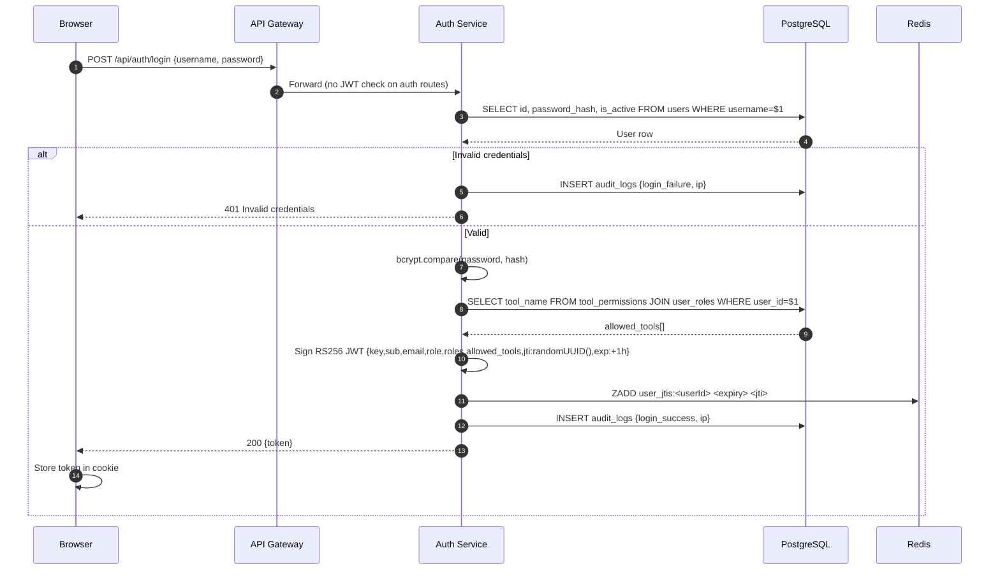

---
tags:
  - platform/flow
  - auth
  - jwt
aliases:
  - auth-flow
  - login-flow
type: Flow
description: End-to-end login sequence — credential validation, allowed_tools computation, RS256 JWT issuance with JTI tracking, and cookie storage
---

# Authentication Flow

> Part of the [[Datto RMM AI Platform|PLATFORM_BRAIN]] knowledge graph · **Flow** node

How a user logs in, gets a JWT with baked-in tool permissions, and that JWT is validated on every subsequent request.



## JWT Payload

```json
{
  "key": "dattoapp",
  "sub": "<uuid>",
  "email": "admin@example.com",
  "role": "admin",
  "roles": ["admin"],
  "allowed_tools": ["get-account", "list-sites", "...37 total"],
  "jti": "<randomUUID>",
  "iat": 1710000000,
  "exp": 1710003600
}
```

## Key Points

> [!warning] Security: Token Revocation
> Active JTIs are tracked in Redis sorted set `user_jtis:<userId>`. `revokeAllForUser()` scans this to force-revoke all sessions (SEC-008). If Redis is unavailable, JTI tracking is skipped and revocation is ==fail-open== (graceful degradation).

- `allowed_tools` is computed once at login from [[Tool Permissions Table|tool_permissions]] table — sealed into the token
- `jti` (JWT ID) is a `randomUUID()` embedded in every access token — enables single-token and forced-user revocation (SEC-002, SEC-008)
- The [[API Gateway]] validates the RS256 signature locally (no round-trip to [[Auth Service]])
- APISIX Lua injects `X-User-Id`, `X-User-Role`, `X-Allowed-Tools` headers from the decoded payload
- Failed logins are audit-logged with the client IP

## Related Nodes

[[Auth Service]] · [[JWT Model]] · [[RBAC System]] · [[Users Table]] · [[Tool Permissions Table]] · [[API Gateway]] · [[Token Manager]] · [[Roles Table]] · [[Web App]] · [[Network Isolation]] · [[PostgreSQL]]
