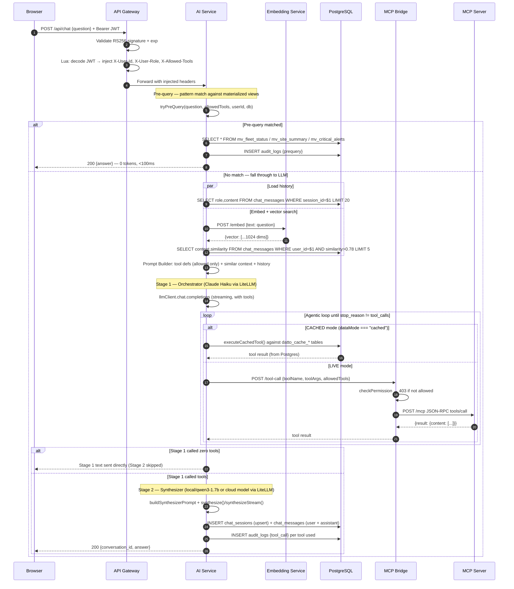

---
tags:
  - platform/flow
  - ai
  - chat
aliases:
  - chat-flow
  - chat-request
type: Flow
description: Full path of a user message through gateway, pre-query check, embedding, vector search, two-stage LLM pipeline, and tool calls to final response
---

# Chat Request Flow

> Part of the [[Datto RMM AI Platform|PLATFORM_BRAIN]] knowledge graph · **Flow** node

End-to-end path of a user message from browser to response, including the pre-query fast path, two-stage LLM pipeline, and tool calls.

## Four-Stage Pipeline

| Stage | Name | Model | Purpose | Latency |
|---|---|---|---|---|
| 0 | Pre-query | None (regex + SQL) | Pattern match → direct answer from materialized views, 0 tokens | <100ms |
| 1 | Orchestrator | `claude-haiku-4-5-*` (default) or `claude-opus-4-6` (high-risk) | Calls tools in a loop until all data is gathered | Depends on tool count |
| 2 | Tool Execution | N/A | CACHED reads from Postgres; LIVE goes through MCP Bridge → MCP Server → Datto API | Per tool |
| 3 | Synthesizer | `local/qwen3-1.7b` (cached), `claude-haiku-4-5-*` (default), or `deepseek-r1` (large data) | Reads tool results, writes final response | Varies by model |

**Pre-query** (`preQuery.ts`) intercepts simple questions ("how many devices?", "fleet status", "critical alerts") and answers them directly from materialized views (`mv_fleet_status`, `mv_site_summary`, `mv_alert_priority`, `mv_critical_alerts`, `mv_os_distribution`). RBAC is enforced — each pattern requires a specific tool permission via `allowedTools`. If no pattern matches or the user lacks the required tool permission, the request falls through to Stage 1.

**Stage 3 (Synthesizer)** is **skipped entirely** if Stage 1 called zero tools — Stage 1 text is sent directly.

Model selection per stage is driven by [[AI Service]] `llmConfig.ts` reading from `llm_routing_config` DB table in [[PostgreSQL]].

Both LLM stages use the **OpenAI SDK** (`llmClient`) via LiteLLM's `/v1/chat/completions` endpoint.

## Data Mode Toggle

The data mode (`cached` or `live`) determines whether tool execution reads from local Postgres cache or hits the Datto API via MCP. Resolution order:

1. **Request body** — `data_mode` field in the POST payload (highest priority)
2. **Session DB** — persisted `data_mode` on `chat_sessions` row
3. **Global default** — `default_data_mode` from `llm_routing_config` (defaults to `cached`)

The resolved mode is persisted back to the session via upsert, so it sticks across messages within a conversation.

## Two Chat Modes

| Mode | Route | Format | File |
|---|---|---|---|
| Legacy (sync) | `POST /api/chat` | `{conversation_id, answer}` | `legacyChat.ts` |
| Streaming (SSE) | `POST /chat` | `event: delta` stream | `chat.ts` |

> [!success] SEC-003 / SEC-Write-001 — Write tool staging (RESOLVED)
> The [[ActionProposal]] state machine (`ai-service/src/actionProposals.ts`, migration `db/015_action_proposals.sql`) ensures write tools cannot execute directly. The LLM stages a proposal → user confirms within 15 min → platform executes. No write tools exist yet, but the infrastructure is in place.
> Additionally, SEC-Cache-001 adds a hard permission gate (`permissions.ts`) that validates every tool name against `allowedTools` before any execution — covering both cached and live paths.

## Related Nodes

[[AI Service]] · [[Prompt Builder]] · [[Tool Router]] · [[Tool Execution Flow]] · [[Chat Messages Table]] · [[Embedding Service]] · [[API Gateway]] · [[MCP Bridge]] · [[MCP Server]] · [[PostgreSQL]] · [[JWT Model]] · [[RBAC System]] · [[Web App]] · [[ActionProposal]] · [[Network Isolation]]
