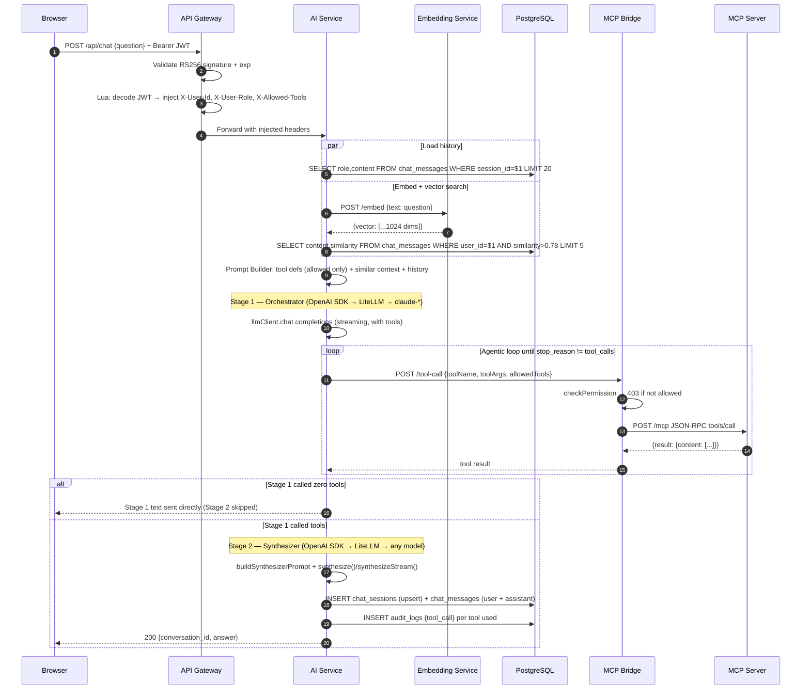

---
tags:
  - platform/flow
  - ai
  - chat
aliases:
  - chat-flow
  - chat-request
type: Flow
description: Full path of a user message through gateway, embedding, vector search, two-stage LLM pipeline, and tool calls to final response
---

# Chat Request Flow

> Part of the [[Datto RMM AI Platform|PLATFORM_BRAIN]] knowledge graph · **Flow** node

End-to-end path of a user message from browser to LLM response, including tool calls and the two-stage pipeline.

## Two-Stage Pipeline

| Stage | Name | Model | Purpose |
|---|---|---|---|
| 1 | Orchestrator | Must be `claude-*` | Calls MCP tools in a loop until all data is gathered |
| 2 | Synthesizer | Any model (via LiteLLM) | Reads tool results, writes final response |

Stage 2 is **skipped entirely** if Stage 1 called zero tools — Stage 1 text is sent directly.
Model selection per stage is driven by [[AI Service]] `llmConfig.ts` reading from `llm_routing_config` DB table in [[PostgreSQL]].

Both stages use the **OpenAI SDK** (`llmClient`) via LiteLLM's `/v1/chat/completions` endpoint.

## Two Chat Modes

| Mode | Route | Format | File |
|---|---|---|---|
| Legacy (sync) | `POST /api/chat` | `{conversation_id, answer}` | `legacyChat.ts` |
| Streaming (SSE) | `POST /chat` | `event: delta` stream | `chat.ts` |

> [!success] SEC-003 / SEC-Write-001 — Write tool staging (RESOLVED)
> The [[ActionProposal]] state machine (`ai-service/src/actionProposals.ts`, migration `db/015_action_proposals.sql`) ensures write tools cannot execute directly. The LLM stages a proposal → user confirms within 15 min → platform executes. No write tools exist yet, but the infrastructure is in place.
> Additionally, SEC-Cache-001 adds a hard permission gate (`permissions.ts`) that validates every tool name against `allowedTools` before any execution — covering both cached and live paths.

## Related Nodes

[[AI Service]] · [[Prompt Builder]] · [[Tool Router]] · [[Tool Execution Flow]] · [[Chat Messages Table]] · [[Embedding Service]] · [[API Gateway]] · [[MCP Bridge]] · [[MCP Server]] · [[PostgreSQL]] · [[JWT Model]] · [[RBAC System]] · [[Web App]] · [[ActionProposal]] · [[Network Isolation]]
