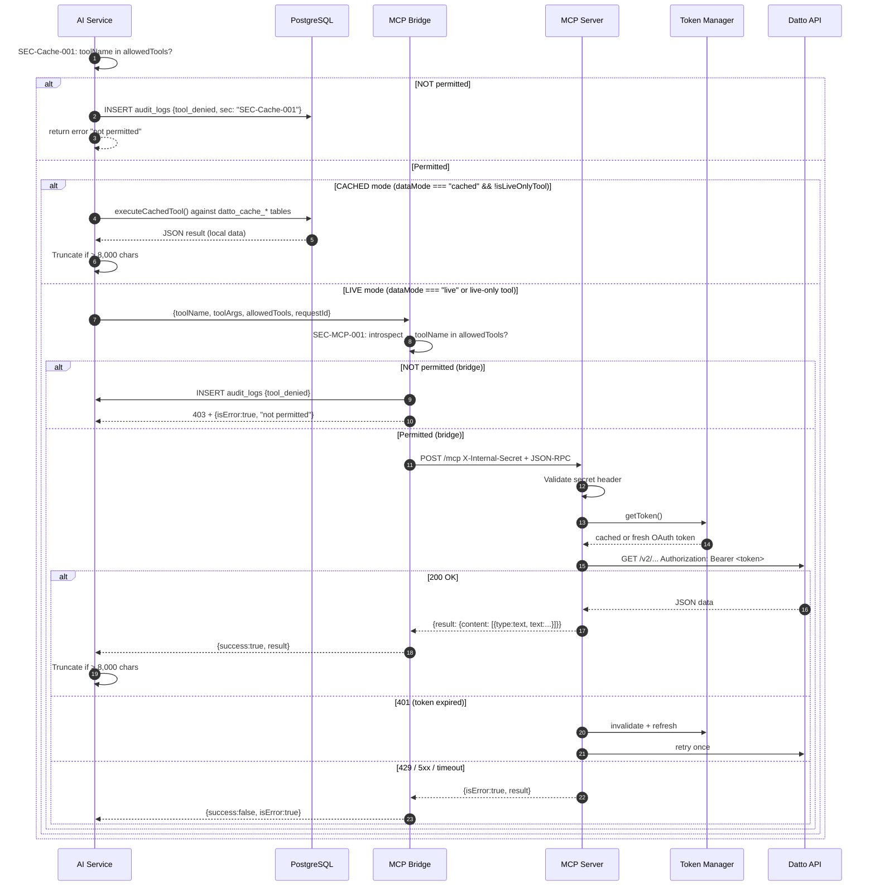

---
tags:
  - platform/flow
  - mcp
  - tools
aliases:
  - tool-flow
  - tool-execution
type: Flow
description: Six-layer permission enforcement — pre-query gate, prompt filter, ai-service gate (SEC-Cache-001), MCP Bridge (SEC-MCP-001), MCP registry, write gate (SEC-Write-001)
---

# Tool Execution Flow

> Part of the [[Datto RMM AI Platform|PLATFORM_BRAIN]] knowledge graph · **Flow** node

What happens from the moment the LLM decides to call a tool until the result is returned. Two paths exist depending on data mode.

## CACHED vs LIVE Paths

| Aspect | CACHED | LIVE |
|---|---|---|
| Data source | `datto_cache_*` tables in [[PostgreSQL]] | Datto API via [[MCP Bridge]] → [[MCP Server]] |
| Latency | ~5-50ms (local SQL) | ~200-2000ms (API round-trip) |
| Freshness | Last sync (see [[Local Data Cache]]) | Real-time |
| Permission gate | SEC-Cache-001 only (Layer 1.5) | SEC-Cache-001 (Layer 1.5) + SEC-MCP-001 (Layer 2) + MCP registry (Layer 3) |
| Unfiltered blocking | `executeCachedTool()` rejects unfiltered list calls to prevent 150K+ token dumps | N/A — API handles pagination |

## Truncation

All tool results are capped at **8,000 characters** (`MAX_TOOL_RESULT_CHARS`). If a result exceeds this limit, it is truncated with a suffix message advising narrower filters. This applies to both CACHED and LIVE paths.

## Six-Layer Permission Model

> [!warning] Defense in Depth
> Every tool call must pass through ==six independent permission layers==. A single-layer bypass is insufficient for unauthorized access.

| Layer | Where | What it stops |
|---|---|---|
| **0 — Pre-query gate** | `preQuery.ts` | Each pre-query pattern requires a specific tool permission; if user lacks it, falls through silently |
| **1 — Prompt** | [[Prompt Builder]] | Model never sees definitions of unauthorised tools |
| **1.5 — ai-service gate (SEC-Cache-001)** | `permissions.ts` + `chat.ts` / `legacyChat.ts` / `cachedQueries.ts` | Rejects tool names not in `allowedTools` before any execution — covers both cached and live paths |
| **2 — Bridge gate (SEC-MCP-001)** | [[MCP Bridge]] `index.ts` | Calls [[Auth Service]] introspect for DB-sourced `allowedTools`; ignores caller-supplied list |
| **3 — MCP registry** | [[MCP Server]] | `Unknown tool: x` error for unregistered names |
| **4 — Write gate (SEC-Write-001)** | [[ActionProposal]] / [[Write Tool State Machine]] | Write tools must be staged as a proposal and confirmed by the user before execution |

> [!info] SEC-Cache-001 — Cached Tool Permission Gate
> When `dataMode === "cached"`, tool calls bypass the [[MCP Bridge]] entirely and execute directly against `datto_cache_*` tables. Layer 1.5 is the **only hard gate** for cached tools. Three-point enforcement: call-site check, inner check in `executeCachedTool()`, and live pre-flight. Denials are audit-logged with `event_type = "tool_denied"` and metadata `{ sec: "SEC-Cache-001" }`.

## Related Nodes

[[MCP Bridge]] · [[MCP Server]] · [[Token Manager]] · [[RBAC System]] · [[AI Service]] · [[Chat Request Flow]] · [[ActionProposal]] · [[Prompt Builder]] · [[Tool Router]] · [[Auth Service]] · [[Datto Credential Isolation]] · [[Network Isolation]] · [[Write Tool State Machine]] · [[Tool Permissions Table]]
