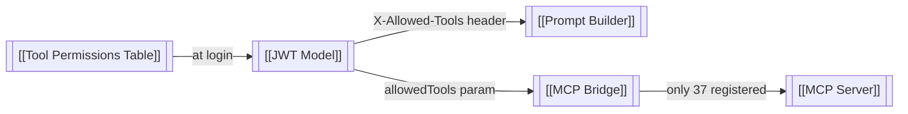

---
tags:
  - platform/module
  - security
  - rbac
type: Module
aliases:
  - RBAC
  - Role-Based Access Control
  - Permissions
description: Five-layer role-based access control — permissions computed at login, sealed into JWT, enforced at prompt, ai-service gate, bridge, MCP registry, and write gate layers
---

# RBAC System

> Part of the [[Datto RMM AI Platform|PLATFORM_BRAIN]] knowledge graph · **Module** node

> [!info] Defense in depth
> ==Five independent layers== ensure that even if one permission check is bypassed, the remaining layers still block unauthorized tool access.

**Purpose:** Five-layer role-based access control ensuring users can only call tools they are authorised for. Permissions computed once at login and sealed into the [[JWT Model|JWT]].

## Files

- `auth-service/src/handlers.ts` — query + embed into JWT
- `ai-service/src/permissions.ts` — SEC-Cache-001: hard permission gate for cached and live paths
- `ai-service/src/legacyChat.ts` + `chat.ts` — prompt filter + SEC-Cache-001 call-site checks
- `ai-service/src/cachedQueries.ts` — SEC-Cache-001: inner guard on `executeCachedTool()`
- `mcp-bridge/src/index.ts` — SEC-MCP-001: independent introspect + `checkPermission()`
- `ai-service/src/toolRegistry.ts` — re-export shim; definitions in `src/tools/` domain files (ARCH-002)
- `ai-service/src/actionProposals.ts` — SEC-Write-001: write tool staging state machine

## Flow



## Default Role Mappings

```
admin    → all 37 tools

analyst  → list-devices, get-device, list-sites, get-site,
           list-open-alerts, list-resolved-alerts, get-alert,
           get-job, get-activity-logs  (9 tools)

helpdesk → list-devices, get-device,
           list-open-alerts, list-resolved-alerts, get-alert  (5 tools)

readonly → list-sites, get-system-status,
           get-rate-limit, get-pagination-config  (4 tools)
```

## Five Permission Layers

| Layer | Where | What it stops |
|---|---|---|
| **1 — Prompt** | [[Prompt Builder]] | Model never sees definitions of unauthorised tools |
| **1.5 — ai-service gate (SEC-Cache-001)** | `permissions.ts` + `chat.ts` / `legacyChat.ts` / `cachedQueries.ts` | Rejects tool names not in `allowedTools` before any execution — covers both cached and live paths |
| **2 — Bridge gate (SEC-MCP-001)** | [[MCP Bridge]] `index.ts` | Calls auth-service introspect for DB-sourced `allowedTools`; ignores caller-supplied list |
| **3 — MCP registry** | [[MCP Server]] | `Unknown tool: x` error for unregistered names |
| **4 — Write gate (SEC-Write-001)** | [[ActionProposal]] | Write tools must be staged as a proposal and confirmed by the user before execution |

## Called By

[[Auth Service]] · [[AI Service]] · [[MCP Bridge]]

## Calls

[[Tool Permissions Table]] · [[Users Table]]

## Related Nodes

[[Tool Permissions Table]] · [[JWT Model]] · [[Tool Router]] · [[Authentication Flow]] · [[Tool Execution Flow]] · [[Auth Service]] · [[AI Service]] · [[MCP Bridge]] · [[MCP Server]] · [[Prompt Builder]] · [[ActionProposal]] · [[Users Table]] · [[Roles Table]] · [[Network Isolation]]
