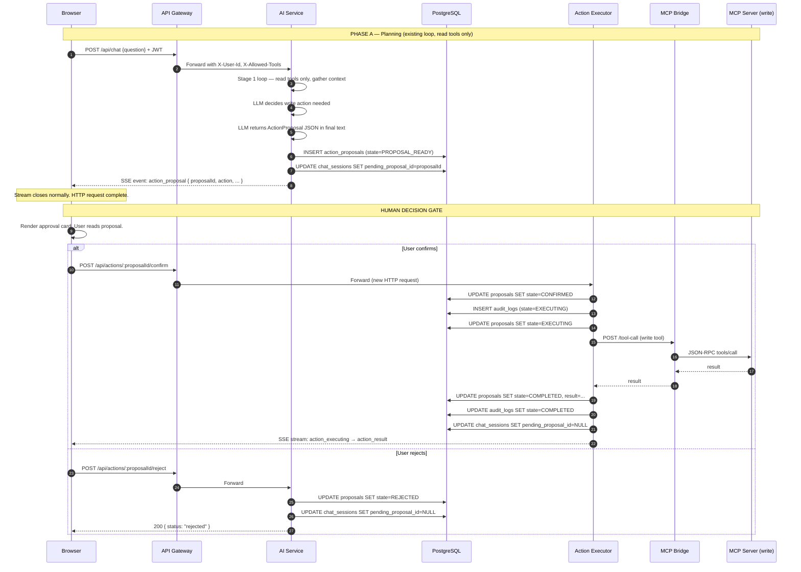
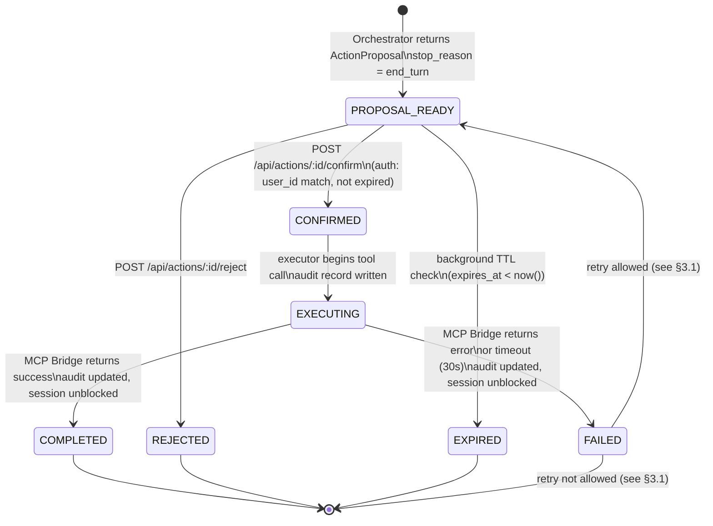

---
tags:
  - platform/architecture
  - write-tools
  - state-machine
type: Architecture
aliases:
  - Write Tool FSM
  - Action State Machine
  - Two-Phase Execution
description: Full specification of the write tool action staging state machine — two-phase execution model, ActionProposal schema, database design, API endpoints, SSE events, audit trail, and security properties. Implementation spec for Phase 1 write tools.
---

# Write Tool State Machine

> Part of the [[Datto RMM AI Platform|PLATFORM_BRAIN]] knowledge graph · **Architecture** node

> [!danger] Pre-implementation gate
> This document is the **required design gate** for [[ROADMAP|Phase 1 — Write Tools]]. No write tool implementation may begin until this spec is reviewed and accepted. The state machine described here addresses [[SECURITY_FINDINGS#SEC-003]] (action staging) and incorporates constraints from SEC-001, SEC-004, SEC-005, and SEC-009.

---

## 1. Why the current loop cannot be retrofitted

The existing agentic loop in [[AI Service]] (`src/chat.ts` and `src/legacyChat.ts`) follows a single, uninterrupted execution path:

```
stream open
  → LLM generates tool_use block
  → AI Service calls MCP Bridge synchronously
  → result pushed back into message array
  → stream continues
  → stop_reason = end_turn
stream closed, HTTP response sent
```

This loop has **no suspension point**. Every step executes inside a single HTTP request lifecycle. To understand why this is fundamentally incompatible with mid-loop human approval, consider each attempt to insert a pause:

### Attempt A: Hold the HTTP connection open waiting for user input

When the LLM decides to call a write tool, the server could pause the loop and wait for the user to confirm before calling [[MCP Bridge]]. In theory this sounds workable. In practice:

- The SSE connection (`POST /chat`) or the sync connection (`POST /api/chat`) would remain open — the response has not been sent.
- Node.js holds the socket. APISIX holds the upstream connection. The user's browser holds the EventSource or fetch connection.
- Production load balancers (APISIX included) have upstream timeout policies. A connection waiting for human input — which could take minutes — will be killed by those timeouts silently and without error propagation.
- The SSE stream has already been sending `event: delta` tokens to the browser. The connection is live. You cannot "pause" an open SSE stream and resume it after an async human decision — the client has no protocol for this and will interpret silence as a dead connection.
- If the user closes the browser tab (common during a decision pause), the connection drops. The loop state is lost. The write tool may or may not have been called — the system has no durable record of the pending decision.
- Under any production concurrency load, holding HTTP connections open waiting for out-of-band human events is unworkable. Each open connection consumes file descriptors, memory, and connection pool budget.

**This approach does not work.**

### Attempt B: Close the stream, reopen it after confirmation, resume the conversation

When the LLM produces a write tool call, the server could close the stream normally, persist the mid-loop state, and reopen a new stream after the user confirms. This sounds architecturally cleaner. The problem is **the LLM has already made a decision**.

In the Anthropic tool_use format, the model generates a `tool_use` block with a specific `tool_name` and `input` object. That block is part of the model's response — the decision to call the tool is baked into the conversation history. If you re-open the stream and push the conversation to the model again without the tool result, the model will either:

- Repeat the tool call (generating a second write proposal before you execute the first one), or
- Behave inconsistently depending on what the re-sent prompt looks like.

There is no way to tell the model "you decided to call this tool, please wait" — that is not part of the conversational protocol. The `tool_use` block requires a `tool_result` response. If you do not provide one and instead ask the model to continue, you are breaking the conversation structure the model was trained on.

Closing and re-opening would also require persisting the full mid-loop conversation state (all accumulated tool results, the partial message list, the pending tool_use block) to a durable store between the two HTTP requests. This is significant infrastructure that introduces its own failure modes (stale state, serialization bugs, race conditions on re-open).

**This approach is also unworkable at production quality.**

### The correct framing

The current loop is not a loop that needs a pause inserted. It is a **read-gathering pipeline** that has no business seeing write tools at all. The architectural fix is to recognize that:

1. The LLM's job in Stage 1 is to gather information and determine what action is needed.
2. The LLM's job ends when it knows what action to propose. It does not execute the action.
3. Execution is a separate concern owned by a separate code path, triggered by a separate HTTP request after a human decision.

This reframing eliminates the retrofit problem entirely. The existing loop is unchanged. A new execution path is added alongside it.

---

## 2. The correct architecture: two-phase execution

The design separates the conversation lifecycle into two fully independent phases. They never overlap. They communicate only through a database record.



### Phase A — Planning (read-only, current loop, unchanged)

Phase A is the existing [[Chat Request Flow]] with one modification: write tool definitions are **never included in the prompt** when a session is in a state that could produce a direct write call. The [[Prompt Builder]] builds the tool list from the user's `allowed_tools` JWT claim, but a separate filter strips any tool tagged `is_write = true` from the definitions array passed to the LLM.

Instead, the system prompt includes a new section (see §9) that instructs the model: when you determine a write action is needed, return an `ActionProposal` JSON structure in your final text response. Do not call a write tool.

The Stage 1 loop continues to run exactly as documented in [[Chat Request Flow]]:
- Read tools are called freely to gather context.
- The loop runs until `stop_reason = end_turn`.
- The final LLM response text is inspected for the `type: "action_proposal"` sentinel field.
- If found: the parser routes to the proposal creation path instead of the synthesis path.
- If not found: the response routes through Stage 2 synthesis as normal.

**When the proposal path is taken:**
- `action_proposals` record is inserted (state = `PROPOSAL_READY`).
- `chat_sessions.pending_proposal_id` is set to the new proposal's UUID.
- The SSE stream emits `event: action_proposal` with the full proposal data.
- The stream closes. The HTTP request completes. No connections are held open.

### Phase B — Execution (new, separate request, after human decision)

Phase B is a new code path. It is not the agentic loop. It is a lightweight executor that:

1. Receives a confirmed proposalId via `POST /api/actions/:proposalId/confirm`.
2. Validates the proposal (state must be `PROPOSAL_READY`, not expired, user match).
3. Writes an audit record (`EXECUTING` state) before calling the tool.
4. Calls [[MCP Bridge]] with the exact `tool_name` and `tool_args` from the proposal record.
5. Records the result and transitions the proposal to `COMPLETED` or `FAILED`.
6. Clears `chat_sessions.pending_proposal_id`.
7. Streams execution progress back to the browser via a new SSE stream on the confirm endpoint.

The executor does not invoke the LLM. It does not call Stage 1 or Stage 2. It executes exactly one tool call with exactly the arguments that the user reviewed and confirmed. There is no opportunity for the model to inject additional actions between confirmation and execution.

> [!important] This is not a "pause" in the current loop
> Phase A and Phase B are two independent HTTP requests with a database record as the handoff. The planning phase is complete and the connection is closed before the execution phase begins. The human decision gate is not a timer waiting inside a held connection — it is the gap between two separate network calls.

---

## 3. State machine — full specification

### States

| State | Description |
|---|---|
| `PLANNING` | Stage 1 orchestrator is running. Read tools are being called. Not persisted as a proposal record — this is the in-flight chat request state. |
| `PROPOSAL_READY` | Orchestrator has returned an ActionProposal. Record exists in `action_proposals`. Session has `pending_proposal_id` set. Awaiting user decision. |
| `CONFIRMED` | User approved via `POST /api/actions/:proposalId/confirm`. Executor is beginning validation. |
| `EXECUTING` | Write tool call is in flight to [[MCP Bridge]] → [[MCP Server]]. Audit record written with `EXECUTING` state. |
| `COMPLETED` | Tool execution succeeded. Audit record updated. `pending_proposal_id` cleared. |
| `REJECTED` | User rejected the proposal. `pending_proposal_id` cleared. No tool execution occurred. |
| `FAILED` | Tool execution returned an error, or timed out. Audit record updated with error detail. `pending_proposal_id` cleared. |
| `EXPIRED` | Background job found `expires_at < now()` and proposal was still in `PROPOSAL_READY`. Transitions to `EXPIRED`. `pending_proposal_id` cleared. |

### State diagram



### Transition triggers

**`PLANNING → PROPOSAL_READY`**
Triggered inside the Phase A chat handler (`chat.ts` / `legacyChat.ts`) when:
- The final text block from Stage 1 contains a JSON object with `type: "action_proposal"`.
- `stop_reason` is `end_turn` (the loop completed normally — not a tool call mid-stream).
- The proposal is parsed, validated against the schema (§4), and inserted into `action_proposals`.
- `chat_sessions.pending_proposal_id` is set.
- SSE `event: action_proposal` is emitted before the stream closes.

**`PROPOSAL_READY → CONFIRMED`**
Triggered by `POST /api/actions/:proposalId/confirm` when:
- JWT is valid and `sub` (userId) matches `proposal.user_id`.
- `proposal.state == 'PROPOSAL_READY'`.
- `proposal.expires_at > now()`.
- If `proposal.requiresSecondApprover` is set: caller's role must match that value (Phase 2 feature — see §11).

**`PROPOSAL_READY → REJECTED`**
Triggered by `POST /api/actions/:proposalId/reject` when:
- JWT is valid and `sub` matches `proposal.user_id`.
- `proposal.state == 'PROPOSAL_READY'` or `CONFIRMED` (allow cancellation before execution starts).
- Optional rejection reason in request body.

**`PROPOSAL_READY → EXPIRED`**
Triggered by a background job (cron, every 60 seconds) that runs:
```sql
UPDATE action_proposals
SET state = 'EXPIRED'
WHERE state = 'PROPOSAL_READY'
  AND expires_at < now();
```
After expiry update: clear `chat_sessions.pending_proposal_id` for all affected sessions.

**`CONFIRMED → EXECUTING`**
Triggered immediately when the executor begins. The transition to `EXECUTING` and the `INSERT INTO audit_logs` must be written to the database before `callMcpTool()` is called. This ensures the audit record exists even if the executor crashes mid-execution.

**`EXECUTING → COMPLETED`**
Triggered when [[MCP Bridge]] returns a non-error result. The executor:
1. Updates `action_proposals.state = 'COMPLETED'`, sets `result`, `completed_at`.
2. Updates `audit_logs.metadata` with the result summary.
3. Updates `chat_sessions` to clear `pending_proposal_id`.

**`EXECUTING → FAILED`**
Triggered when [[MCP Bridge]] returns `isError: true`, or when the executor's 30-second timeout fires. Same write sequence as COMPLETED but with `state = 'FAILED'` and the error detail in `result`.

### 3.1 Retry policy (design decision)

Two options exist for handling `FAILED` proposals:

**Option A: No retry. FAILED is terminal.**
The user must start a new chat message. The system trusts that if the action failed once (network error, tool error, auth error), retrying the same proposal without new context is probably not what the user wants. The user can ask the AI again, which will gather fresh context and propose a new action.

*Pros:* Simpler state machine. Prevents double-execution bugs. Forces fresh context gathering.
*Cons:* User friction on transient failures (network blip during reboot command).

**Option B: Retry allowed from FAILED → PROPOSAL_READY.**
The executor re-sets `state = 'PROPOSAL_READY'`, clears `executed_at`, and allows re-confirmation. The proposal's `expires_at` is preserved (not reset). The UI must surface the failure reason so the user can decide whether a retry makes sense.

*Pros:* Better UX for transient failures.
*Cons:* Requires the executor to distinguish retryable errors (503, timeout) from non-retryable errors (403 permission denied, tool error with user-facing message). Adds state transition complexity.

> [!note] Recommendation — Phase 1 decision
> **Implement Option A first.** Add Option B in a follow-on if users report friction. Transient MCP failures should be rare (the bridge already retries 3× with backoff). If a proposal fails after the bridge's retry exhaustion, the failure is likely meaningful (wrong device UID, Datto API error) and warrants fresh context.

---

## 4. ActionProposal schema

The LLM returns this structure as the **entire content of its final text response** when a write action is needed. The parser in `chat.ts` / `legacyChat.ts` detects `type: "action_proposal"` in the text block and routes to proposal creation.

```typescript
interface ActionProposal {
  /** Sentinel field — parser detects this to distinguish from normal text response */
  type: "action_proposal";

  /** UUID — must be unique. The LLM generates this. The server validates it is a valid UUID
   *  and replaces it with a server-generated UUID before persisting. Never trust the LLM-supplied
   *  proposalId as the canonical ID — use the DB-assigned id. */
  proposalId: string;

  /** Exact tool name matching a registered write tool in toolRegistry.ts */
  action: string;

  /** Tool arguments — these are what will be executed verbatim if confirmed.
   *  The user is reviewing these. They must be human-readable. */
  args: Record<string, unknown>;

  /** Risk level — must match the tool's tool_policies.risk_level value.
   *  If the LLM's riskLevel does not match the DB value, the DB value wins. */
  riskLevel: "low" | "medium" | "high" | "critical";

  /** Human-readable description of what will happen.
   *  Example: "Reboot device LAPTOP-001 (hostname: laptop-001.acme.com, last seen 2h ago)" */
  description: string;

  /** Why the LLM determined this action was needed.
   *  Must reference specific data gathered in Phase A (device name, alert text, etc.)
   *  Example: "Device LAPTOP-001 has been showing alert 'Agent offline' for 2 hours.
   *  A reboot is the standard first remediation step for this alert type." */
  rationale: string;

  /** Whether this action can be undone.
   *  reboot-device: true (device comes back online)
   *  mute-alert: true (can unmute)
   *  run-script: false (side effects may be permanent)
   *  reset-agent: false */
  reversible: boolean;

  /** Human-readable impact estimate.
   *  Example: "Device will be offline for approximately 2–5 minutes during reboot." */
  estimatedImpact: string;

  /** How long this proposal is valid, in seconds. Default: 600 (10 minutes).
   *  Critical-risk actions may use shorter TTLs (e.g. 300 seconds). */
  ttlSeconds: number;

  /** For critical actions requiring a second approver: the role name required.
   *  Phase 1: leave undefined. Phase 2 feature. */
  requiresSecondApprover?: string;
}
```

### Parser logic in `chat.ts` / `legacyChat.ts`

The existing response handler checks the final text content for the sentinel field:

```typescript
function parseActionProposal(text: string): ActionProposal | null {
  // Strip any leading/trailing whitespace or markdown code fences the LLM may wrap around the JSON
  const stripped = text.trim().replace(/^```json?\n?/, '').replace(/\n?```$/, '');
  try {
    const parsed = JSON.parse(stripped);
    if (parsed && parsed.type === 'action_proposal') {
      return parsed as ActionProposal;
    }
  } catch {
    // Not JSON — route to normal synthesis path
  }
  return null;
}
```

If `parseActionProposal` returns non-null:
1. Validate the proposal against the schema (all required fields present, `action` exists in tool registry as a write tool, `riskLevel` is a valid enum value).
2. Look up `tool_policies` for the tool — override `riskLevel` with the DB value (the LLM's risk assessment is informational, not authoritative).
3. Generate a server-side UUID for the proposal (discard LLM's `proposalId`).
4. Compute `expires_at = now() + proposal.ttlSeconds`.
5. Mask sensitive `args` fields (§8) to produce `tool_args_masked`.
6. Insert `action_proposals` record.
7. Update `chat_sessions.pending_proposal_id`.
8. Emit `event: action_proposal` on the SSE stream.
9. Skip Stage 2 synthesis entirely — the proposal is the response.

---

## 5. Database schema

### Migration: `db/014_write_tool_state_machine.sql`

This migration must be applied as part of Phase 1 before any write tool code is deployed.

```sql
-- ============================================================
-- action_proposals: one record per proposed write action
-- ============================================================
CREATE TABLE IF NOT EXISTS action_proposals (
  id                uuid        PRIMARY KEY DEFAULT uuid_generate_v4(),
  session_id        uuid        NOT NULL REFERENCES chat_sessions(id) ON DELETE CASCADE,
  user_id           uuid        NOT NULL REFERENCES users(id) ON DELETE CASCADE,
  message_id        uuid        REFERENCES chat_messages(id) ON DELETE SET NULL,
  tool_name         text        NOT NULL,
  tool_args         jsonb       NOT NULL,
  tool_args_masked  jsonb       NOT NULL,
  risk_level        text        NOT NULL CHECK (risk_level IN ('low','medium','high','critical')),
  description       text        NOT NULL,
  rationale         text        NOT NULL,
  reversible        boolean     NOT NULL,
  estimated_impact  text,
  state             text        NOT NULL DEFAULT 'PROPOSAL_READY'
                                CHECK (state IN (
                                  'PROPOSAL_READY','CONFIRMED','EXECUTING',
                                  'COMPLETED','REJECTED','FAILED','EXPIRED'
                                )),
  created_at        timestamptz NOT NULL DEFAULT now(),
  expires_at        timestamptz NOT NULL,
  confirmed_at      timestamptz,
  confirmed_by      uuid        REFERENCES users(id),
  executed_at       timestamptz,
  completed_at      timestamptz,
  rejected_at       timestamptz,
  rejected_by       uuid        REFERENCES users(id),
  rejection_reason  text,
  result            jsonb,
  audit_log_id      uuid        REFERENCES audit_logs(id)
);

CREATE INDEX IF NOT EXISTS action_proposals_session_id_idx
  ON action_proposals (session_id);
CREATE INDEX IF NOT EXISTS action_proposals_user_id_state_idx
  ON action_proposals (user_id, state);
CREATE INDEX IF NOT EXISTS action_proposals_expires_at_idx
  ON action_proposals (expires_at)
  WHERE state = 'PROPOSAL_READY';

-- ============================================================
-- chat_sessions additions
-- ============================================================

-- data_mode column (already exists in current schema — included for completeness)
ALTER TABLE chat_sessions
  ADD COLUMN IF NOT EXISTS allowed_tools text[] DEFAULT '{}';

ALTER TABLE chat_sessions
  ADD COLUMN IF NOT EXISTS data_mode text NOT NULL DEFAULT 'cached';

-- The blocking column: non-null means the session is gated behind a pending action.
-- A new chat message on a session with pending_proposal_id set returns 409.
ALTER TABLE chat_sessions
  ADD COLUMN IF NOT EXISTS pending_proposal_id uuid
    REFERENCES action_proposals(id) ON DELETE SET NULL;

-- ============================================================
-- tool_policies additions (existing table)
-- ============================================================

-- Mark tools as write tools so the prompt builder can exclude them
-- from the LLM's direct call list and the tool registry knows to
-- require the staging flow.
ALTER TABLE tool_policies
  ADD COLUMN IF NOT EXISTS is_write boolean NOT NULL DEFAULT false;

-- ============================================================
-- Immutability enforcement (SEC-005)
-- ============================================================

-- Create audit_writer role with INSERT-only on audit_logs
DO $$
BEGIN
  IF NOT EXISTS (SELECT FROM pg_roles WHERE rolname = 'audit_writer') THEN
    CREATE ROLE audit_writer;
  END IF;
END $$;

GRANT INSERT ON audit_logs TO audit_writer;
-- The application's app_user should be granted audit_writer, not direct DML on audit_logs.
-- REVOKE UPDATE, DELETE ON audit_logs FROM app_user;  -- run after verifying app_user exists
-- GRANT audit_writer TO app_user;
```

### Why `pending_proposal_id` blocks new chat messages

`pending_proposal_id` is not merely informational — it is an active gate. When `POST /api/chat` receives a request on a session where `pending_proposal_id IS NOT NULL`, the handler returns:

```json
HTTP 409 Conflict
{ "error": "pending_action", "proposalId": "<uuid>" }
```

The user cannot send another message until they confirm or reject the pending proposal.

**Why this is necessary (context freeze):**

Consider the following sequence without this gate:

1. User asks: "LAPTOP-001 keeps dropping offline. What should I do?"
2. AI gathers context (device status, alerts, last seen time) and proposes: "Reboot LAPTOP-001."
3. User says "actually, tell me more about that alert first."
4. AI responds with alert detail. User reads. Thirty seconds pass.
5. User clicks [Confirm] on the original reboot proposal.
6. The reboot executes — but the user's context has changed. They may have learned something in step 3/4 that would have changed their decision. The proposal's rationale referenced the state as of step 2, not step 5.

The `pending_proposal_id` block prevents steps 3–4 from being possible. The user must make a binary decision (confirm or reject) before the conversation can continue. This ensures the human approval is made with the same context the AI used to generate the proposal.

Additionally, it prevents a subtler attack: if a user has write permissions and a crafted prompt injection causes an ActionProposal to be generated, the context freeze ensures the user cannot be distracted into chatting away from the pending proposal and then approving it accidentally later.

---

## 6. New API endpoints

### `POST /api/actions/:proposalId/confirm`

Confirms a pending proposal and begins execution.

```
Auth:    JWT required (APISIX validates RS256)
Headers: X-User-Id (injected by APISIX Lua)

Validations:
  1. Load proposal WHERE id = :proposalId
  2. Return 404 if not found
  3. Return 403 if proposal.user_id != X-User-Id
  4. Return 409 if proposal.state != 'PROPOSAL_READY'
  5. Return 410 if proposal.expires_at < now() (also transition to EXPIRED)
  6. If proposal.requiresSecondApprover: return 403 with { error: "requires_second_approver", role: ... }

On success:
  - UPDATE action_proposals SET state='CONFIRMED', confirmed_at=now(), confirmed_by=userId
  - Begin executor (see §2 Phase B sequence)
  - Return: SSE stream with events:
      { event: "action_executing", data: { proposalId, toolName, status: "in_flight" } }
      { event: "action_result",    data: { proposalId, success: boolean, result: string } }
```

### `POST /api/actions/:proposalId/reject`

Rejects a pending proposal.

```
Auth:    JWT required
Headers: X-User-Id (injected by APISIX)
Body:    { reason?: string }

Validations:
  1. Load proposal WHERE id = :proposalId
  2. Return 404 if not found
  3. Return 403 if proposal.user_id != X-User-Id
  4. Return 409 if proposal.state not in ('PROPOSAL_READY', 'CONFIRMED')

On success:
  - UPDATE action_proposals SET
      state='REJECTED',
      rejected_at=now(),
      rejected_by=userId,
      rejection_reason=body.reason
  - UPDATE chat_sessions SET pending_proposal_id=NULL WHERE pending_proposal_id=:proposalId
  - Return: 200 { status: "rejected" }
```

### `GET /api/actions/:proposalId`

Returns the current state and details of a proposal. Used for polling and page-refresh recovery.

```
Auth:    JWT required
Headers: X-User-Id

Validations:
  1. Load proposal
  2. Return 404 if not found
  3. Return 403 if proposal.user_id != X-User-Id (users cannot see others' proposals)

Returns:
  {
    id, state, toolName, description, rationale, riskLevel,
    reversible, estimatedImpact, expiresAt, createdAt,
    confirmedAt?, rejectedAt?, completedAt?,
    result?
  }
  Note: tool_args is NOT returned here — it was shown to the user in the original
  action_proposal SSE event. Returning it again on every poll is unnecessary and
  reduces the exposure surface for sensitive argument values.
```

### `POST /api/chat` — new validation

```
Existing handler gains one additional check at the top, before any other processing:

  1. Load session WHERE id = :sessionId AND user_id = :userId
  2. If session.pending_proposal_id IS NOT NULL:
       Check if proposal has expired:
         If expired: UPDATE proposal SET state='EXPIRED', clear pending_proposal_id, continue
         Else: return 409 {
           error: "pending_action",
           proposalId: session.pending_proposal_id,
           message: "Confirm or reject the pending action before sending another message."
         }
```

---

## 7. SSE event types

The following SSE event types are added to the existing event vocabulary defined in `src/sse.ts`.

### `action_proposal`

Emitted at the end of Phase A when a valid ActionProposal is parsed from the LLM's response. This is the event the UI uses to render the approval card.

```typescript
{
  event: "action_proposal",
  data: {
    proposalId: string;        // server-assigned UUID (not LLM's proposalId)
    action: string;            // tool name: "reboot-device"
    args: Record<string, unknown>;  // tool args (not masked — user needs to see these)
    riskLevel: "low" | "medium" | "high" | "critical";
    description: string;       // "Reboot device LAPTOP-001 (last seen 2h ago)"
    rationale: string;         // why the AI decided this
    reversible: boolean;
    estimatedImpact: string;
    expiresAt: string;         // ISO 8601 timestamp — UI shows countdown timer
    requiresSecondApprover?: string;  // role name, if set
  }
}
```

### `action_executing`

Emitted on the confirmation SSE stream immediately after the executor begins the MCP call.

```typescript
{
  event: "action_executing",
  data: {
    proposalId: string;
    toolName: string;
    status: "in_flight";
  }
}
```

### `action_result`

Emitted on the confirmation SSE stream when execution completes (success or failure).

```typescript
{
  event: "action_result",
  data: {
    proposalId: string;
    success: boolean;
    result: string;     // Human-readable result or error message (truncated at 2000 chars)
    completedAt: string;  // ISO 8601
  }
}
```

### `action_expired`

Emitted if the TTL background job expires a proposal while the user's browser is connected (i.e. on the SSE stream for the original chat). The UI uses this to disable the approval card.

```typescript
{
  event: "action_expired",
  data: {
    proposalId: string;
  }
}
```

> [!note] UI behaviour contract
> On receiving `event: action_proposal`: render an approval card with the description, rationale, estimated impact, risk level badge, countdown timer, and [Confirm] / [Reject] buttons. Disable the chat input field.
>
> On receiving `event: action_expired`: grey out the card, show "This proposal expired", re-enable the chat input.
>
> On user clicking [Confirm]: fire `POST /api/actions/:proposalId/confirm` — this opens a new SSE stream. Show a "Executing..." spinner while `action_executing` is in flight. Show success/error state when `action_result` arrives.
>
> On user clicking [Reject]: fire `POST /api/actions/:proposalId/reject`. Dismiss the card. Re-enable the chat input.

---

## 8. Immutable audit trail design

Every write action produces an audit record that must be tamper-resistant. The design addresses [[SECURITY_FINDINGS#SEC-005]] and [[SECURITY_FINDINGS#SEC-009]] together.

### Write sequence (must be atomic or compensating)

The executor follows this exact sequence:

```
1. UPDATE action_proposals SET state='CONFIRMED', confirmed_at=now()

2. INSERT INTO audit_logs {
     event_type:  'write_tool_executing',
     user_id:     proposal.user_id,
     tool_name:   proposal.tool_name,
     ip_address:  X-Forwarded-For from request,
     metadata: {
       proposalId:     proposal.id,
       sessionId:      proposal.session_id,
       toolArgsMasked: proposal.tool_args_masked,  -- NEVER tool_args
       riskLevel:      proposal.risk_level,
       confirmedBy:    proposal.confirmed_by,
       state:          'EXECUTING'
     }
   }
   → capture audit_log_id

3. UPDATE action_proposals SET
     state='EXECUTING',
     executed_at=now(),
     audit_log_id=<from step 2>

4. result = await callMcpTool(proposal.tool_name, proposal.tool_args)

5a. On success:
    UPDATE action_proposals SET
      state='COMPLETED',
      completed_at=now(),
      result={ success: true, summary: truncate(result, 2000) }

    INSERT INTO audit_logs {
      event_type: 'write_tool_completed',
      ...same fields as step 2...,
      metadata: { ...step2 metadata..., result: truncate(result, 2000), state: 'COMPLETED' }
    }

5b. On failure:
    UPDATE action_proposals SET
      state='FAILED',
      completed_at=now(),
      result={ success: false, error: errorMessage }

    INSERT INTO audit_logs {
      event_type: 'write_tool_failed',
      ...same fields as step 2...,
      metadata: { ...step2 metadata..., error: errorMessage, state: 'FAILED' }
    }

6. UPDATE chat_sessions SET pending_proposal_id=NULL
```

> [!danger] Step 2 must precede step 4
> The audit INSERT must happen before `callMcpTool()` is invoked. If the executor crashes after the MCP call but before the audit write, we have an executed action with no audit record. Inserting the `EXECUTING` record first ensures there is always a record that the action was attempted, even if the completion/failure update never arrives.

### Immutability enforcement (SEC-005)

The `audit_logs` table must be INSERT-only for all application code paths. The migration in §5 creates the `audit_writer` PostgreSQL role. Implementation:

1. The executor connects with a `pg.Pool` that authenticates as `audit_writer`.
2. `audit_writer` has `GRANT INSERT ON audit_logs`. No `UPDATE`, `DELETE`, or `TRUNCATE`.
3. The `state` information in step 5a/5b is captured by inserting a **new** audit row (event type `write_tool_completed` or `write_tool_failed`) rather than updating the existing row from step 2. This means the audit log contains two records per execution: one for the start, one for the end.
4. For critical-risk actions: dual-write to an append-only external sink. Phase 1 recommendation: write to a PostgreSQL `UNLOGGED` table (`audit_logs_critical_shadow`) that mirrors critical events. Phase 2: forward to S3 append-only bucket or a WORM-compliant log aggregator.

### Parameter masking (SEC-009)

`tool_args_masked` is computed before the `action_proposals` INSERT using a recursive redaction function:

```typescript
const SENSITIVE_PARAM_NAMES = new Set([
  'password', 'secret', 'credential', 'token', 'key',
  'apiKey', 'api_key', 'accessKey', 'access_key',
  'privateKey', 'private_key', 'passphrase'
]);

function maskSensitiveArgs(args: Record<string, unknown>): Record<string, unknown> {
  const result: Record<string, unknown> = {};
  for (const [k, v] of Object.entries(args)) {
    const lowerKey = k.toLowerCase();
    if ([...SENSITIVE_PARAM_NAMES].some(s => lowerKey.includes(s))) {
      result[k] = '[REDACTED]';
    } else if (v !== null && typeof v === 'object' && !Array.isArray(v)) {
      result[k] = maskSensitiveArgs(v as Record<string, unknown>);
    } else {
      result[k] = v;
    }
  }
  return result;
}
```

`tool_args` (unmasked) is stored in `action_proposals` for execution purposes but **never written to `audit_logs`**. Only `tool_args_masked` reaches the audit table.

### What the audit record captures

```
proposalId         — links audit to the action_proposals record
userId             — who requested this
userName           — denormalized for audit readability (resolved at insert time)
sessionId          — which conversation context produced the proposal
toolName           — e.g. "reboot-device"
toolArgsMasked     — { deviceUid: "abc123", ... } — never plaintext secrets
riskLevel          — "low" | "medium" | "high" | "critical"
confirmedBy        — may differ from userId for second-approver flow
executedAt         — ISO 8601
result             — success/error, truncated at 2000 chars
ipAddress          — from X-Forwarded-For header (trust APISIX as the terminator)
```

---

## 9. Orchestrator prompt changes

The `buildSystemPrompt()` function in `src/prompt.ts` must be modified to include a write-actions section when write tools are in scope for the user's session.

The write-actions section is appended only when `allowedWriteTools.length > 0` (i.e. the user has at least one write tool in their `tool_policies`). For users with no write tools, the prompt is unchanged.

```
## Write Actions

You have access to the following write operations through this platform:
{{#each allowedWriteTools}}
- {{this.name}}: {{this.description}}
{{/each}}

IMPORTANT: You must NOT call these tools directly. The platform does not permit
direct LLM execution of write operations.

When you determine that a write action is needed:

1. Use read tools first to gather all necessary context (device status, current
   alerts, last seen time, site information — whatever is relevant to confirm the
   action is appropriate).

2. Once you have sufficient context, respond with ONLY the following JSON structure
   and nothing else — no preamble, no explanation outside the JSON:

{
  "type": "action_proposal",
  "proposalId": "<generate a uuid>",
  "action": "<exact tool name from the list above>",
  "args": { <tool arguments> },
  "riskLevel": "<low|medium|high|critical>",
  "description": "<one sentence: what will happen, naming the specific device/resource>",
  "rationale": "<two to three sentences: why this action is needed, referencing specific data you gathered>",
  "reversible": <true|false>,
  "estimatedImpact": "<what the user should expect: downtime duration, affected services, etc.>",
  "ttlSeconds": 600
}

3. Do not speculate about the outcome. Do not confirm the action will succeed.
   Only propose it.

4. If you are not certain the action is appropriate based on the data gathered,
   say so in plain text instead of returning a proposal.

5. Return exactly one proposal per response. Do not chain multiple proposals.
```

> [!warning] Prompt injection resilience
> A prompt injection attack that causes the LLM to return a forged ActionProposal is still safe — the proposal still requires human confirmation before execution. The server-side parser validates that:
> - `action` matches a registered write tool name.
> - `args` matches the tool's input schema.
> - `riskLevel` is overridden by the DB value in `tool_policies`.
>
> The LLM cannot bypass the human confirmation gate by crafting a proposal. The worst a successful injection can do is surface a plausible-looking proposal that the user then confirms or rejects. See §10 for the full security property analysis.

---

## 10. Security properties of this design

This section enumerates what the two-phase design guarantees and what it does not.

### No LLM-initiated writes

The LLM never calls a write tool. Write tool definitions are stripped from the prompt's tool list (the `buildSystemPrompt` call passes only read tools to the Anthropic/OpenAI SDK). The LLM can only signal intent to write by returning a structured text response. A prompt injection that causes the LLM to attempt a direct write tool call will fail at the `callMcpTool` layer because no write tool name will exist in the registered MCP tools reachable from Phase A.

### User-bound confirmation

`POST /api/actions/:proposalId/confirm` checks `proposal.user_id == X-User-Id` (the JWT sub). This check is performed server-side against the database record — it does not trust any claim in the request body. Cross-user confirmation is structurally impossible: user B cannot confirm a proposal created during user A's session.

### Expiry prevents stale approvals

`expires_at` is computed at proposal creation time from `proposal.ttlSeconds`. The executor checks `expires_at > now()` before allowing confirmation. A proposal created while the user was looking at one device cannot be confirmed twenty minutes later when the user has moved on to a different context. The TTL default (600 seconds / 10 minutes) is a balance between usability and staleness risk. Critical-risk tools may use shorter TTLs.

### Context freeze prevents drift

`chat_sessions.pending_proposal_id` blocks new messages while a proposal is pending. The user cannot continue the conversation, accumulate new context, and then approve an action whose rationale is now stale. The approval decision is forced to be made synchronously with the AI's reasoning.

### Masked audit — sensitive args never reach audit storage in plaintext

The `maskSensitiveArgs` function (§8) is applied before the `action_proposals` INSERT. `audit_logs` records reference `tool_args_masked`, not `tool_args`. Even if the `audit_logs` table is compromised, write tool parameters matching the sensitive key list are stored as `[REDACTED]`.

### Separation of planning and execution

Phase A (planning) and Phase B (execution) are independent HTTP requests separated by a human decision and a database state transition. The planning phase completes — the connection is closed, the LLM context is flushed — before execution begins. There is no shared in-flight state between phases. If the Phase A request fails mid-stream, no proposal is created. If the Phase B executor crashes, the Phase A request is already complete and the proposal record exists in `EXECUTING` state for recovery.

### Audit record precedes execution

The `INSERT INTO audit_logs` (event type `write_tool_executing`) occurs before `callMcpTool()` is invoked. This is not just a correctness concern — it is a security guarantee. There is always an audit record showing that a write was attempted, even if the executor dies immediately after the MCP call returns.

### MCP write container isolation (SEC-004 dependency)

This design assumes that write tools are served by a separate `mcp-write` container as specified in [[SECURITY_FINDINGS#SEC-004]]. The executor in Phase B calls [[MCP Bridge]] with the write tool name. The bridge routes to `mcp-write` based on `tool_policies.is_write`. If SEC-004 is not implemented before Phase 1 ships, the security isolation guarantee of this design is weakened — a compromised `mcp-read` container would also be a compromised write tool executor. **SEC-004 is a hard dependency of Phase 1.**

---

## 11. What this design does not solve

The following items are explicitly out of scope for Phase 1. They are documented here so future phases can design against these gaps.

### Second-approver flow (critical-risk actions)

The schema includes `requiresSecondApprover` in `ActionProposal` and `confirmed_by` in `action_proposals` to support a co-approval model. Phase 1 does not implement this. The confirm endpoint returns `403 { error: "requires_second_approver" }` if the field is set. The full second-approver UX (notifications, approval UI for the second approver, role matching) is a Phase 2 design concern.

**What the data model already supports:** `confirmed_by` can reference a different user than `user_id`. The audit record captures both. A Phase 2 implementation would add a `second_approver_required` state to the state machine between `PROPOSAL_READY` and `CONFIRMED`, and a new endpoint `POST /api/actions/:proposalId/second-approve` with role-based access control.

### Bulk action proposals

If the LLM determines that 20 devices need rebooting, the current schema and UX supports exactly one proposal per response. There is no batch approval flow. Operators needing to approve bulk operations must either:
- Ask the AI to propose each device individually (and confirm each one), or
- Use the Datto RMM portal directly for bulk operations.

Batch approval requires a separate UX design — a multi-select confirmation card, bulk-state tracking in `action_proposals`, and atomic-or-all-fail execution semantics. This is a Phase 3 concern.

### Action rollback / undo

Not all write tools can be undone. The `reversible` field in `ActionProposal` is informational — it tells the user whether an undo is conceptually possible, but the platform provides no automated rollback mechanism. Reversible operations (reboot-device, mute-alert) can be undone by proposing the inverse action in a new conversation turn. Irreversible operations (run-script) cannot be undone by the platform.

A formal rollback system would require: per-action undo definitions, state snapshots before execution, and an "undo" proposal type. This is out of scope for Phase 1.

### Run-script tool staging

`run-script` is the highest-risk write tool. It requires additional design beyond what is specified here:
- Script content must be visible and human-readable in the approval card.
- Script execution should have a separate, shorter TTL (e.g. 120 seconds).
- Output streaming back to the user after confirmation.
- Mandatory second-approver for scripts affecting production devices.

Recommendation: implement `reboot-device` and `mute-alert` in Phase 1. Design `run-script` as a separate phase with its own spec.

---

## Related Nodes

[[Chat Request Flow]] · [[AI Service]] · [[MCP Bridge]] · [[MCP Server]] · [[Tool Router]] · [[Prompt Builder]] · [[RBAC System]] · [[SECURITY_FINDINGS]] · [[ROADMAP]] · [[Chat Messages Table]] · [[Tool Execution Flow]] · [[PostgreSQL]] · [[ActionProposal]] · [[API Gateway]] · [[JWT Model]] · [[Web App]] · [[Datto Credential Isolation]] · [[Network Isolation]]
