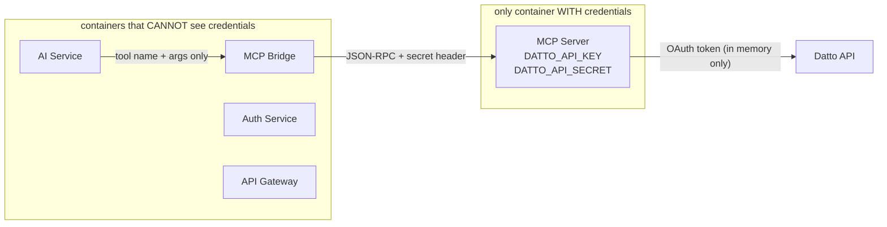

---
tags:
  - platform/security
  - datto
  - isolation
type: Security
aliases:
  - Credential Isolation
  - Datto API Security
description: Structural guarantee that Datto API credentials exist only in the MCP Server container — never in any other service
---

# Datto Credential Isolation

> Part of the [[Datto RMM AI Platform|PLATFORM_BRAIN]] knowledge graph · **Security** node

**Purpose:** Structural guarantee that Datto API credentials (`DATTO_API_KEY`, `DATTO_API_SECRET`) are present **only** in the [[MCP Server]] container environment.

## What the Credentials Protect

- OAuth token fetch: `POST *.centrastage.net/auth/oauth/token`
- All Datto API calls: `GET /v2/...`

## Isolation Chain

> [!warning] SEC-004 — Split read/write MCP containers before adding write tools
> The current isolation guarantee ("compromised MCP = read-only data") disappears if write tools share this container and credentials.
> **Fix:** Split into `mcp-read` (current) and `mcp-write` with separately scoped Datto credentials before any write tool is added. See [[SECURITY_FINDINGS#SEC-004]].

## Security Properties

> [!success] Defense in depth
> Even if the [[MCP Server]] container is compromised, the attacker gains ==read-only RMM data access only== — zero access to platform user data (different container, different DB).

- Credentials injected as env vars into [[MCP Server]] container only
- OAuth tokens cached **in-memory only** — never written to DB, disk, or logs (see [[Token Manager]])
- [[MCP Server]] is **read-only by design** — 37 GET tools only, no create/update/delete Datto operations
- If MCP container is compromised: attacker gets read-only RMM data access only, zero access to platform user data (different container, different DB)

## Related Nodes

[[MCP Server]] · [[Token Manager]] · [[Network Isolation]] · [[Tool Execution Flow]] · [[MCP Bridge]] · [[AI Service]] · [[Auth Service]] · [[API Gateway]] · [[ActionProposal]]
