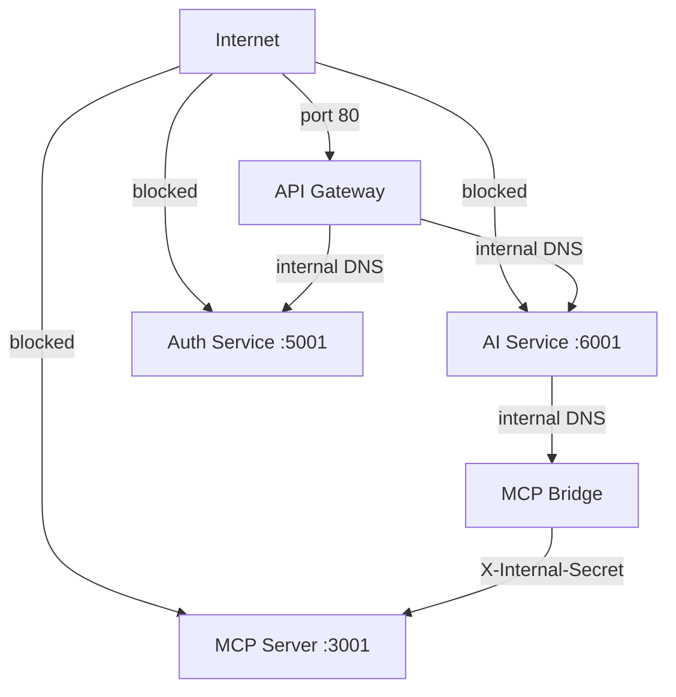
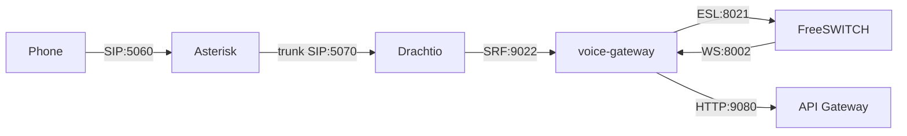

---
tags:
  - platform/security
  - docker
  - network
type: Security
aliases:
  - Docker Networks
  - Network Security
description: Two Docker network topology ensuring internal services are structurally unreachable from the public internet
---

# Network Isolation

> Part of the [[Datto RMM AI Platform|PLATFORM_BRAIN]] knowledge graph · **Security** node

> [!warning] Security-critical design
> This is a ==structural guarantee== — internal services are unreachable from outside the Docker network regardless of application-layer controls.

**Purpose:** Structural guarantee that internal services are unreachable from outside the Docker network, regardless of application-layer controls.

## Two Docker Networks

| Network | Members | Public? |
|---|---|---|
| `public` | [[API Gateway]], [[Web App]] | APISIX port 80 only |
| `internal` (bridge) | All other services | No public ports |

## Reachability Matrix

> [!success] SEC-006 ✅ — Auth login rate limiting implemented
> `POST /api/auth/login` is rate-limited via APISIX `limit-req` plugin: 5 req/s sustained, burst 10, `remote_addr` key, 429 rejection. Applied by `./setup-apisix.sh` when creating route 1.

## Inter-Service Auth

> [!info] No TLS inside the internal network
> The Docker bridge network boundary is the security layer — [[API Gateway]] communicates with internal services over plain HTTP.

- [[MCP Bridge]] → [[MCP Server]]: `X-Internal-Secret` header (shared secret in `.env`)
- [[API Gateway]] → internal services: plain HTTP (network boundary is the security layer)
- All containers resolve each other by Docker DNS hostname (service name)

## Voice Stack (LAN-only)

The [[Voice Gateway]] runs a self-hosted Asterisk PBX, Drachtio, and FreeSWITCH — all on the `internal` bridge network. No host networking needed.

| Container | Port | Access |
|---|---|---|
| Asterisk | 5060 (SIP), 10000-10100 (RTP) | LAN phones connect here |
| Drachtio | 5070 (SIP), 9022 (admin) | SIP signaling — static trunk from Asterisk |
| FreeSWITCH | 5080 (SIP), 30000-30100 (RTP) | Media server |
| voice-gateway | 8001, 8002 | Orchestrator — calls APISIX like a browser |

> All voice containers run on the `internal` bridge network. No host networking needed. Phone connects to Asterisk via Docker port mapping (5060 on host → container).

Voice-gateway authenticates as a service account with standard [[RBAC System|RBAC]] — no privilege escalation. Audio processed in-memory only, never persisted to disk.

## CVE Scanner (Internal)

The [[CVE Scanner]] runs on the `internal` bridge network. It connects only to PostgreSQL for data storage and the internet for NVD feed downloads. No public ports exposed.

| Container | Port | Access |
|---|---|---|
| cve-scanner | 8500 (HTTP) | Internal only — health check + API |

## Dev Exceptions (localhost only)

- `auth-service:5001` exposed for direct testing
- `ai-service:6001` exposed for direct testing
- `apisix-dashboard:9000` on `127.0.0.1`
- `zipkin:9411` on `127.0.0.1`

## Related Nodes

[[API Gateway]] · [[MCP Server]] · [[Datto Credential Isolation]] · [[MCP Bridge]] · [[Voice Gateway]] · [[CVE Scanner]] · [[AI Service]] · [[Auth Service]] · [[Web App]] · [[JWT Model]] · [[RBAC System]]
