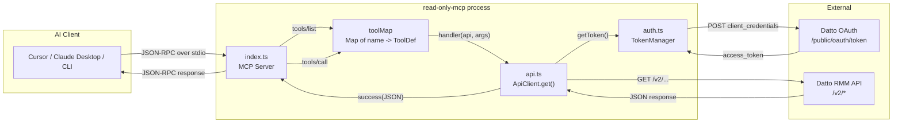

# Read-Only MCP Server -- Second Brain

This document is a complete architecture reference for the `read-only-mcp` project. Any AI agent or developer can read this single file to understand every part of the codebase: what each file does, how the pieces connect, how authentication works, where every tool is defined, and how to add or edit tools.

---

## 1. What This Project Is

A **standalone MCP (Model Context Protocol) server** that exposes **37 read-only GET tools** against the Datto RMM REST API. It communicates over **stdio** (standard input/output), not HTTP. An AI client (Cursor, Claude Desktop, Claude Code CLI) launches the server as a subprocess, sends JSON-RPC requests on stdin, and reads JSON-RPC responses on stdout.

- **Runtime:** Node.js 22+
- **Language:** TypeScript (compiled to ES2022)
- **Protocol SDK:** `@modelcontextprotocol/sdk` v1.x
- **Auth method:** OAuth2 `client_credentials` grant against Datto RMM
- **Transport:** stdio only -- no ports, no HTTP server

---

## 2. File Tree

```
read-only-mcp/
├── package.json              # npm metadata, scripts (build, start, dev), dependencies
├── tsconfig.json             # TypeScript compiler config (ES2022, NodeNext modules)
├── Dockerfile                # Single-stage Docker build (node:22-alpine)
├── .dockerignore             # Excludes node_modules, dist, .env from build context
│
├── src/
│   ├── index.ts              # Entry point -- creates MCP server, registers all tools, starts stdio transport
│   ├── auth.ts               # Platform URL resolver, OAuth2 TokenManager class, loadConfig()
│   ├── api.ts                # ApiClient interface (.get method), ToolDef interface, success/error helpers
│   │
│   └── tools/                # One file per API domain -- each exports a ToolDef[] array
│       ├── account.ts        #  8 tools -- account info, sites, devices, users, variables, components, alerts
│       ├── sites.ts          #  7 tools -- site detail, site devices, site alerts, site variables, settings, filters
│       ├── devices.ts        #  5 tools -- device by UID/ID/MAC, device open/resolved alerts
│       ├── alerts.ts         #  1 tool  -- single alert detail
│       ├── jobs.ts           #  5 tools -- job info, components, results, stdout, stderr
│       ├── audit.ts          #  5 tools -- device audit, software, audit by MAC, ESXi, printer
│       ├── activity.ts       #  1 tool  -- activity logs
│       ├── filters.ts        #  2 tools -- default filters, custom filters
│       └── system.ts         #  3 tools -- system status, rate limit, pagination config
│
├── SECOND-BRAIN.md           # This file
├── CONFIGURATION.md          # Where to put API tokens and env vars
└── STARTUP.md                # How to build and run the server
```

---

## 3. Architecture Diagram



### Request lifecycle

1. The AI client sends a `tools/list` or `tools/call` JSON-RPC message on stdin.
2. `index.ts` receives it via `StdioServerTransport`.
3. For `tools/list`, it returns the name, description, and inputSchema of all 37 tools.
4. For `tools/call`, it looks up the tool name in `toolMap` (a `Map<string, ToolDef>`), then calls `tool.handler(api, args)`.
5. The handler calls `api.get(path, query)` which:
   - Asks `TokenManager.getToken()` for a valid Bearer token (cached or freshly fetched).
   - Makes a `GET` request to the Datto RMM API with the token in the `Authorization` header.
   - Returns the parsed JSON.
6. The handler wraps the result in `success(JSON.stringify(data))` or `error(message)` and returns it.
7. `index.ts` sends the result back as a JSON-RPC response on stdout.

---

## 4. Core Abstractions

### 4.1 `ToolDef` (src/api.ts)

Every tool in the server is defined as an object conforming to this interface:

```typescript
interface ToolDef {
  name: string;           // MCP tool name, e.g. "get-device"
  description: string;    // Human-readable description shown to the AI
  inputSchema: {
    type: "object";
    properties: Record<string, unknown>;   // JSON Schema for tool parameters
    required?: string[];                    // Which params are mandatory
  };
  handler: (
    api: ApiClient,
    args: Record<string, unknown>
  ) => Promise<{ content: Array<{ type: "text"; text: string }>; isError?: boolean }>;
}
```

The `handler` receives the shared `ApiClient` and the user-supplied arguments, makes the API call, and returns a text content block.

### 4.2 `ApiClient` (src/api.ts)

A thin wrapper around `fetch` with a single method:

```typescript
interface ApiClient {
  get(path: string, query?: Record<string, unknown>): Promise<unknown>;
}
```

- Automatically attaches the Bearer token from `TokenManager`.
- Converts the `query` object into URL search params (handles arrays by appending multiple values for the same key).
- Throws on non-2xx responses with the status code and body.

Helper functions `success(text)` and `error(text)` format the MCP response envelope.

### 4.3 `TokenManager` (src/auth.ts)

Manages OAuth2 `client_credentials` tokens:

- **Caching:** Stores the current token and its expiry timestamp.
- **Buffer:** Refreshes 5 minutes before actual expiry (`BUFFER_MS = 5 * 60 * 1000`).
- **Dedup:** If multiple concurrent requests trigger a refresh, only one HTTP call is made (stored in `refreshPromise`).
- **Credentials:** Sends `apiKey:apiSecret` as a Base64-encoded `Basic` auth header to the token endpoint.
- **Token endpoint:** `{baseUrl}/public/oauth/token` (derived from the platform URL).

### 4.4 `loadConfig()` (src/auth.ts)

Reads three environment variables and returns an `AppConfig`:

| Env Var | Required | Default | Purpose |
|---------|----------|---------|---------|
| `DATTO_API_KEY` | Yes | -- | OAuth2 client ID |
| `DATTO_API_SECRET` | Yes | -- | OAuth2 client secret |
| `DATTO_PLATFORM` | No | `merlot` | Selects the API base URL by region |

Throws immediately on startup if required vars are missing.

### 4.5 Platform URL Mapping (src/auth.ts)

The `PLATFORM_URLS` dictionary maps code names to API base URLs:

| Code | Region | Base URL |
|------|--------|----------|
| `merlot` | US East (default) | `https://merlot-api.centrastage.net/api` |
| `concord` | US West | `https://concord-api.centrastage.net/api` |
| `pinotage` | Asia Pacific | `https://pinotage-api.centrastage.net/api` |
| `vidal` | EU Frankfurt | `https://vidal-api.centrastage.net/api` |
| `zinfandel` | EU London | `https://zinfandel-api.centrastage.net/api` |
| `syrah` | Canada | `https://syrah-api.centrastage.net/api` |

---

## 5. Token Lifecycle (Step by Step)

1. On first tool call, `api.get()` calls `tokenManager.getToken()`.
2. `getToken()` sees `this.token` is null, so it calls `fetchToken()`.
3. `fetchToken()` sends a POST to `{baseUrl}/public/oauth/token` with:
   - Header: `Authorization: Basic base64(apiKey:apiSecret)`
   - Header: `Content-Type: application/x-www-form-urlencoded`
   - Body: `grant_type=client_credentials`
4. Datto returns `{ access_token: "...", expires_in: 3600 }`.
5. `TokenManager` stores the token and computes `expiresAt = Date.now() + expires_in * 1000`.
6. Subsequent calls to `getToken()` return the cached token if `Date.now() < expiresAt - 300000` (5 min buffer).
7. When the buffer window is reached, a new `fetchToken()` is triggered.
8. If two tool calls hit the refresh window simultaneously, the second one reuses the in-flight `refreshPromise`.

---

## 6. Full Tool Catalogue (37 Tools)

### Account (src/tools/account.ts) -- 8 tools

| Tool Name | API Endpoint | Required Params |
|-----------|-------------|-----------------|
| `get-account` | `GET /v2/account` | -- |
| `list-sites` | `GET /v2/account/sites` | -- |
| `list-devices` | `GET /v2/account/devices` | -- |
| `list-users` | `GET /v2/account/users` | -- |
| `list-account-variables` | `GET /v2/account/variables` | -- |
| `list-components` | `GET /v2/account/components` | -- |
| `list-open-alerts` | `GET /v2/account/alerts/open` | -- |
| `list-resolved-alerts` | `GET /v2/account/alerts/resolved` | -- |

### Sites (src/tools/sites.ts) -- 7 tools

| Tool Name | API Endpoint | Required Params |
|-----------|-------------|-----------------|
| `get-site` | `GET /v2/site/{siteUid}` | `siteUid` |
| `list-site-devices` | `GET /v2/site/{siteUid}/devices` | `siteUid` |
| `list-site-open-alerts` | `GET /v2/site/{siteUid}/alerts/open` | `siteUid` |
| `list-site-resolved-alerts` | `GET /v2/site/{siteUid}/alerts/resolved` | `siteUid` |
| `list-site-variables` | `GET /v2/site/{siteUid}/variables` | `siteUid` |
| `get-site-settings` | `GET /v2/site/{siteUid}/settings` | `siteUid` |
| `list-site-filters` | `GET /v2/site/{siteUid}/filters` | `siteUid` |

### Devices (src/tools/devices.ts) -- 5 tools

| Tool Name | API Endpoint | Required Params |
|-----------|-------------|-----------------|
| `get-device` | `GET /v2/device/{deviceUid}` | `deviceUid` |
| `get-device-by-id` | `GET /v2/device/id/{deviceId}` | `deviceId` |
| `get-device-by-mac` | `GET /v2/device/macAddress/{macAddress}` | `macAddress` |
| `list-device-open-alerts` | `GET /v2/device/{deviceUid}/alerts/open` | `deviceUid` |
| `list-device-resolved-alerts` | `GET /v2/device/{deviceUid}/alerts/resolved` | `deviceUid` |

### Alerts (src/tools/alerts.ts) -- 1 tool

| Tool Name | API Endpoint | Required Params |
|-----------|-------------|-----------------|
| `get-alert` | `GET /v2/alert/{alertUid}` | `alertUid` |

### Jobs (src/tools/jobs.ts) -- 5 tools

| Tool Name | API Endpoint | Required Params |
|-----------|-------------|-----------------|
| `get-job` | `GET /v2/job/{jobUid}` | `jobUid` |
| `get-job-components` | `GET /v2/job/{jobUid}/components` | `jobUid` |
| `get-job-results` | `GET /v2/job/{jobUid}/results/{deviceUid}` | `jobUid`, `deviceUid` |
| `get-job-stdout` | `GET /v2/job/{jobUid}/results/{deviceUid}/stdout` | `jobUid`, `deviceUid` |
| `get-job-stderr` | `GET /v2/job/{jobUid}/results/{deviceUid}/stderr` | `jobUid`, `deviceUid` |

### Audit (src/tools/audit.ts) -- 5 tools

| Tool Name | API Endpoint | Required Params |
|-----------|-------------|-----------------|
| `get-device-audit` | `GET /v2/audit/device/{deviceUid}` | `deviceUid` |
| `get-device-software` | `GET /v2/audit/device/{deviceUid}/software` | `deviceUid` |
| `get-device-audit-by-mac` | `GET /v2/audit/device/macAddress/{macAddress}` | `macAddress` |
| `get-esxi-audit` | `GET /v2/audit/esxihost/{deviceUid}` | `deviceUid` |
| `get-printer-audit` | `GET /v2/audit/printer/{deviceUid}` | `deviceUid` |

### Activity (src/tools/activity.ts) -- 1 tool

| Tool Name | API Endpoint | Required Params |
|-----------|-------------|-----------------|
| `get-activity-logs` | `GET /v2/activity-logs` | -- |

### Filters (src/tools/filters.ts) -- 2 tools

| Tool Name | API Endpoint | Required Params |
|-----------|-------------|-----------------|
| `list-default-filters` | `GET /v2/filter/default-filters` | -- |
| `list-custom-filters` | `GET /v2/filter/custom-filters` | -- |

### System (src/tools/system.ts) -- 3 tools

| Tool Name | API Endpoint | Required Params |
|-----------|-------------|-----------------|
| `get-system-status` | `GET /v2/system/status` | -- |
| `get-rate-limit` | `GET /v2/system/request_rate` | -- |
| `get-pagination-config` | `GET /v2/system/pagination` | -- |

---

## 7. Common Optional Parameters

Many tools accept pagination and filtering query params. These are not listed in every row above to keep the table concise.

- **Pagination:** `page` (number), `max` (number, up to 250) -- used by most list endpoints.
- **Muted filter:** `muted` (boolean) -- used by alert endpoints.
- **Account device filters:** `hostname`, `siteName`, `deviceType`, `operatingSystem`, `filterId` -- used by `list-devices`.
- **Site device filter:** `filterId` -- used by `list-site-devices`.
- **Activity log filters:** `size`, `order`, `from`, `until`, `entities`, `categories`, `actions`, `siteIds`, `userIds`.

---

## 8. How to Add a New Tool

1. **Choose the file:** Pick the `src/tools/*.ts` file that matches the API domain (e.g., `devices.ts` for device endpoints). Create a new file if it is a new domain.

2. **Add an entry** to the exported `ToolDef[]` array:

```typescript
{
  name: "my-new-tool",
  description: "What this tool does",
  inputSchema: {
    type: "object",
    properties: {
      someParam: { type: "string", description: "..." },
    },
    required: ["someParam"],
  },
  handler: async (api, args) => {
    try {
      const data = await api.get(`/v2/some/endpoint/${args["someParam"]}`);
      return success(JSON.stringify(data, null, 2));
    } catch (e) {
      return error(`Error: ${e instanceof Error ? e.message : e}`);
    }
  },
},
```

3. **If you created a new file**, import its array in `src/index.ts` and spread it into `allTools`:

```typescript
import { myNewTools } from "./tools/mynew.js";

const allTools: ToolDef[] = [
  ...accountTools,
  // ...existing spreads...
  ...myNewTools,       // <-- add here
];
```

4. **Rebuild:** `npm run build` (or `docker build -t read-only-mcp .`).

That is it. The tool auto-registers because `index.ts` iterates `allTools` for both `tools/list` and `tools/call`.

---

## 9. How to Edit an Existing Tool

1. Find the tool by name in the appropriate `src/tools/*.ts` file (see the catalogue above).
2. The `handler` function contains the API call logic. The `inputSchema.properties` object controls what parameters the AI can supply.
3. To change the API endpoint, edit the path string inside `api.get(...)`.
4. To add an optional parameter, add it to `properties`. To make it required, add its key to the `required` array.
5. The `args` object keys match the property names in `inputSchema`. Path params are extracted by key (e.g., `args["deviceUid"]`); remaining args are passed as query params.

---

## 10. Key Design Patterns

- **Single shared ApiClient:** Created once in `main()`, passed to every handler. The `TokenManager` inside it handles token refresh transparently.
- **Path params vs query params:** Tools that need a UID in the URL path destructure it out of `args` and pass the rest as the `query` object: `const { siteUid, ...query } = args;`
- **Error handling:** Every handler wraps its call in try/catch and returns `error(message)` rather than throwing, so the MCP server never crashes from a bad API response.
- **No side effects:** This server only makes GET requests. It cannot create, update, or delete anything in Datto RMM.
